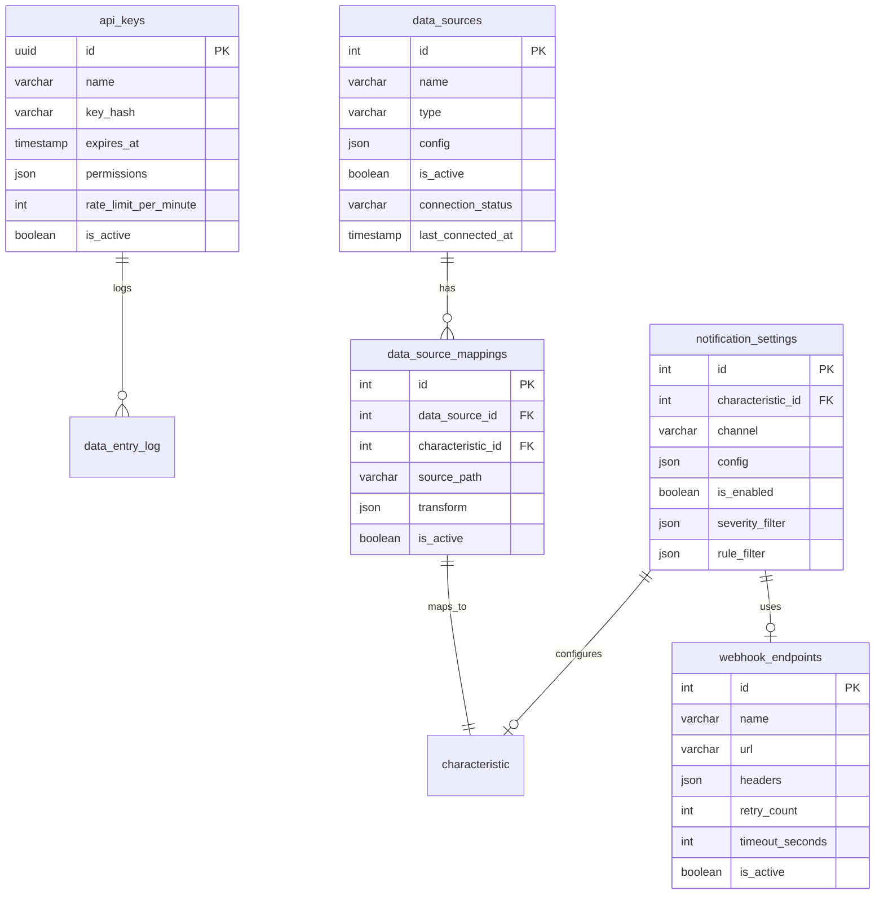

# Phase 2 Architecture Design: Data Integration, Notifications & UX Enhancements

## Executive Summary

This document provides the detailed system architecture for Phase 2 of OpenSPC, covering 6 features: API data entry endpoint, Nelson Rules configuration UI with alarm/notification system, Help tooltip framework, Chart styling improvements, Dark mode theming, and Data collection configuration (MQTT/SparkplugB/OPC-UA).

---

## 1. Component Design

### System Overview

```
+------------------+     +------------------+     +------------------+
|   External       |     |   Frontend       |     |   Backend        |
|   Systems        |     |   (React)        |     |   (FastAPI)      |
+------------------+     +------------------+     +------------------+
| API Clients      |---->| Theme Provider   |---->| API Router       |
| MQTT Publishers  |     | Help Tooltips    |     |   /api/v1/data-entry
| OPC-UA Servers   |     | Dark Mode Toggle |     |   /api/v1/notifications
+------------------+     | Nelson Rules UI  |     +------------------+
                         | Chart Styling    |             |
                         +------------------+             v
                                |              +------------------+
                                |              | Notification     |
                                +------------->| Manager          |
                                   WebSocket   +------------------+
                                               | - In-App Alerts  |
                                               | - Webhooks       |
                                               | - Event Bus      |
                                               +------------------+
                                                        |
                                                        v
                                               +------------------+
                                               | Data Providers   |
                                               +------------------+
                                               | - Manual API     |
                                               | - MQTT Client    |
                                               | - SparkplugB     |
                                               | - OPC-UA Client  |
                                               +------------------+
```

### Design Patterns

| Layer | Pattern | Rationale |
|-------|---------|-----------|
| API | Controller + DTO | Clean request/response separation; existing pattern |
| Business | Service Layer | Encapsulate notification logic, enable testing |
| Data | Repository | Already established for samples, violations, characteristics |
| Providers | Protocol/Strategy | Existing DataProvider protocol enables swappable implementations |
| Notifications | Observer/Pub-Sub | Event bus already established for decoupled notification delivery |
| UI | Context Provider | React Context for theme and help system state |
| Styling | CSS Variables | Enable runtime theme switching without rebuild |

---

## 2. Feature Architecture Details

### Feature 1: API Data Entry Endpoint

**Purpose:** REST API endpoint for programmatic data submission from external systems.

**Component: DataEntryController**

```
/api/v1/data-entry/
  POST /submit          # Single sample submission
  POST /batch           # Batch submission (multiple samples)
  GET  /schema          # Get expected payload schema
```

**Design Decisions:**
- Reuse existing `SampleCreate` schema with additional metadata fields
- Authentication via API keys stored in new `api_keys` table
- Rate limiting via middleware (configurable per API key)
- Validation identical to manual entry (existing SPCEngine integration)

**New Database Entity: APIKey**
```
api_keys
  id: UUID (PK)
  name: str
  key_hash: str (bcrypt hash of API key)
  created_at: datetime
  expires_at: datetime | null
  permissions: JSON (list of characteristic IDs or "all")
  rate_limit_per_minute: int
  is_active: bool
```

**Request Schema (DataEntryRequest):**
```python
class DataEntryRequest(BaseModel):
    characteristic_id: int
    measurements: list[float]
    timestamp: datetime | None = None  # Defaults to server time
    batch_number: str | None = None
    operator_id: str | None = None
    metadata: dict | None = None  # Extensible context
```

**Integration Flow:**
```
API Request -> Auth Middleware -> DataEntryController -> SPCEngine.process_sample() -> Response
```

---

### Feature 2: Nelson Rules Configuration UI + Alarm/Notification System

**Purpose:** UI to configure which Nelson rules apply per characteristic, plus notification delivery when violations occur.

#### 2a. Nelson Rules Configuration UI

**Existing Infrastructure:**
- `CharacteristicRule` model exists with `char_id`, `rule_id`, `is_enabled`
- API endpoints exist: `GET/PUT /{char_id}/rules`
- Rules are already checked during sample processing

**New UI Component: NelsonRulesConfigPanel**

```tsx
interface NelsonRulesConfigPanelProps {
  characteristicId: number
}

// Features:
// - Display all 8 rules with name, description, severity
// - Toggle switches for enable/disable
// - Help tooltip icon next to each rule explaining what it detects
// - "Reset to defaults" button
```

**UI Location:** New tab in `CharacteristicForm.tsx` or expandable section.

#### 2b. Alarm/Notification System

**Component: NotificationManager**

Extends existing `AlertManager` with multiple notification channels.

**New Database Entities:**

```
notification_settings
  id: int (PK)
  characteristic_id: int | null (FK, null = global)
  channel: str ("in_app", "webhook", "email")
  config: JSON  # Channel-specific configuration
  is_enabled: bool
  severity_filter: list[str] | null  # ["WARNING", "CRITICAL"] or null for all
  rule_filter: list[int] | null  # [1, 2, 3] or null for all

webhook_endpoints
  id: int (PK)
  name: str
  url: str
  headers: JSON  # Custom headers (auth tokens, etc.)
  retry_count: int (default 3)
  timeout_seconds: int (default 30)
  is_active: bool
```

**Notification Channels:**

1. **In-App Notifications** (existing WebSocket infrastructure)
   - Extend `ConnectionManager` with `broadcast_notification()` method
   - New WebSocket message type: `{ type: "notification", payload: {...} }`

2. **Webhook Callbacks**
   - New `WebhookNotifier` class implementing `AlertNotifier` protocol
   - Async HTTP POST with retry logic and exponential backoff
   - Payload format matches API data entry response

3. **Email (Future)**
   - Placeholder interface for SMTP integration

**Event Flow:**
```
Violation Created -> AlertManager.create_violations()
                  -> ViolationCreatedEvent published to EventBus
                  -> NotificationManager subscriber
                  -> Filter by settings
                  -> Dispatch to enabled channels
```

---

### Feature 3: Help Tooltip Framework

**Purpose:** Reusable contextual help system with "?" icons providing rich tooltips.

**Component: HelpTooltip**

```tsx
interface HelpTooltipProps {
  helpKey: string  // Unique key to look up content
  placement?: "top" | "bottom" | "left" | "right"
  children?: ReactNode  // Optional custom trigger (defaults to "?" icon)
}

// Usage:
<HelpTooltip helpKey="nelson-rule-1" />
<HelpTooltip helpKey="ucl-recalculation">
  <InfoIcon />
</HelpTooltip>
```

**Help Content Registry:**

```typescript
// help-content.ts
export const helpContent: Record<string, HelpContent> = {
  "nelson-rule-1": {
    title: "Rule 1: Outlier",
    description: "One point beyond 3 sigma (control limits).",
    details: "This is the most severe violation...",
    severity: "CRITICAL",
    learnMoreUrl: "/docs/nelson-rules#rule-1"
  },
  "ucl-recalculation": {
    title: "When to Recalculate Control Limits",
    description: "Control limits should be recalculated when...",
    details: "..."
  },
  // ... all 8 Nelson rules, statistical terms, mode explanations
}
```

**Implementation Strategy:**
- Use Radix UI `Tooltip` or `Popover` primitives (already in shadcn/ui)
- Support markdown rendering for rich content
- Lazy load detailed content to minimize bundle size
- Support both hover (desktop) and click (mobile/touch)

**Standard Help Keys:**
- `nelson-rule-{1-8}` - Nelson Rule explanations
- `ucl-recalculation`, `lcl-recalculation` - When/why to recalculate
- `subgroup-mode-{a,b,c}` - Mode explanations
- `zone-{a,b,c}` - Zone definitions
- `sigma-estimation` - Statistical methods

---

### Feature 4: Chart Styling Improvements

**Purpose:** Make X-bar charts more visually appealing with better color differentiation and visual hierarchy.

**Current State Analysis:**
- Using Recharts with basic styling
- Zone areas use semi-transparent fills
- Data line is single color (primary)
- Points show violation state via color/size

**Enhancements:**

1. **Gradient Data Line:**
```tsx
<defs>
  <linearGradient id="chartLineGradient" x1="0" y1="0" x2="1" y2="0">
    <stop offset="0%" stopColor="hsl(var(--chart-primary))" />
    <stop offset="100%" stopColor="hsl(var(--chart-secondary))" />
  </linearGradient>
</defs>
<Line stroke="url(#chartLineGradient)" strokeWidth={2.5} />
```

2. **Enhanced Point Markers:**
```tsx
// Different shapes for different states
const getMarkerShape = (point: ChartPoint) => {
  if (point.hasViolation) return <DiamondMarker />
  if (point.is_undersized) return <TriangleMarker />
  return <CircleMarker />
}
```

3. **Zone Area Improvements:**
- Add subtle gradient fills (top to bottom fade)
- Improve zone boundary lines with subtle shadows
- Use Sepasoft palette colors consistently

4. **Visual Hierarchy:**
- Center line thicker and more prominent
- UCL/LCL dashed with subtle glow effect
- Recent points slightly larger (recency emphasis)
- Animation for new points entering chart

**CSS Variables for Chart Theming:**
```css
--chart-line-width: 2.5px;
--chart-point-radius: 4px;
--chart-point-radius-violation: 6px;
--chart-zone-opacity: 0.15;
--chart-animation-duration: 300ms;
```

---

### Feature 5: Dark Mode

**Purpose:** Theme toggle with Sepasoft-compatible dark palette.

**Implementation Strategy:**

1. **CSS Variables Approach** (already partially in place):

```css
/* index.css - add dark theme */
.dark {
  --color-background: hsl(220 15% 10%);
  --color-foreground: hsl(0 0% 95%);
  --color-card: hsl(220 15% 13%);
  --color-card-foreground: hsl(0 0% 95%);
  --color-primary: hsl(212 100% 45%);  /* Brightened for dark mode */
  --color-muted: hsl(220 10% 20%);
  --color-muted-foreground: hsl(220 5% 60%);
  --color-border: hsl(220 10% 20%);
  /* ... etc for all variables */
}
```

2. **Theme Provider Component:**

```tsx
// ThemeProvider.tsx
interface ThemeContextValue {
  theme: "light" | "dark" | "system"
  setTheme: (theme: "light" | "dark" | "system") => void
}

export function ThemeProvider({ children }: { children: ReactNode }) {
  const [theme, setTheme] = useLocalStorage<Theme>("openspc-theme", "system")

  useEffect(() => {
    const root = document.documentElement
    const isDark = theme === "dark" ||
      (theme === "system" && window.matchMedia("(prefers-color-scheme: dark)").matches)

    root.classList.toggle("dark", isDark)
  }, [theme])

  return (
    <ThemeContext.Provider value={{ theme, setTheme }}>
      {children}
    </ThemeContext.Provider>
  )
}
```

3. **Theme Toggle UI:**
- Add toggle button in Layout header
- Use `Sun`/`Moon` icons from lucide-react
- Persist preference to localStorage

4. **Chart Colors for Dark Mode:**
- Brighten line colors for contrast
- Adjust zone fill opacities
- Ensure text remains readable

---

### Feature 6: Data Collection Configuration (MQTT/SparkplugB/OPC-UA)

**Purpose:** Configure data collection from industrial protocols.

**Architecture Overview:**

```
                          +----------------------+
                          | DataSourceManager    |
                          +----------------------+
                          | - register()         |
                          | - unregister()       |
                          | - get_status()       |
                          +----------+-----------+
                                     |
         +---------------------------+---------------------------+
         |                           |                           |
+--------v-------+         +---------v--------+         +--------v-------+
| MQTTSource     |         | SparkplugBSource |         | OPCUASource    |
+----------------+         +------------------+         +----------------+
| host, port     |         | namespace_uri    |         | endpoint_url   |
| username       |         | group_id         |         | security_mode  |
| password       |         | node_id          |         | certificate    |
| topic_mapping  |         | topic_mapping    |         | node_mapping   |
+----------------+         +------------------+         +----------------+
        |                          |                           |
        +---------->   SampleEvent   <-----------------------+
                                |
                        SPCEngine.process_sample()
```

**New Database Entities:**

```
data_sources
  id: int (PK)
  name: str
  type: str ("MQTT", "SPARKPLUG_B", "OPC_UA")
  config: JSON  # Protocol-specific configuration
  is_active: bool
  connection_status: str ("connected", "disconnected", "error")
  last_connected_at: datetime | null
  last_error: str | null
  created_at: datetime
  updated_at: datetime

data_source_mappings
  id: int (PK)
  data_source_id: int (FK)
  characteristic_id: int (FK)
  source_path: str  # Topic, node path, etc.
  transform: JSON | null  # Value transformation config
  is_active: bool
```

**Protocol-Specific Configuration Schemas:**

```python
class MQTTSourceConfig(BaseModel):
    host: str
    port: int = 1883
    username: str | None = None
    password: str | None = None
    client_id: str | None = None
    tls_enabled: bool = False
    tls_ca_cert: str | None = None

class SparkplugBSourceConfig(BaseModel):
    mqtt_config: MQTTSourceConfig
    namespace_uri: str = "spBv1.0"
    group_id: str
    node_id: str | None = None  # Subscribe to specific node or all

class OPCUASourceConfig(BaseModel):
    endpoint_url: str
    security_mode: str = "None"  # None, Sign, SignAndEncrypt
    security_policy: str | None = None
    username: str | None = None
    password: str | None = None
    certificate_path: str | None = None
    private_key_path: str | None = None
```

**API Endpoints:**

```
/api/v1/data-sources/
  GET    /                # List all data sources
  POST   /                # Create new data source
  GET    /{id}            # Get data source details
  PATCH  /{id}            # Update configuration
  DELETE /{id}            # Delete data source
  POST   /{id}/connect    # Manually trigger connection
  POST   /{id}/disconnect # Manually disconnect
  GET    /{id}/status     # Get connection status
  POST   /{id}/test       # Test connection without saving

/api/v1/data-sources/{id}/mappings/
  GET    /                # List mappings for source
  POST   /                # Create new mapping
  DELETE /{mapping_id}    # Delete mapping
```

**Frontend: DataSourceConfigPanel**

```tsx
// Multi-step wizard for configuration:
// 1. Select protocol type
// 2. Configure connection settings
// 3. Test connection
// 4. Map tags/nodes to characteristics
// 5. Activate

interface DataSourceConfigProps {
  onComplete: (sourceId: number) => void
}
```

**Connection Lifecycle:**
- DataSourceManager initializes on app startup
- Loads active sources from database
- Creates appropriate provider instances
- Registers with SPCEngine via callback
- Monitors connection health with heartbeat
- Reconnects automatically on failure

---

## 3. API Contracts

### Base URL
`/api/v1`

### Authentication
- Existing endpoints: Session-based (existing pattern)
- Data Entry endpoint: API key in `X-API-Key` header

### New Endpoints

#### POST /api/v1/data-entry/submit
**Description:** Submit a sample from external system

**Headers:**
- `X-API-Key: <api_key>`

**Request:**
```json
{
  "characteristic_id": 1,
  "measurements": [10.1, 10.2, 10.0],
  "timestamp": "2026-02-04T10:30:00Z",
  "batch_number": "B123",
  "operator_id": "OP001",
  "metadata": {"machine": "CNC-1"}
}
```

**Response 201:**
```json
{
  "sample_id": 42,
  "characteristic_id": 1,
  "timestamp": "2026-02-04T10:30:00Z",
  "mean": 10.1,
  "range_value": 0.2,
  "zone": "zone_c_upper",
  "in_control": true,
  "violations": []
}
```

**Response 401:**
```json
{
  "error": "INVALID_API_KEY",
  "message": "API key is invalid or expired"
}
```

---

## 4. Data Model

### New Entities



---

## 5. Implementation Priorities

Based on requirements priority grouping:

### High Priority (Core Functionality)
1. **API Data Entry Endpoint** - Enables external integration
   - APIKey model and auth middleware
   - DataEntryController with /submit and /batch endpoints
   - Rate limiting middleware

2. **Nelson Rules Configuration UI** - Core SPC functionality
   - NelsonRulesConfigPanel component
   - Help tooltips for each rule

3. **Help Tooltip Framework** - Improves usability
   - HelpTooltip component
   - Help content registry
   - Integration points throughout UI

### Medium Priority (UX)
4. **Chart Styling Improvements**
   - Gradient line effects
   - Enhanced point markers
   - Zone area improvements

5. **Dark Mode**
   - CSS variable dark theme
   - ThemeProvider context
   - Toggle in header

### Lower Priority (Complex Integration)
6. **Data Collection Configuration**
   - DataSource model and API
   - MQTT provider enhancement (config from DB)
   - SparkplugB provider implementation
   - OPC-UA provider implementation (requires asyncua library)
   - DataSourceConfigPanel wizard UI

---

## 6. Key Dependencies

### Backend Dependencies to Add
- `bcrypt` - API key hashing
- `httpx` - Async HTTP client for webhooks
- `asyncua` - OPC-UA client (for Feature 6)

### Frontend Dependencies (Already Available)
- `@radix-ui/react-tooltip` - For help tooltips (via shadcn/ui)
- `lucide-react` - Icons (already in use)
- `sonner` - Toast notifications (already in use)

---

## 7. Critical Files for Implementation

- `backend/src/openspc/api/v1/samples.py` - Pattern for new data-entry endpoint
- `backend/src/openspc/core/alerts/manager.py` - AlertManager to extend
- `frontend/src/components/CharacteristicForm.tsx` - Add Nelson Rules section
- `frontend/src/index.css` - CSS variables for dark theme
- `backend/src/openspc/mqtt/client.py` - Pattern for data source providers
