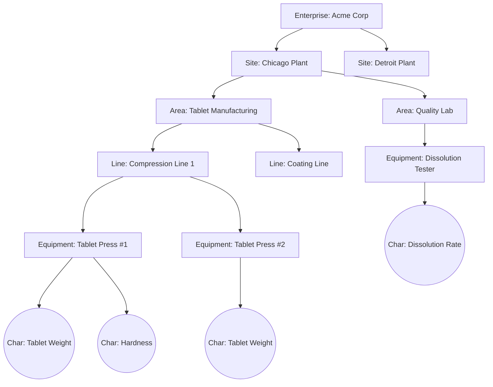
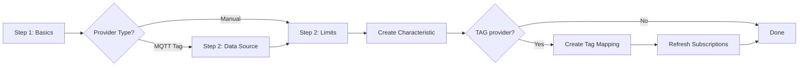
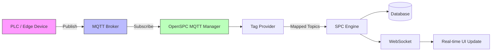

# Administration Guide

This guide covers system administration tasks for OpenSPC, including initial setup, plant management, user management, equipment hierarchy configuration, industrial connectivity, and ongoing maintenance.

**Audience:** Administrators and engineers responsible for deploying, configuring, and maintaining an OpenSPC installation.

---

## Table of Contents

1. [Initial Setup](#1-initial-setup)
2. [Plant Management](#2-plant-management)
3. [Equipment Hierarchy](#3-equipment-hierarchy)
4. [Characteristic Management](#4-characteristic-management)
5. [User Management](#5-user-management)
6. [Industrial Connectivity (MQTT/Sparkplug B)](#6-industrial-connectivity-mqttsparkplug-b)
7. [API Keys](#7-api-keys)
8. [System Settings](#8-system-settings)
9. [Development Tools (Sandbox Mode)](#9-development-tools-sandbox-mode)
10. [Maintenance](#10-maintenance)

---

## 1. Initial Setup

### First Login

When OpenSPC starts for the first time with an empty database, it automatically creates a bootstrap admin account. The default credentials are:

| Field    | Default Value |
|----------|---------------|
| Username | `admin`       |
| Password | `admin`       |

These defaults can be overridden with environment variables before first startup:

```bash
export OPENSPC_ADMIN_USERNAME=myadmin
export OPENSPC_ADMIN_PASSWORD=a-strong-password-here
```

Navigate to the login page and sign in with the bootstrap credentials.

> **Warning:** Change the default admin password immediately after first login. The default `admin`/`admin` credentials are insecure and should never be used in production.

### Changing Default Credentials

1. Log in as the admin user.
2. Navigate to **Users** (`/admin/users`) in the sidebar.
3. Click **Edit** on the admin user row.
4. Enter a new password (minimum 8 characters) and confirm it.
5. Click **Save Changes**.

Alternatively, set the `OPENSPC_ADMIN_USERNAME` and `OPENSPC_ADMIN_PASSWORD` environment variables before the first startup so the bootstrap process creates the account with your chosen credentials from the start.

### Understanding the Admin Role

OpenSPC uses a four-tier role hierarchy. The admin role is the highest level and grants full access to all system features:

| Role       | Level | Access Scope |
|------------|-------|--------------|
| Operator   | 1     | Dashboard, data entry, violations, kiosk |
| Supervisor | 2     | + Reports, acknowledge violations, edit/exclude samples |
| Engineer   | 3     | + Configuration, connectivity, API keys, database settings |
| Admin      | 4     | + User management, site management, branding, dev tools |

Roles are **per-plant** -- a user can be an admin on one plant and an operator on another. The system resolves the user's effective role based on the currently selected plant.

When new plants are created, all existing admin users are automatically granted admin access to the new plant.

---

## 2. Plant Management

### What Is a Plant?

A **plant** (also called a "site") represents a physical facility or logical grouping for data isolation. Each plant has its own:

- Equipment hierarchy
- Characteristics and samples
- MQTT broker connections
- User role assignments

This multi-tenant design allows a single OpenSPC instance to serve multiple sites while keeping data cleanly separated.

### Default Plant

Every installation starts with a **DEFAULT** plant. This plant:

- Cannot be deleted
- Cannot be deactivated
- Has its code locked to `DEFAULT`
- Serves as the initial data container

### Creating a Plant

1. Navigate to **Settings > Sites** (`/settings`, Sites tab).
2. Scroll to the **Add New Site** form.
3. Fill in:
   - **Site Name** -- a human-readable name (e.g., "Chicago Factory")
   - **Code** -- a short uppercase identifier, max 10 characters (e.g., `CHI`)
   - **Settings (JSON)** -- optional plant-specific configuration (e.g., `{"timezone": "America/Chicago"}`)
4. Click **Add Site**.

When a new plant is created, all users with admin roles on any existing plant are automatically granted admin access to the new plant.

### Managing Plants

From the Sites settings tab, you can:

- **Edit** a plant's name, code, or settings by clicking the pencil icon.
- **Deactivate** a plant by clicking the power-off icon (non-DEFAULT plants only). Deactivated plants are hidden from regular users but retain their data.
- **Activate** a previously deactivated plant by clicking the power icon.
- **Delete** a plant by clicking the trash icon (only available for inactive, non-DEFAULT plants). This permanently removes the plant and all associated hierarchies, characteristics, and data.

> **Warning:** Deleting a plant is irreversible and destroys all data associated with that site.

### Switching Between Plants

Use the **plant selector** dropdown in the application header to switch between plants. Switching plants:

- Reloads the hierarchy tree
- Resets the dashboard and configuration views
- Updates all data queries to the selected plant scope

---

## 3. Equipment Hierarchy

### ISA-95 Equipment Model

OpenSPC organizes equipment using a tree structure based on the ISA-95 standard. The available node types are:

| Node Type   | Description                          | Typical Use |
|-------------|--------------------------------------|-------------|
| Enterprise  | Top-level organization               | Company name |
| Site        | Physical location                    | Factory, campus |
| Area        | Functional area within a site        | Building, department |
| Line        | Production line                      | Assembly line, packaging line |
| Cell        | Work cell within a line              | Station, machine group |
| Equipment   | Individual piece of equipment        | CNC machine, oven, press |
| Tag         | Data point on equipment              | Sensor, measurement point |
| Folder      | Generic organizational grouping      | Logical grouping of any items |

The hierarchy is plant-scoped -- each plant has its own independent tree.

### Example Hierarchy



### Creating Hierarchy Nodes

1. Navigate to **Configuration** (`/configuration`) in the sidebar.
2. Make sure the correct plant is selected in the header dropdown.
3. Click the **+** button in the Hierarchy panel header.
4. Select a **Node Type** from the dropdown.
5. Enter a **Name** for the node.
6. If you have a node selected in the tree, the new node will be created as a child of that node. Otherwise, it will be created as a root-level node.
7. Click **Create Node**.

### Organizing Characteristics

Characteristics (measurable quality attributes) are attached to hierarchy nodes. Select a node in the tree, then click **Add Characteristic** to open the creation wizard.

### Best Practices for Hierarchy Design

- **Mirror your physical layout.** The hierarchy should reflect how your factory floor is organized so operators can find characteristics intuitively.
- **Use consistent naming conventions.** Establish naming patterns early (e.g., `Line 1 > Press A > Weight` not `Weight of Press A on L1`).
- **Keep the tree shallow when possible.** Deep nesting (more than 5-6 levels) makes navigation cumbersome.
- **Use Folders for logical grouping.** When items do not map directly to ISA-95 levels, use Folder nodes.
- **Delete leaf-first.** You cannot delete a node that has children -- remove or relocate child nodes first.
- **Plan before building.** Restructuring a large hierarchy later requires recreating nodes since moving nodes between parents is not directly supported.

---

## 4. Characteristic Management

### What Is a Characteristic?

A **characteristic** represents a single measurable quality attribute that you want to monitor with SPC control charts. Examples include:

- Tablet weight (mg)
- Fill volume (mL)
- Temperature (C)
- Surface roughness (Ra)
- pH level

Each characteristic has its own control chart, control limits, Nelson rule configuration, and sample history.

### Creating Characteristics with the Wizard

The Create Characteristic Wizard walks you through a multi-step process:



**Step 1 -- Basics:**
- **Name**: Descriptive name for the characteristic
- **Provider Type**: `Manual Entry` (operator inputs data) or `MQTT Tag` (automated from industrial equipment)
- **Subgroup Size**: Number of measurements per sample (1-25). This determines the chart type:
  - n=1: Individuals & Moving Range (I-MR)
  - n=2-10: X-bar & R chart
  - n>10: X-bar & S chart

**Step 2 -- Data Source** (TAG provider type only):
- Select a connected MQTT broker
- Browse or manually enter the MQTT topic
- For Sparkplug B payloads, select the specific metric
- Choose a trigger strategy (On Change, On Trigger, On Timer)

**Step 3 -- Limits:**
- **Target**: Nominal target value (optional)
- **USL / LSL**: Upper and Lower Specification Limits (optional)
- All limits can be configured or changed later

### Configuration Tabs

After creating a characteristic, select it in the Configuration page hierarchy tree to access the detailed configuration tabs:

**General Tab:**
- Name and description
- Provider type (Manual or Tag)
- Subgroup size
- Decimal precision for display

**Limits Tab:**
- View current UCL (Upper Control Limit), CL (Center Line), and LCL (Lower Control Limit)
- **Recalculate limits** with options:
  - Exclude out-of-control samples
  - Specify a date range
  - Use last N samples (default: 100)
- **Set manual limits**: Override calculated limits with specific UCL/CL/LCL values

**Sampling Tab:**
- **Subgroup mode**:
  - *Nominal Tolerance* -- Standard mode using target/USL/LSL
  - *Standardized* -- Z-score normalization for variable subgroup sizes
  - *Variable Limits* -- Per-sample control limits based on actual subgroup size
- Minimum measurement count per sample
- Warning threshold for undersized samples

**Rules Tab:**
- Enable or disable each of the 8 Nelson rules individually
- Configure whether each rule requires acknowledgment when triggered
- Visual sparkline illustrations show the pattern each rule detects:

| Rule | Name           | Pattern                                           | Default Severity |
|------|----------------|----------------------------------------------------|-----------------|
| 1    | Outlier        | 1 point beyond 3-sigma                             | CRITICAL        |
| 2    | Shift          | 9 consecutive points on same side of center line    | WARNING         |
| 3    | Trend          | 6 consecutive points monotonically increasing/decreasing | WARNING    |
| 4    | Alternator     | 14 consecutive alternating up/down                  | WARNING         |
| 5    | Zone A         | 2 of 3 consecutive in Zone A or beyond              | WARNING         |
| 6    | Zone B         | 4 of 5 consecutive in Zone B or beyond              | WARNING         |
| 7    | Stratification | 15 consecutive in Zone C (too little variation)     | WARNING         |
| 8    | Mixture        | 8 consecutive outside Zone C                        | WARNING         |

---

## 5. User Management

### Creating Users

1. Navigate to **Users** (`/admin/users`) in the sidebar (admin only).
2. Click **Create User**.
3. Fill in the user details:
   - **Username** (required, minimum 3 characters)
   - **Email** (optional)
   - **Password** (required, minimum 8 characters)
   - **Confirm Password**
4. Add **Site Role Assignments** (see below).
5. Click **Create User**.

### Role Hierarchy

Roles are hierarchical -- a higher role inherits all permissions of lower roles:

```
Admin (4)
  |-- Engineer (3)
       |-- Supervisor (2)
            |-- Operator (1)
```

| Role       | Can Do Everything Below Plus...                              |
|------------|--------------------------------------------------------------|
| Operator   | View dashboards, enter data, view violations, use kiosk mode |
| Supervisor | Acknowledge violations, edit/exclude/delete samples, create annotations, view reports |
| Engineer   | Configure characteristics, manage hierarchy, configure connectivity, manage API keys |
| Admin      | Manage users, manage plants/sites, configure branding, access dev tools |

### Assigning Per-Plant Roles

Roles are scoped to individual plants. A user can have different roles at different sites:

1. In the Create/Edit User dialog, click **+ Add Assignment** under Site Roles.
2. Select a **Site** from the dropdown.
3. Select a **Role** from the dropdown.
4. Repeat for each plant the user needs access to.
5. To remove access to a plant, click the **x** button next to the assignment.

A user with no role assigned to a plant will not be able to access that plant's data or appear in the plant selector.

### Password Management

- Passwords are hashed using Argon2id (industry-standard algorithm).
- When editing a user, leave the password field blank to keep the current password.
- Enter a new password (minimum 8 characters) to change it.
- There is no self-service password reset -- an admin must set new passwords.

### Deactivating Users

Deactivating a user prevents them from logging in while preserving their data and audit trail:

1. In the User Management table, click the user's action menu.
2. Click **Deactivate**.
3. Confirm the action in the dialog.

Deactivated users:
- Cannot log in
- Retain their username (cannot be reused while deactivated)
- Can be reactivated by editing the user and checking the "Active" checkbox

### Permanently Deleting Users

Permanent deletion is a two-step process:

1. First, **deactivate** the user.
2. Once deactivated, the **Delete** option becomes available.
3. Click **Delete** and confirm.

> **Warning:** Permanent deletion cannot be undone. The username becomes available for reuse.

**Safeguards:**
- You cannot deactivate yourself.
- You cannot remove your own admin role.
- You cannot permanently delete an active user (must deactivate first).

---

## 6. Industrial Connectivity (MQTT/Sparkplug B)

### Overview

OpenSPC can automatically ingest data from industrial equipment via MQTT brokers. This eliminates manual data entry by subscribing to equipment data topics and feeding measurements directly into the SPC engine.



**Supported protocols:**
- Standard MQTT (JSON payloads)
- Sparkplug B (protobuf-encoded industrial IoT payloads)

### Adding MQTT Broker Connections

Brokers can be added through the Settings page or the Connectivity page:

**Via Settings > Data Collection:**
1. Navigate to **Settings** and select the **Data Collection** tab.
2. Configure the broker connection:
   - **Name**: A descriptive name (e.g., "Factory Floor Broker")
   - **Host**: Broker hostname or IP address
   - **Port**: MQTT port (default: 1883)
   - **Username / Password**: MQTT authentication credentials (optional)
   - **Client ID**: Custom MQTT client identifier (optional)
   - **Payload Format**: `json` or `sparkplugb`
   - **TLS**: Enable for encrypted connections
3. Save the configuration.

**Via Connectivity Page:**
1. Navigate to **Connectivity** (`/connectivity`).
2. The page shows broker status cards, topic browser, and tag mapping in one view.

### Broker Status Monitoring

The Connectivity page provides real-time status for all configured brokers:

- **Connected** (green indicator, pulsing): Broker is online and receiving data
- **Disconnected** (gray indicator): Broker is offline or not yet connected
- **Error**: Connection failed with an error message displayed

Each broker card shows:
- Connection status
- Number of subscribed topics
- Last connected timestamp
- Error message (if applicable)

### Connecting and Disconnecting

- Click **Connect** on a disconnected broker card to establish the connection.
- Click **Disconnect** to close the connection.
- Only one broker can be active per plant at a time.

### Topic Discovery and Browsing

Once a broker is connected, you can discover available topics:

1. Click **Discover** on a connected broker card.
2. The system subscribes to all topics (`#` wildcard) and collects messages for a configurable period.
3. Browse discovered topics in the **Topic Browser** panel:
   - **Tree view**: Topics organized by `/` separator hierarchy
   - **Flat view**: All topics listed alphabetically
   - **Search**: Filter topics by name
4. For Sparkplug B topics, the browser shows decoded metric names and their current values.

> **Tip:** Topic discovery subscribes to all messages on the broker. On busy brokers, limit the discovery duration to avoid overwhelming the system.

### Tag Mapping

Tag mapping links an MQTT topic to an OpenSPC characteristic, enabling automatic data flow:

1. Select a broker in the Broker Status Cards.
2. Select a topic in the Topic Browser (or type one manually).
3. In the **Tag Mapping** panel:
   - View the **Live Value Preview** to verify the topic is delivering the expected data
   - Select the target **Characteristic** from the dropdown
   - For Sparkplug B, select the specific **Metric** from the preview
   - Choose a **Trigger Strategy**:
     - *On Change*: Create a sample whenever the value changes
     - *On Trigger*: Create a sample when a specific trigger tag fires
     - *On Timer*: Create samples at timed intervals
4. Click **Map Tag**.

Existing mappings are shown in the right panel and can be deleted individually.

### Troubleshooting Connections

| Symptom | Possible Cause | Resolution |
|---------|---------------|------------|
| Broker shows "Disconnected" | Wrong host/port, broker offline | Verify broker address and ensure the broker process is running |
| Connection error on connect | Authentication failure | Check username/password credentials |
| No topics discovered | Broker has no active publishers | Verify that PLCs/edge devices are publishing to the broker |
| Topic values not updating | Subscription not refreshed | Go to Settings > Data Collection and click refresh, or restart the tag provider |
| SparkplugB metrics not decoded | Wrong payload format | Ensure the broker is configured with `sparkplugb` payload format |

---

## 7. API Keys

### What Are API Keys For?

API keys enable **programmatic data submission** from external systems without requiring user login credentials. Common use cases:

- Custom data collection scripts
- Integration with laboratory information systems (LIMS)
- Edge computing devices submitting measurements
- Third-party quality management systems

### Creating API Keys

1. Navigate to **Settings > API Keys** (`/settings`, API Keys tab).
2. Click **Create Key**.
3. Enter a descriptive **name** (e.g., "Production Line 1 Collector").
4. Click **Create**.
5. **Copy the key immediately** -- it is only displayed once and cannot be retrieved later.

The key format is `openspc_` followed by 32 URL-safe bytes (e.g., `openspc_a1b2c3d4...`).

> **Warning:** Store API keys securely. If a key is compromised, revoke it immediately and create a new one.

### Using API Keys

Include the API key in the `X-API-Key` HTTP header when calling the data entry endpoints:

```bash
# Submit a single sample
curl -X POST https://your-openspc-server/api/v1/data-entry/submit \
  -H "X-API-Key: openspc_your_key_here" \
  -H "Content-Type: application/json" \
  -d '{
    "characteristic_id": 1,
    "measurements": [10.5, 10.3, 10.4]
  }'

# Batch submit multiple samples
curl -X POST https://your-openspc-server/api/v1/data-entry/batch \
  -H "X-API-Key: openspc_your_key_here" \
  -H "Content-Type: application/json" \
  -d '{
    "samples": [
      {"characteristic_id": 1, "measurements": [10.5, 10.3]},
      {"characteristic_id": 2, "measurements": [5.1, 5.0, 4.9]}
    ]
  }'
```

The schema endpoint (`GET /api/v1/data-entry/schema`) is unauthenticated and returns the expected JSON structure for integration development.

### Key Permissions and Scoping

API keys support optional scoping:

- **Characteristic permissions**: Restrict the key to submit data only for specific characteristics. Keys with no permissions configured have access to all characteristics.
- **Expiration**: Keys can have an optional expiry date. Expired keys are automatically rejected.
- **Rate limiting**: Each key has a `rate_limit_per_minute` setting (default: 60 requests/minute).

### Managing Keys

From the API Keys settings tab:

- **Revoke**: Deactivates a key without deleting it. Revoked keys cannot authenticate but remain in the list for audit purposes.
- **Delete**: Permanently removes the key. Any integrations using the key will immediately stop working.

---

## 8. System Settings

The Settings page (`/settings`) provides system-wide configuration organized into tabs. Tab visibility depends on the user's role.

### Appearance (All Users)

- **Chart color presets**: Choose from predefined color schemes or customize individual chart element colors (lines, zones, points, violations)
- Changes apply immediately and are persisted to the browser's local storage

### Branding (Admin Only)

Customize the application's visual identity:

- **Primary color**: Main brand color used for buttons, links, and accents
- **Accent color**: Secondary brand color
- **Logo**: Upload a custom logo image (stored as data URI)
- **App name**: Change the application name displayed in the header

Brand settings are stored in local storage and applied via CSS custom properties.

### Sites (Admin Only)

Manage plants/sites as described in [Plant Management](#2-plant-management).

### Data Collection (Engineer+)

MQTT broker configuration for industrial data ingestion. See [Industrial Connectivity](#6-industrial-connectivity-mqttsparkplug-b).

### API Keys (Engineer+)

API key management for programmatic access. See [API Keys](#7-api-keys).

### Notifications (All Users)

Configure notification preferences for violation alerts and system events.

### Database (Engineer+)

View database information and perform maintenance operations:

- Database path and size
- Connection status

---

## 9. Development Tools (Sandbox Mode)

### What Is Sandbox Mode?

Sandbox mode enables development and testing tools that are not appropriate for production use. It is controlled by the `OPENSPC_SANDBOX` environment variable:

```bash
export OPENSPC_SANDBOX=true
```

When sandbox mode is enabled:

- The **Dev Tools** page appears in the sidebar (admin only)
- The `/api/v1/devtools` endpoints become available
- A warning badge is displayed to indicate the instance is in sandbox mode

### Database Reset and Seed Data

The Dev Tools page provides seed scripts that **wipe the entire database** and reload it with demonstration data:

| Seed Script      | Description                              | Data Volume |
|------------------|------------------------------------------|-------------|
| Pharma           | Pharmaceutical manufacturing demo: 3 sites, ~26 characteristics | ~37,000 samples |
| Nelson Test      | Nelson rules testing: 2 plants, 10 characteristics with various rule violations | ~1,200 samples |
| Chart Showcase   | Chart type demonstrations: 1 plant, 4 characteristics | ~360 samples |

**To run a seed script:**

1. Navigate to **Dev Tools** (`/dev-tools`).
2. Click **Run** on the desired seed script card.
3. Confirm the destructive action in the dialog -- this will **wipe ALL existing data**.
4. Wait for the seed to complete. Script output is displayed in the output panel.
5. You will be automatically logged out and redirected to the login page.
6. Log in with the default credentials (`admin`/`admin`) created by the seed script.

> **Warning:** Database reset is irreversible and destroys all plants, users, samples, violations, and configuration. Only use this in development and testing environments.

### When to Use Sandbox Mode

- **Development**: Testing new features with realistic data
- **Training**: Demonstrating OpenSPC capabilities to new users
- **Testing**: Verifying SPC calculations with known data patterns
- **Sales demos**: Showcasing the application with pre-populated data

**Never enable sandbox mode in production.** The reset operation has no safeguards beyond the confirmation dialog.

---

## 10. Maintenance

### Backup Strategies

OpenSPC uses SQLite by default, which stores the entire database in a single file:

- **Default location**: `./openspc.db` in the backend directory
- **Configurable via**: `OPENSPC_DATABASE_URL` environment variable

**Backup approaches:**

1. **File copy** (simplest): Stop the application, copy the `openspc.db` file, restart.
2. **SQLite `.backup` command**: Perform a hot backup without stopping the application:
   ```bash
   sqlite3 openspc.db ".backup backup_$(date +%Y%m%d).db"
   ```
3. **Scheduled backups**: Use cron or a task scheduler to automate backup file rotation.

For production deployments, see the [Deployment Guide](deployment.md) for detailed backup strategies including PostgreSQL and automated backup solutions.

### Monitoring

Key metrics to monitor:

- **Application health**: Backend API responsiveness (`GET /api/v1/auth/me` with valid token)
- **MQTT connectivity**: Broker connection status via the Connectivity page or `GET /api/v1/brokers/all/status`
- **Tag provider**: Samples processed count via `GET /api/v1/providers/status`
- **Violation rates**: Unacknowledged violation counts via `GET /api/v1/violations/stats`
- **Database size**: Monitor the SQLite file size for capacity planning

For production monitoring setup, see the [Deployment Guide](deployment.md).

### Database Management

**JWT Secret:**
The JWT signing secret is auto-generated on first startup and stored in a `.jwt_secret` file in the backend directory. If this file is lost, all active sessions are invalidated and users must re-authenticate. Include this file in your backup procedures.

**Database URL:**
The default SQLite database can be overridden for production deployments:

```bash
# SQLite (default)
export OPENSPC_DATABASE_URL="sqlite+aiosqlite:///./openspc.db"

# Custom path
export OPENSPC_DATABASE_URL="sqlite+aiosqlite:////var/data/openspc/production.db"
```

**Environment variables reference:**

| Variable                   | Default                                  | Description                       |
|----------------------------|------------------------------------------|-----------------------------------|
| `OPENSPC_DATABASE_URL`     | `sqlite+aiosqlite:///./openspc.db`       | Database connection string        |
| `OPENSPC_JWT_SECRET`       | Auto-generated                           | JWT signing secret                |
| `OPENSPC_COOKIE_SECURE`    | `false`                                  | Set `true` for HTTPS production   |
| `OPENSPC_ADMIN_USERNAME`   | `admin`                                  | Bootstrap admin username          |
| `OPENSPC_ADMIN_PASSWORD`   | `admin`                                  | Bootstrap admin password          |
| `OPENSPC_CORS_ORIGINS`     | `http://localhost:5173`                  | Comma-separated allowed origins   |
| `OPENSPC_SANDBOX`          | `false`                                  | Enable sandbox/dev tools mode     |

---

## See Also

- [Getting Started](getting-started.md) -- Installation and first steps
- [User Guide](user-guide.md) -- Day-to-day usage for operators and supervisors
- [Deployment Guide](deployment.md) -- Production deployment, scaling, and infrastructure
- [API Reference](api-reference.md) -- Complete REST API documentation
- [Architecture](architecture.md) -- System design and technical architecture
