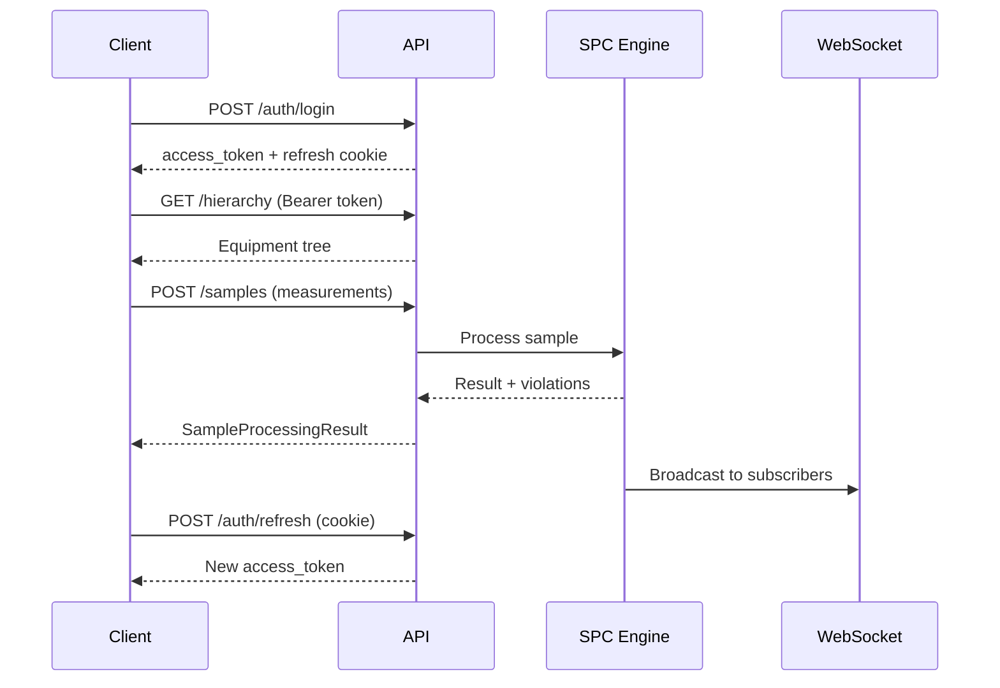

# API Reference

Complete REST API and WebSocket reference for OpenSPC v0.4.0.

---

## Overview

| Property | Value |
|----------|-------|
| **Base URL** | `http://localhost:8000/api/v1/` |
| **Authentication** | Bearer token in `Authorization` header |
| **Content type** | `application/json` |
| **Interactive docs** | Swagger UI at `/docs`, ReDoc at `/redoc` |

### Typical API Workflow



### Role Hierarchy

Endpoints require a minimum role. Roles are granted per-plant.

| Role | Level | Description |
|------|-------|-------------|
| `operator` | 1 | Submit samples, view data |
| `supervisor` | 2 | Acknowledge violations, manage annotations, exclude samples |
| `engineer` | 3 | Configure characteristics, limits, rules, brokers, tags, OPC-UA servers |
| `admin` | 4 | Manage users, plants, database, delete resources |

A higher role implicitly satisfies a lower-role requirement (e.g., an engineer can do everything a supervisor can).

---

## 1. Authentication

### `POST /auth/login`

Authenticate with username and password.

**Auth**: None

**Request body**:

| Field | Type | Required | Description |
|-------|------|----------|-------------|
| `username` | string | Yes | Username |
| `password` | string | Yes | Password |
| `remember_me` | boolean | No | Extend refresh token to 30 days (default: 7 days) |

**Response** (`LoginResponse`):

| Field | Type | Description |
|-------|------|-------------|
| `access_token` | string | JWT access token (15 min expiry) |
| `token_type` | string | Always `"bearer"` |
| `user` | object | User profile with plant roles |

**Side effects**: Sets `refresh_token` httpOnly cookie with `path=/api/v1/auth`.

---

### `POST /auth/refresh`

Rotate access and refresh tokens using the refresh cookie.

**Auth**: Refresh token cookie

**Request**: No body. The `refresh_token` cookie is sent automatically.

**Response** (`TokenResponse`):

| Field | Type | Description |
|-------|------|-------------|
| `access_token` | string | New JWT access token |
| `token_type` | string | Always `"bearer"` |

**Side effects**: Sets new `refresh_token` cookie, clears old one.

**Errors**: `401` if cookie is missing, expired, or user is inactive.

---

### `POST /auth/logout`

Clear the refresh token cookie.

**Auth**: None

**Response**: `{"message": "Logged out successfully"}`

---

### `GET /auth/me`

Get the current authenticated user with all plant roles.

**Auth**: JWT (any role)

**Response** (`UserWithRolesResponse`):

| Field | Type | Description |
|-------|------|-------------|
| `id` | integer | User ID |
| `username` | string | Username |
| `email` | string | Email (nullable) |
| `is_active` | boolean | Account status |
| `plant_roles` | array | `[{plant_id, plant_name, plant_code, role}]` |
| `created_at` | datetime | Account creation time |
| `updated_at` | datetime | Last update time |

---

### Token Details

| Property | Value |
|----------|-------|
| Algorithm | HS256 |
| Access token expiry | 15 minutes |
| Refresh token expiry | 7 days (30 days with `remember_me`) |
| Refresh cookie path | `/api/v1/auth` |
| Refresh cookie flags | `httpOnly`, `SameSite=Lax` |
| Token payload | `{"sub": "<username>", "exp": <timestamp>, "type": "access"|"refresh"}` |

---

## 2. Plants

### `GET /plants`

List all plants.

**Auth**: JWT (any role)

**Query parameters**:

| Parameter | Type | Default | Description |
|-----------|------|---------|-------------|
| `active_only` | boolean | `false` | Only return active plants |

**Response**: `PlantResponse[]`

| Field | Type | Description |
|-------|------|-------------|
| `id` | integer | Plant ID |
| `name` | string | Plant name |
| `code` | string | Unique short code (uppercased) |
| `is_active` | boolean | Active status |
| `settings` | object | Plant-specific settings (nullable) |
| `created_at` | datetime | Creation time |

---

### `POST /plants`

Create a new plant. Auto-assigns admin role for all existing admin users.

**Auth**: Admin

**Request body**:

| Field | Type | Required | Description |
|-------|------|----------|-------------|
| `name` | string | Yes | Plant name |
| `code` | string | Yes | Unique short code |
| `is_active` | boolean | No | Default `true` |
| `settings` | object | No | Plant-specific settings |

**Response**: `PlantResponse` (201 Created)

**Errors**: `409` if name or code already exists.

---

### `GET /plants/{plant_id}`

Get a plant by ID.

**Auth**: JWT (any role)

**Response**: `PlantResponse`

**Errors**: `404` if not found.

---

### `PUT /plants/{plant_id}`

Update a plant. Only provided fields are updated.

**Auth**: Admin

**Request body**: Same fields as create (all optional).

**Response**: `PlantResponse`

**Errors**: `404` if not found. `409` if name/code conflict.

---

### `DELETE /plants/{plant_id}`

Delete a plant. The DEFAULT plant cannot be deleted.

**Auth**: Admin

**Response**: 204 No Content

**Errors**: `400` if DEFAULT plant. `404` if not found.

---

## 3. Equipment Hierarchy

Hierarchy follows the ISA-95 equipment model. Node types: `Folder`, `Enterprise`, `Site`, `Area`, `Line`, `Cell`, `Equipment`, `Tag`.

### `GET /hierarchy`

Get the full hierarchy as a nested tree.

**Auth**: JWT (any role)

**Response**: `HierarchyTreeNode[]`

| Field | Type | Description |
|-------|------|-------------|
| `id` | integer | Node ID |
| `name` | string | Node name |
| `type` | string | ISA-95 type |
| `children` | array | Nested child nodes |
| `characteristic_count` | integer | Number of characteristics on this node |

---

### `POST /hierarchy`

Create a hierarchy node.

**Auth**: Engineer+

**Request body**:

| Field | Type | Required | Description |
|-------|------|----------|-------------|
| `name` | string | Yes | Node name |
| `type` | string | Yes | ISA-95 type |
| `parent_id` | integer | No | Parent node ID (null for root) |

**Response**: `HierarchyResponse` (201 Created)

**Errors**: `404` if parent not found. `422` if integrity constraint violated.

---

### `GET /hierarchy/{node_id}`

Get a single hierarchy node.

**Auth**: JWT (any role)

**Response**: `HierarchyResponse` -- `{id, parent_id, name, type}`

---

### `PATCH /hierarchy/{node_id}`

Update a hierarchy node (partial update).

**Auth**: Engineer+

**Request body**: `{name?, type?, parent_id?}`

**Response**: `HierarchyResponse`

---

### `DELETE /hierarchy/{node_id}`

Delete a leaf hierarchy node. Nodes with children cannot be deleted.

**Auth**: Engineer+

**Response**: 204 No Content

**Errors**: `404` if not found. `409` if node has children.

---

### `GET /hierarchy/{node_id}/characteristics`

List characteristics under a hierarchy node.

**Auth**: JWT (any role)

**Query parameters**:

| Parameter | Type | Default | Description |
|-----------|------|---------|-------------|
| `include_descendants` | boolean | `false` | Include characteristics from child nodes |

**Response**: `CharacteristicResponse[]`

---

### Plant-Scoped Hierarchy

These endpoints are identical in behavior but scoped to a specific plant.

| Method | Path | Description |
|--------|------|-------------|
| `GET` | `/plants/{plant_id}/hierarchies` | Get tree for a plant |
| `POST` | `/plants/{plant_id}/hierarchies` | Create node in a plant |

---

## 4. Characteristics

### Data Source Model (v0.4.0)

In v0.4.0, the previous `provider_type` and `mqtt_topic` fields on characteristics were replaced by a polymorphic **DataSource** model using joined-table inheritance. Characteristics now have an optional one-to-one `data_source` relationship:

- **No data source** (`data_source: null`): Manual data entry
- **MQTT data source** (`data_source.type: "mqtt"`): MQTT/SparkplugB tag mapping
- **OPC-UA data source** (`data_source.type: "opcua"`): OPC-UA node subscription

The `data_source` object is included in `CharacteristicResponse` and has the following base fields:

| Field | Type | Description |
|-------|------|-------------|
| `id` | integer | Data source ID |
| `type` | string | `"mqtt"` or `"opcua"` |
| `characteristic_id` | integer | Owning characteristic |
| `trigger_strategy` | string | `"on_change"`, `"on_trigger"`, or `"on_timer"` |
| `is_active` | boolean | Whether the data source is active |
| `created_at` | datetime | Creation time |
| `updated_at` | datetime | Last update time |

For MQTT data sources, additional fields are included:

| Field | Type | Description |
|-------|------|-------------|
| `broker_id` | integer | Associated broker ID (nullable) |
| `topic` | string | MQTT topic |
| `metric_name` | string | SparkplugB metric name (nullable) |
| `trigger_tag` | string | Trigger metric name (nullable) |
| `broker_name` | string | Broker display name (nullable) |

---

### `GET /characteristics`

List characteristics with filtering and pagination.

**Auth**: JWT (any role)

**Query parameters**:

| Parameter | Type | Default | Description |
|-----------|------|---------|-------------|
| `hierarchy_id` | integer | -- | Filter by hierarchy node |
| `provider_type` | string | -- | Filter by `MANUAL`, `MQTT`, or `TAG` |
| `plant_id` | integer | -- | Filter by plant |
| `in_control` | boolean | -- | Filter by control status of latest sample |
| `offset` | integer | `0` | Pagination offset |
| `limit` | integer | `100` | Items per page (max 1000) |
| `page` | integer | -- | Page number (1-indexed, alternative to offset) |
| `per_page` | integer | -- | Items per page (alternative to limit) |

**Response**: `PaginatedResponse<CharacteristicResponse>`

```json
{
  "items": [...],
  "total": 42,
  "offset": 0,
  "limit": 100
}
```

**`CharacteristicResponse` fields**:

| Field | Type | Description |
|-------|------|-------------|
| `id` | integer | Characteristic ID |
| `hierarchy_id` | integer | Parent hierarchy node |
| `name` | string | Characteristic name |
| `description` | string | Description (nullable) |
| `subgroup_size` | integer | Nominal subgroup size (default 1) |
| `target_value` | float | Nominal target (nullable) |
| `usl` | float | Upper spec limit (nullable) |
| `lsl` | float | Lower spec limit (nullable) |
| `ucl` | float | Upper control limit (nullable) |
| `lcl` | float | Lower control limit (nullable) |
| `data_source` | object | DataSource object (nullable, see above) |
| `subgroup_mode` | string | `NOMINAL_TOLERANCE`, `STANDARDIZED`, or `VARIABLE_LIMITS` |
| `min_measurements` | integer | Minimum measurements per sample |
| `warn_below_count` | integer | Warn threshold (nullable) |
| `stored_sigma` | float | Persisted process sigma (nullable) |
| `stored_center_line` | float | Persisted center line (nullable) |
| `decimal_precision` | integer | Display precision (default 3) |

---

### `POST /characteristics`

Create a characteristic. Auto-initializes all 8 Nelson rules (enabled). Data source (MQTT, OPC-UA) is configured separately via the tag mapping API.

**Auth**: Engineer+ (at the owning plant)

**Request body** (`CharacteristicCreate`):

| Field | Type | Required | Description |
|-------|------|----------|-------------|
| `hierarchy_id` | integer | Yes | Parent hierarchy node |
| `name` | string | Yes | Characteristic name (max 100 chars) |
| `description` | string | No | Description |
| `subgroup_size` | integer | No | Default 1 (max 25) |
| `target_value` | float | No | Nominal target |
| `usl` | float | No | Upper spec limit |
| `lsl` | float | No | Lower spec limit |
| `subgroup_mode` | string | No | Default `NOMINAL_TOLERANCE` |
| `min_measurements` | integer | No | Default 1 (must be <= subgroup_size) |
| `warn_below_count` | integer | No | Warn threshold (nullable) |
| `decimal_precision` | integer | No | Default 3 (0-10) |

**Response**: `CharacteristicResponse` (201 Created)

**Errors**: `404` if hierarchy node not found.

---

### `GET /characteristics/{char_id}`

Get characteristic details.

**Auth**: JWT (any role)

**Response**: `CharacteristicResponse`

---

### `PATCH /characteristics/{char_id}`

Update characteristic configuration (partial update).

**Auth**: Engineer+ (at the owning plant)

**Request body** (`CharacteristicUpdate`): Any of `{name?, description?, target_value?, usl?, lsl?, ucl?, lcl?, subgroup_mode?, min_measurements?, warn_below_count?, decimal_precision?}`

**Response**: `CharacteristicResponse`

---

### `DELETE /characteristics/{char_id}`

Delete a characteristic. Blocked if the characteristic has samples.

**Auth**: Engineer+ (at the owning plant)

**Response**: 204 No Content

**Errors**: `404` if not found. `409` if characteristic has samples.

---

### `GET /characteristics/{char_id}/chart-data`

Get SPC chart rendering data with samples, control limits, and zone boundaries.

**Auth**: JWT (any role)

**Query parameters**:

| Parameter | Type | Default | Description |
|-----------|------|---------|-------------|
| `limit` | integer | `100` | Number of recent samples (max 1000) |
| `start_date` | datetime | -- | Start date filter |
| `end_date` | datetime | -- | End date filter |

**Response** (`ChartDataResponse`):

| Field | Type | Description |
|-------|------|-------------|
| `characteristic_id` | integer | Characteristic ID |
| `characteristic_name` | string | Characteristic name |
| `data_points` | array | Array of `ChartSample` |
| `control_limits` | object | `{center_line, ucl, lcl}` |
| `spec_limits` | object | `{usl, lsl, target}` |
| `zone_boundaries` | object | `{plus_1_sigma, plus_2_sigma, plus_3_sigma, minus_*}` |
| `subgroup_mode` | string | Current subgroup mode |
| `nominal_subgroup_size` | integer | Configured subgroup size |
| `decimal_precision` | integer | Display precision |
| `stored_sigma` | float | Process sigma (nullable) |

Each `ChartSample`:

| Field | Type | Description |
|-------|------|-------------|
| `sample_id` | integer | Sample ID |
| `timestamp` | string | ISO 8601 timestamp |
| `mean` | float | Sample mean |
| `range` | float | Sample range (nullable) |
| `std_dev` | float | Sample std dev (nullable, n>=2) |
| `excluded` | boolean | Excluded from calculations |
| `violation_ids` | integer[] | Violation IDs on this sample |
| `violation_rules` | integer[] | Nelson rule IDs triggered |
| `zone` | string | Zone classification |
| `actual_n` | integer | Actual measurement count |
| `is_undersized` | boolean | Below nominal subgroup size |
| `effective_ucl` | float | Per-point UCL (VARIABLE_LIMITS mode, nullable) |
| `effective_lcl` | float | Per-point LCL (VARIABLE_LIMITS mode, nullable) |
| `z_score` | float | Z-score (STANDARDIZED mode, nullable) |
| `display_value` | float | Value to plot (z-score in STANDARDIZED mode) |

---

### `POST /characteristics/{char_id}/recalculate-limits`

Recalculate control limits from historical data.

**Auth**: Engineer+ (at the owning plant)

**Query parameters**:

| Parameter | Type | Default | Description |
|-----------|------|---------|-------------|
| `exclude_ooc` | boolean | `false` | Exclude out-of-control samples |
| `min_samples` | integer | `25` | Minimum samples required |
| `start_date` | datetime | -- | Baseline period start |
| `end_date` | datetime | -- | Baseline period end |
| `last_n` | integer | -- | Use only the most recent N samples |

**Response**:

```json
{
  "before": {"ucl": 10.5, "lcl": 9.5, "center_line": 10.0},
  "after": {"ucl": 10.3, "lcl": 9.7, "center_line": 10.0},
  "calculation": {
    "method": "moving_range",
    "sigma": 0.1,
    "sample_count": 100,
    "excluded_count": 3,
    "calculated_at": "2025-01-15T10:30:00Z"
  }
}
```

Method selection is automatic based on subgroup size:

| Subgroup Size | Method | Description |
|---------------|--------|-------------|
| n = 1 | `moving_range` | Individual measurements |
| 2 <= n <= 10 | `r_bar_d2` | Range-based |
| n > 10 | `s_bar_c4` | Standard deviation-based |

---

### `POST /characteristics/{char_id}/set-limits`

Manually set control limits from an external capability study.

**Auth**: Engineer+ (at the owning plant)

**Request body** (`SetLimitsRequest`):

| Field | Type | Required | Description |
|-------|------|----------|-------------|
| `ucl` | float | Yes | Upper control limit |
| `lcl` | float | Yes | Lower control limit |
| `center_line` | float | Yes | Center line |
| `sigma` | float | Yes | Process sigma (must be > 0) |

**Validation**: UCL must be greater than LCL. Center line must be between LCL and UCL.

**Response**: `ControlLimitsResponse` with before/after values.

---

### `GET /characteristics/{char_id}/rules`

Get Nelson rule configuration for a characteristic.

**Auth**: JWT (any role)

**Response**: `NelsonRuleConfig[]`

| Field | Type | Description |
|-------|------|-------------|
| `rule_id` | integer | Rule number (1-8) |
| `is_enabled` | boolean | Whether rule is active |
| `require_acknowledgement` | boolean | Violations require ack |

---

### `PUT /characteristics/{char_id}/rules`

Replace Nelson rule configuration.

**Auth**: Engineer+

**Request body**: `NelsonRuleConfig[]` (same schema as response)

**Response**: Updated `NelsonRuleConfig[]`

**Errors**: `400` if rule_id is not 1-8.

---

### `POST /characteristics/{char_id}/change-mode`

Change subgroup mode with historical sample migration.

**Auth**: Engineer+ (at the owning plant)

**Request body**:

| Field | Type | Required | Description |
|-------|------|----------|-------------|
| `new_mode` | string | Yes | `NOMINAL_TOLERANCE`, `STANDARDIZED`, or `VARIABLE_LIMITS` |

**Response**: `{previous_mode, new_mode, samples_migrated, characteristic}`

**Errors**: `400` if `stored_sigma`/`stored_center_line` not set (required for STANDARDIZED and VARIABLE_LIMITS when samples exist).

---

### Characteristic Configuration

Configuration is polymorphic: `ManualConfig` or `TagConfig` based on the characteristic's data source.

### `GET /characteristics/{char_id}/config`

Get characteristic configuration.

**Auth**: JWT (any role)

**Response**: `CharacteristicConfigResponse` or `null`

---

### `PUT /characteristics/{char_id}/config`

Create or update characteristic configuration.

**Auth**: Engineer+

**Request body**: `{config: ManualConfig | TagConfig}`

**Response**: `CharacteristicConfigResponse`

**Errors**: `400` if `config_type` does not match the characteristic's data source (manual characteristics require `ManualConfig`, data-source characteristics require `TagConfig`).

---

### `DELETE /characteristics/{char_id}/config`

Delete characteristic configuration.

**Auth**: Engineer+

**Response**: 204 No Content

---

## 5. Samples

### `GET /samples`

List samples with filtering and pagination.

**Auth**: JWT (any role)

**Query parameters**:

| Parameter | Type | Default | Description |
|-----------|------|---------|-------------|
| `characteristic_id` | integer | -- | Filter by characteristic |
| `start_date` | datetime | -- | Start date (inclusive) |
| `end_date` | datetime | -- | End date (inclusive) |
| `include_excluded` | boolean | `false` | Include excluded samples |
| `offset` | integer | `0` | Pagination offset |
| `limit` | integer | `100` | Items per page (max 1000) |
| `sort_dir` | string | `desc` | Sort by timestamp: `asc` or `desc` |

**Response**: `PaginatedResponse<SampleResponse>`

**`SampleResponse` fields**:

| Field | Type | Description |
|-------|------|-------------|
| `id` | integer | Sample ID |
| `char_id` | integer | Characteristic ID |
| `timestamp` | datetime | Collection time |
| `batch_number` | string | Production batch (nullable) |
| `operator_id` | string | Operator (nullable) |
| `is_excluded` | boolean | Excluded from calculations |
| `measurements` | float[] | Individual measurement values |
| `mean` | float | Sample mean |
| `range_value` | float | Sample range (nullable) |
| `actual_n` | integer | Actual measurement count |
| `is_undersized` | boolean | Below nominal subgroup size |
| `z_score` | float | Z-score (STANDARDIZED mode, nullable) |
| `is_modified` | boolean | Has been edited |
| `edit_count` | integer | Number of edits |

---

### `POST /samples`

Submit a sample for SPC processing. Runs through the full SPC engine pipeline.

**Auth**: Operator+ (at the owning plant)

**Request body** (`SampleCreate`):

| Field | Type | Required | Description |
|-------|------|----------|-------------|
| `characteristic_id` | integer | Yes | Target characteristic |
| `measurements` | float[] | Yes | Measurement values |
| `batch_number` | string | No | Production batch reference |
| `operator_id` | string | No | Operator identifier |

**Response** (`SampleProcessingResult`, 201 Created):

| Field | Type | Description |
|-------|------|-------------|
| `sample_id` | integer | Created sample ID |
| `timestamp` | datetime | Sample timestamp |
| `mean` | float | Sample mean |
| `range_value` | float | Sample range (nullable) |
| `zone` | string | Zone classification |
| `in_control` | boolean | No violations triggered |
| `violations` | array | `[{violation_id, rule_id, rule_name, severity}]` |
| `processing_time_ms` | float | Processing duration |

---

### `GET /samples/{sample_id}`

Get a sample with measurements and statistics.

**Auth**: JWT (any role)

**Response**: `SampleResponse`

---

### `PUT /samples/{sample_id}`

Update sample measurements. Re-evaluates Nelson rules and creates an audit trail.

**Auth**: Supervisor+ (at the owning plant)

**Request body** (`SampleUpdate`):

| Field | Type | Required | Description |
|-------|------|----------|-------------|
| `measurements` | float[] | Yes | New measurement values |
| `reason` | string | No | Edit justification |

**Response**: `SampleProcessingResult`

---

### `PATCH /samples/{sample_id}/exclude`

Toggle sample exclusion from calculations.

**Auth**: Supervisor+ (at the owning plant)

**Request body**: `{is_excluded: boolean}`

**Response**: `SampleResponse`

---

### `DELETE /samples/{sample_id}`

Permanently delete a sample and its measurements.

**Auth**: Supervisor+ (at the owning plant)

**Response**: 204 No Content

---

### `GET /samples/{sample_id}/history`

Get edit history for a sample.

**Auth**: JWT (any role)

**Response**: `SampleEditHistoryResponse[]`

| Field | Type | Description |
|-------|------|-------------|
| `id` | integer | History entry ID |
| `sample_id` | integer | Sample ID |
| `edited_at` | datetime | When the edit occurred |
| `edited_by` | string | Username of editor |
| `reason` | string | Edit reason (nullable) |
| `previous_values` | float[] | Measurements before edit |
| `new_values` | float[] | Measurements after edit |
| `previous_mean` | float | Mean before edit |
| `new_mean` | float | Mean after edit |

---

### `POST /samples/batch`

Batch import samples for historical data migration.

**Auth**: Operator+ (at the owning plant)

**Request body**:

| Field | Type | Required | Description |
|-------|------|----------|-------------|
| `characteristic_id` | integer | Yes | Target characteristic |
| `samples` | array | Yes | `[{measurements, batch_number?, operator_id?}]` (max 1000) |
| `skip_rule_evaluation` | boolean | No | Skip Nelson rules for performance |

**Response** (`BatchImportResult`):

| Field | Type | Description |
|-------|------|-------------|
| `total` | integer | Total samples submitted |
| `imported` | integer | Successfully processed |
| `failed` | integer | Failed count |
| `errors` | string[] | Error messages for failures |

---

## 6. Data Entry (External Systems)

These endpoints support dual authentication: JWT Bearer token or API key via `X-API-Key` header.

### `POST /data-entry/submit`

Submit a single sample from an external system.

**Auth**: JWT or API Key

**Request body** (`DataEntryRequest`):

| Field | Type | Required | Description |
|-------|------|----------|-------------|
| `characteristic_id` | integer | Yes | Target characteristic |
| `measurements` | float[] | Yes | Measurement values |
| `batch_number` | string | No | Batch reference |
| `operator_id` | string | No | Operator identifier |
| `metadata` | object | No | Arbitrary metadata |

**Response** (`DataEntryResponse`, 201 Created):

| Field | Type | Description |
|-------|------|-------------|
| `sample_id` | integer | Created sample ID |
| `characteristic_id` | integer | Characteristic ID |
| `timestamp` | datetime | Sample timestamp |
| `mean` | float | Sample mean |
| `zone` | string | Zone classification |
| `in_control` | boolean | No violations |
| `violations` | array | `[{rule_id, rule_name, severity}]` |

**Errors**: `403` if API key lacks permission for the characteristic.

---

### `POST /data-entry/batch`

Submit multiple samples in a single request. Each sample is processed independently.

**Auth**: JWT or API Key

**Request body**: `{samples: DataEntryRequest[]}`

**Response** (`BatchEntryResponse`, 201 Created):

| Field | Type | Description |
|-------|------|-------------|
| `total` | integer | Total submitted |
| `successful` | integer | Successfully processed |
| `failed` | integer | Failed count |
| `results` | array | `DataEntryResponse[]` for successes |
| `errors` | string[] | Error messages for failures |

---

### `GET /data-entry/schema`

Get the expected request/response JSON schemas for integration discovery.

**Auth**: None (public endpoint)

**Response**: JSON schema definitions for single and batch endpoints plus authentication info.

---

## 7. Violations

### `GET /violations`

List violations with filtering and pagination.

**Auth**: JWT (any role)

**Query parameters**:

| Parameter | Type | Default | Description |
|-----------|------|---------|-------------|
| `characteristic_id` | integer | -- | Filter by characteristic |
| `sample_id` | integer | -- | Filter by sample |
| `acknowledged` | boolean | -- | Filter by ack status |
| `severity` | string | -- | `WARNING` or `CRITICAL` |
| `rule_id` | integer | -- | Nelson rule number (1-8) |
| `start_date` | datetime | -- | Start date filter |
| `end_date` | datetime | -- | End date filter |
| `offset` | integer | `0` | Pagination offset |
| `limit` | integer | `100` | Items per page |

**Response**: `PaginatedResponse<ViolationResponse>`

**`ViolationResponse` fields**:

| Field | Type | Description |
|-------|------|-------------|
| `id` | integer | Violation ID |
| `sample_id` | integer | Associated sample |
| `rule_id` | integer | Nelson rule number (1-8) |
| `rule_name` | string | Human-readable rule name |
| `severity` | string | `WARNING` or `CRITICAL` |
| `acknowledged` | boolean | Has been acknowledged |
| `requires_acknowledgement` | boolean | Must be acknowledged |
| `ack_user` | string | Who acknowledged (nullable) |
| `ack_reason` | string | Acknowledgment reason (nullable) |
| `ack_timestamp` | datetime | When acknowledged (nullable) |
| `created_at` | datetime | When violation was detected |
| `characteristic_id` | integer | Characteristic ID |
| `characteristic_name` | string | Characteristic name |
| `hierarchy_path` | string | Full path like "Plant > Area > Line" |

---

### `GET /violations/stats`

Get aggregated violation statistics.

**Auth**: JWT (any role)

**Query parameters**:

| Parameter | Type | Description |
|-----------|------|-------------|
| `characteristic_id` | integer | Optional filter |
| `start_date` | datetime | Optional start date |
| `end_date` | datetime | Optional end date |

**Response** (`ViolationStats`):

```json
{
  "total": 15,
  "unacknowledged": 3,
  "informational": 2,
  "by_rule": {"1": 5, "2": 3, "3": 7},
  "by_severity": {"WARNING": 10, "CRITICAL": 5}
}
```

---

### `GET /violations/reason-codes`

Get standard acknowledgment reason codes.

**Auth**: JWT (any role)

**Response**: `string[]`

```json
[
  "Tool Change", "Raw Material Change", "Setup Adjustment",
  "Measurement Error", "Process Adjustment", "Environmental Factor",
  "Operator Error", "Equipment Malfunction", "False Alarm",
  "Under Investigation", "Other"
]
```

---

### `GET /violations/{violation_id}`

Get violation details.

**Auth**: JWT (any role)

**Response**: `ViolationResponse`

---

### `POST /violations/{violation_id}/acknowledge`

Acknowledge a violation.

**Auth**: Supervisor+ (at the owning plant)

**Request body** (`ViolationAcknowledge`):

| Field | Type | Required | Description |
|-------|------|----------|-------------|
| `user` | string | Yes | Acknowledging user |
| `reason` | string | No | Reason code or free text |
| `exclude_sample` | boolean | No | Also exclude the associated sample |

**Response**: Updated `ViolationResponse`

**Errors**: `404` if not found. `409` if already acknowledged.

---

### `POST /violations/batch-acknowledge`

Acknowledge multiple violations at once.

**Auth**: Supervisor+

**Request body** (`BatchAcknowledgeRequest`):

| Field | Type | Required | Description |
|-------|------|----------|-------------|
| `violation_ids` | integer[] | Yes | Violation IDs to acknowledge |
| `user` | string | Yes | Acknowledging user |
| `reason` | string | No | Reason code |
| `exclude_sample` | boolean | No | Exclude associated samples |

**Response** (`BatchAcknowledgeResult`):

| Field | Type | Description |
|-------|------|-------------|
| `total` | integer | Total attempted |
| `successful` | integer | Successfully acknowledged |
| `failed` | integer | Failed count |
| `results` | array | `[{violation_id, success, error}]` |
| `acknowledged` | integer[] | IDs that were acknowledged |
| `errors` | object | `{violation_id: error_message}` |

---

## 8. Annotations

Annotations are scoped under characteristics. Two types: `point` (linked to a sample) and `period` (time range).

### `GET /characteristics/{char_id}/annotations`

List annotations for a characteristic.

**Auth**: JWT (any role)

**Query parameters**:

| Parameter | Type | Description |
|-----------|------|-------------|
| `annotation_type` | string | Filter by `point` or `period` |

**Response**: `AnnotationResponse[]`

| Field | Type | Description |
|-------|------|-------------|
| `id` | integer | Annotation ID |
| `characteristic_id` | integer | Parent characteristic |
| `annotation_type` | string | `point` or `period` |
| `text` | string | Annotation content |
| `color` | string | Display color (nullable) |
| `sample_id` | integer | Linked sample (point type, nullable) |
| `start_time` | datetime | Period start (nullable) |
| `end_time` | datetime | Period end (nullable) |
| `created_by` | string | Username |
| `created_at` | datetime | Creation time |

---

### `POST /characteristics/{char_id}/annotations`

Create an annotation. Point annotations use upsert semantics -- one annotation per sample.

**Auth**: Supervisor+

**Request body** (`AnnotationCreate`):

| Field | Type | Required | Description |
|-------|------|----------|-------------|
| `annotation_type` | string | Yes | `point` or `period` |
| `text` | string | Yes | Annotation content |
| `color` | string | No | Display color |
| `sample_id` | integer | No | For point annotations |
| `start_time` | datetime | No | For period annotations |
| `end_time` | datetime | No | For period annotations |

**Response**: `AnnotationResponse` (201 Created)

**Notes**: If a point annotation already exists for the same sample, its text is updated and the previous text is saved to `AnnotationHistory`.

---

### `PUT /characteristics/{char_id}/annotations/{annotation_id}`

Update an annotation's text or color. Text changes are tracked in history.

**Auth**: Supervisor+

**Request body**: `{text?, color?}`

**Response**: `AnnotationResponse`

---

### `DELETE /characteristics/{char_id}/annotations/{annotation_id}`

Delete an annotation.

**Auth**: Supervisor+

**Response**: 204 No Content

---

## 9. Users

All user management endpoints require **Admin** role.

### `GET /users`

List users with optional search.

**Auth**: Admin

**Query parameters**:

| Parameter | Type | Default | Description |
|-----------|------|---------|-------------|
| `search` | string | -- | Search by username or email |
| `active_only` | boolean | `false` | Only active users |

**Response**: `UserWithRolesResponse[]`

---

### `POST /users`

Create a new user.

**Auth**: Admin

**Request body** (`UserCreate`):

| Field | Type | Required | Description |
|-------|------|----------|-------------|
| `username` | string | Yes | Unique username |
| `email` | string | No | Email address |
| `password` | string | Yes | Password (hashed with argon2id) |

**Response**: `UserResponse` (201 Created)

**Errors**: `409` if username or email already exists.

---

### `GET /users/{user_id}`

Get a user by ID with plant roles.

**Auth**: Admin

**Response**: `UserWithRolesResponse`

---

### `PATCH /users/{user_id}`

Update a user. Supports partial updates.

**Auth**: Admin

**Request body** (`UserUpdate`): `{username?, email?, password?}`

**Response**: `UserResponse`

---

### `DELETE /users/{user_id}`

Soft-deactivate a user. Cannot deactivate yourself.

**Auth**: Admin

**Response**: 204 No Content

---

### `DELETE /users/{user_id}/permanent`

Permanently delete a deactivated user. User must be deactivated first. Cannot delete yourself.

**Auth**: Admin

**Response**: 204 No Content

**Errors**: `400` if user is still active or deleting self.

---

### `POST /users/{user_id}/roles`

Assign or update a user's role at a plant.

**Auth**: Admin

**Request body** (`PlantRoleAssign`):

| Field | Type | Required | Description |
|-------|------|----------|-------------|
| `plant_id` | integer | Yes | Plant to assign role for |
| `role` | string | Yes | `operator`, `supervisor`, `engineer`, or `admin` |

**Response**: `UserWithRolesResponse`

---

### `DELETE /users/{user_id}/roles/{plant_id}`

Remove a user's role at a plant. Cannot remove your own admin role.

**Auth**: Admin

**Response**: 204 No Content

---

## 10. MQTT Brokers

### `GET /brokers`

List MQTT broker configurations.

**Auth**: JWT (any role)

**Query parameters**:

| Parameter | Type | Default | Description |
|-----------|------|---------|-------------|
| `active_only` | boolean | `false` | Only active brokers |
| `plant_id` | integer | -- | Filter by plant |
| `offset` | integer | `0` | Pagination offset |
| `limit` | integer | `100` | Items per page |

**Response**: `PaginatedResponse<BrokerResponse>`

**`BrokerResponse` fields**:

| Field | Type | Description |
|-------|------|-------------|
| `id` | integer | Broker ID |
| `plant_id` | integer | Owning plant |
| `name` | string | Broker name (unique) |
| `host` | string | Hostname or IP |
| `port` | integer | MQTT port (default 1883) |
| `username` | string | MQTT username (nullable) |
| `client_id` | string | Client ID (nullable) |
| `keepalive` | integer | Keepalive seconds |
| `use_tls` | boolean | TLS enabled |
| `is_active` | boolean | Is the active broker |
| `payload_format` | string | `json` or `sparkplugb` |

Note: Passwords are never returned in responses.

---

### `POST /brokers`

Create a new MQTT broker configuration.

**Auth**: Engineer+

**Request body** (`BrokerCreate`):

| Field | Type | Required | Description |
|-------|------|----------|-------------|
| `plant_id` | integer | Yes | Owning plant |
| `name` | string | Yes | Unique name |
| `host` | string | Yes | Hostname or IP |
| `port` | integer | No | Default 1883 |
| `username` | string | No | MQTT auth |
| `password` | string | No | MQTT auth |
| `client_id` | string | No | Client identifier |
| `keepalive` | integer | No | Default 60 |
| `use_tls` | boolean | No | Default false |
| `payload_format` | string | No | `json` (default) or `sparkplugb` |

**Response**: `BrokerResponse` (201 Created)

**Errors**: `409` if name already exists.

---

### `GET /brokers/all/status`

Get connection status of all configured brokers.

**Auth**: JWT (any role)

**Query parameters**: `plant_id` (optional filter)

**Response** (`BrokerAllStatesResponse`):

```json
{
  "states": [
    {
      "broker_id": 1,
      "broker_name": "Production MQTT",
      "is_connected": true,
      "last_connected": "2025-01-15T10:00:00Z",
      "error_message": null,
      "subscribed_topics": ["sensors/temp", "sensors/pressure"]
    }
  ]
}
```

---

### `GET /brokers/current/status`

Get status of the currently connected broker.

**Auth**: JWT (any role)

**Response**: `BrokerConnectionStatus`

---

### `POST /brokers/disconnect`

Disconnect from the current MQTT broker.

**Auth**: Engineer+

**Response**: `{"message": "Disconnected from MQTT broker"}`

---

### `POST /brokers/test`

Test connection to an MQTT broker without persisting configuration.

**Auth**: Engineer+

**Request body** (`BrokerTestRequest`):

| Field | Type | Required | Description |
|-------|------|----------|-------------|
| `host` | string | Yes | Hostname |
| `port` | integer | Yes | Port |
| `username` | string | No | MQTT auth |
| `password` | string | No | MQTT auth |

**Response** (`BrokerTestResponse`):

| Field | Type | Description |
|-------|------|-------------|
| `success` | boolean | Connection succeeded |
| `message` | string | Status message |
| `latency_ms` | float | Connection latency (nullable) |

---

### `GET /brokers/{broker_id}`

Get broker configuration by ID.

**Auth**: JWT (any role)

**Response**: `BrokerResponse`

---

### `PATCH /brokers/{broker_id}`

Update broker configuration (partial update).

**Auth**: Engineer+

**Response**: `BrokerResponse`

---

### `DELETE /brokers/{broker_id}`

Delete a broker configuration.

**Auth**: Admin

**Response**: 204 No Content

---

### `POST /brokers/{broker_id}/activate`

Set a broker as the active connection. Deactivates other brokers.

**Auth**: Engineer+

**Response**: `BrokerResponse`

---

### `GET /brokers/{broker_id}/status`

Get connection status for a specific broker.

**Auth**: JWT (any role)

**Response**: `BrokerConnectionStatus`

---

### `POST /brokers/{broker_id}/connect`

Connect to a specific broker (disconnects from current if any).

**Auth**: Engineer+

**Response**: `BrokerConnectionStatus`

---

### `POST /brokers/{broker_id}/discover`

Start topic discovery (subscribes to wildcard `#`).

**Auth**: Engineer+

**Response**: `{"message": "Discovery started on broker ..."}` (202 Accepted)

**Errors**: `400` if broker is not connected.

---

### `DELETE /brokers/{broker_id}/discover`

Stop topic discovery.

**Auth**: Engineer+

**Response**: `{"message": "Discovery stopped on broker ..."}`

---

### `GET /brokers/{broker_id}/topics`

Get discovered topics.

**Auth**: Engineer+

**Query parameters**:

| Parameter | Type | Default | Description |
|-----------|------|---------|-------------|
| `format` | string | `flat` | `flat` (list) or `tree` (hierarchical) |
| `search` | string | -- | Filter topics by substring |

**Response (flat)**: `DiscoveredTopicResponse[]`

| Field | Type | Description |
|-------|------|-------------|
| `topic` | string | MQTT topic path |
| `message_count` | integer | Messages received |
| `last_seen` | datetime | Last message time |
| `is_sparkplug` | boolean | SparkplugB topic |
| `sparkplug_group` | string | SparkplugB group (nullable) |
| `sparkplug_node` | string | SparkplugB node (nullable) |
| `sparkplug_metrics` | array | `[{name, data_type}]` |

**Response (tree)**: `TopicTreeNodeResponse` -- hierarchical tree grouped by `/` separators.

---

## 11. Tags

### `GET /tags/mappings`

List all MQTT tag-to-characteristic mappings.

**Auth**: Engineer+

**Query parameters**:

| Parameter | Type | Description |
|-----------|------|-------------|
| `plant_id` | integer | Filter by plant |
| `broker_id` | integer | Filter by broker |

**Response**: `TagMappingResponse[]`

| Field | Type | Description |
|-------|------|-------------|
| `data_source_id` | integer | DataSource ID |
| `characteristic_id` | integer | Mapped characteristic |
| `characteristic_name` | string | Characteristic name |
| `mqtt_topic` | string | Subscribed topic |
| `trigger_strategy` | string | `on_change`, `on_trigger`, or `on_timer` |
| `trigger_tag` | string | Trigger metric name (nullable) |
| `broker_id` | integer | Associated broker (nullable) |
| `broker_name` | string | Broker name (nullable) |
| `metric_name` | string | SparkplugB metric (nullable) |
| `is_active` | boolean | Whether the mapping is active |

---

### `POST /tags/map`

Create or update a tag-to-characteristic mapping. Creates a DataSource + MQTTDataSource for the characteristic. If a data source already exists, it is replaced. Refreshes TAG provider subscriptions.

**Auth**: Engineer+

**Request body** (`TagMappingCreate`):

| Field | Type | Required | Description |
|-------|------|----------|-------------|
| `characteristic_id` | integer | Yes | Target characteristic |
| `broker_id` | integer | Yes | Broker to use |
| `mqtt_topic` | string | Yes | Topic to subscribe to (max 500 chars) |
| `trigger_strategy` | string | No | `on_change` (default), `on_trigger`, or `on_timer` |
| `trigger_tag` | string | No | SparkplugB trigger metric (max 500 chars) |
| `metric_name` | string | No | SparkplugB metric to extract (max 255 chars) |

**Response**: `TagMappingResponse`

**Errors**: `404` if characteristic or broker not found.

---

### `DELETE /tags/map/{characteristic_id}`

Remove a tag mapping from a characteristic. Deletes the DataSource row (cascades to MQTTDataSource) and refreshes subscriptions.

**Auth**: Engineer+

**Response**: 204 No Content

**Errors**: `404` if no data source mapping exists.

---

### `POST /tags/preview`

Preview live values on an MQTT topic. Subscribes temporarily and collects values.

**Auth**: Engineer+

**Request body** (`TagPreviewRequest`):

| Field | Type | Required | Description |
|-------|------|----------|-------------|
| `broker_id` | integer | Yes | Connected broker |
| `topic` | string | Yes | Topic to preview (max 500 chars) |
| `duration_seconds` | float | No | Collection duration (1-30s, default 5s) |

**Response** (`TagPreviewResponse`):

| Field | Type | Description |
|-------|------|-------------|
| `topic` | string | Previewed topic |
| `values` | array | `[{value, timestamp, raw_payload, metric_name?}]` |
| `sample_count` | integer | Number of values collected |
| `started_at` | datetime | Preview start time |
| `duration_seconds` | float | Actual duration |

**Errors**: `400` if broker is not connected.

---

## 12. API Keys

Key format: `openspc_{base64url_32_bytes}`. The full key is only returned once at creation.

### `GET /api-keys`

List all API keys (without exposing actual keys).

**Auth**: Engineer+

**Response**: `APIKeyResponse[]`

| Field | Type | Description |
|-------|------|-------------|
| `id` | string | UUID |
| `name` | string | Human-readable label |
| `created_at` | datetime | Creation time |
| `expires_at` | datetime | Expiry (nullable) |
| `rate_limit_per_minute` | integer | Rate limit |
| `is_active` | boolean | Active status |
| `last_used_at` | datetime | Last usage time (nullable) |

---

### `POST /api-keys`

Create a new API key. The key is returned **only once** -- store it securely.

**Auth**: Engineer+

**Request body** (`APIKeyCreate`):

| Field | Type | Required | Description |
|-------|------|----------|-------------|
| `name` | string | Yes | Label (1-255 chars) |
| `expires_at` | datetime | No | Optional expiration |
| `rate_limit_per_minute` | integer | No | Default 60 (max 1000) |

**Response** (`APIKeyCreateResponse`, 201 Created):

| Field | Type | Description |
|-------|------|-------------|
| `id` | string | UUID |
| `name` | string | Label |
| `key` | string | Full API key (only shown once) |
| `created_at` | datetime | Creation time |
| `expires_at` | datetime | Expiry (nullable) |
| `rate_limit_per_minute` | integer | Rate limit |
| `is_active` | boolean | Active status |

---

### `GET /api-keys/{key_id}`

Get API key details by ID.

**Auth**: Engineer+

**Response**: `APIKeyResponse`

---

### `PATCH /api-keys/{key_id}`

Update API key settings.

**Auth**: Engineer+

**Request body**: `{name?, is_active?, rate_limit_per_minute?}`

**Response**: `APIKeyResponse`

---

### `DELETE /api-keys/{key_id}`

Permanently delete an API key.

**Auth**: Admin

**Response**: 204 No Content

---

### `POST /api-keys/{key_id}/revoke`

Revoke an API key (set `is_active=false`) without deleting it.

**Auth**: Admin

**Response**: `APIKeyResponse`

---

## 13. Providers

### `GET /providers/status`

Get combined MQTT and TAG provider status.

**Auth**: JWT (any role)

**Response** (`ProviderStatusResponse`):

```json
{
  "mqtt": {
    "is_connected": true,
    "broker_id": 1,
    "broker_name": "Production",
    "last_connected": "2025-01-15T10:00:00Z",
    "error_message": null,
    "subscribed_topics": ["sensors/+"]
  },
  "tag_provider": {
    "is_running": true,
    "subscribed_topics": ["sensors/temp"],
    "characteristics_count": 5,
    "samples_processed": 1234,
    "last_sample_time": "2025-01-15T10:30:00Z",
    "error_message": null
  }
}
```

---

### `POST /providers/tag/restart`

Restart the TAG provider with fresh configuration.

**Auth**: Engineer+

**Response**: `TagProviderStatusResponse`

**Errors**: `503` if MQTT is not connected.

---

### `POST /providers/tag/refresh`

Refresh TAG provider subscriptions based on current characteristic mappings.

**Auth**: Engineer+

**Response**: `{"message": "Refreshed subscriptions for N characteristics", "characteristics_count": N}`

**Errors**: `503` if TAG provider is not running.

---

## 14. OPC-UA Servers

OPC-UA server configuration and connection management endpoints. Credentials are encrypted at rest using the same encryption key as database credentials (`.db_encryption_key`). Passwords are never returned in responses.

### `GET /opcua-servers`

List OPC-UA server configurations with optional filtering.

**Auth**: JWT (any role)

**Query parameters**:

| Parameter | Type | Default | Description |
|-----------|------|---------|-------------|
| `active_only` | boolean | `false` | Only return active servers |
| `plant_id` | integer | -- | Filter by plant |
| `offset` | integer | `0` | Pagination offset |
| `limit` | integer | `100` | Items per page (max 1000) |

**Response**: `PaginatedResponse<OPCUAServerResponse>`

**`OPCUAServerResponse` fields**:

| Field | Type | Description |
|-------|------|-------------|
| `id` | integer | Server ID |
| `name` | string | Server name (unique) |
| `endpoint_url` | string | OPC-UA endpoint (e.g. `opc.tcp://host:4840`) |
| `auth_mode` | string | `anonymous` or `username_password` |
| `username` | string | Username (nullable, encrypted at rest) |
| `security_policy` | string | `None` or `Basic256Sha256` |
| `security_mode` | string | `None`, `Sign`, or `SignAndEncrypt` |
| `is_active` | boolean | Active status |
| `session_timeout` | integer | Session timeout in ms (default 30000) |
| `publishing_interval` | integer | Subscription publish interval in ms (default 1000) |
| `sampling_interval` | integer | Monitored item sampling interval in ms (default 250) |
| `plant_id` | integer | Owning plant (nullable) |
| `created_at` | datetime | Creation time |
| `updated_at` | datetime | Last update time |

Note: Passwords are never returned in responses.

---

### `POST /opcua-servers`

Create a new OPC-UA server configuration. Validates name uniqueness and encrypts credentials.

**Auth**: Engineer+

**Request body** (`OPCUAServerCreate`):

| Field | Type | Required | Description |
|-------|------|----------|-------------|
| `name` | string | Yes | Server name (1-100 chars) |
| `endpoint_url` | string | Yes | Must start with `opc.tcp://` (max 500 chars) |
| `auth_mode` | string | No | `anonymous` (default) or `username_password` |
| `username` | string | No | Username (max 255 chars) |
| `password` | string | No | Password (max 255 chars) |
| `security_policy` | string | No | `None` (default) or `Basic256Sha256` |
| `security_mode` | string | No | `None` (default), `Sign`, or `SignAndEncrypt` |
| `is_active` | boolean | No | Default `true` |
| `session_timeout` | integer | No | Default 30000 (1000-300000 ms) |
| `publishing_interval` | integer | No | Default 1000 (50-60000 ms) |
| `sampling_interval` | integer | No | Default 250 (10-60000 ms) |
| `plant_id` | integer | No | Owning plant |

**Response**: `OPCUAServerResponse` (201 Created)

**Errors**: `409` if name already exists.

---

### `POST /opcua-servers/test`

Test connection to an OPC-UA server without persisting configuration.

**Auth**: Engineer+

**Request body** (`OPCUAServerTestRequest`):

| Field | Type | Required | Description |
|-------|------|----------|-------------|
| `endpoint_url` | string | Yes | Must start with `opc.tcp://` |
| `auth_mode` | string | No | `anonymous` (default) or `username_password` |
| `username` | string | No | Username |
| `password` | string | No | Password |
| `timeout` | float | No | Connection timeout in seconds (1-30, default 5) |

**Response** (`OPCUAServerTestResponse`):

| Field | Type | Description |
|-------|------|-------------|
| `success` | boolean | Connection succeeded |
| `message` | string | Status message |
| `latency_ms` | float | Connection latency (nullable) |
| `server_name` | string | OPC-UA server display name (nullable) |

---

### `GET /opcua-servers/all/status`

Get connection status of all configured OPC-UA servers.

**Auth**: JWT (any role)

**Query parameters**: `plant_id` (optional filter)

**Response** (`OPCUAAllStatesResponse`):

```json
{
  "states": [
    {
      "server_id": 1,
      "server_name": "Production OPC-UA",
      "endpoint_url": "opc.tcp://192.168.1.100:4840",
      "is_connected": true,
      "last_connected": "2025-01-15T10:00:00Z",
      "error_message": null,
      "monitored_nodes": ["ns=2;i=1234", "ns=2;i=1235"]
    }
  ]
}
```

---

### `GET /opcua-servers/{server_id}`

Get OPC-UA server configuration by ID.

**Auth**: JWT (any role)

**Response**: `OPCUAServerResponse`

**Errors**: `404` if not found.

---

### `PATCH /opcua-servers/{server_id}`

Update OPC-UA server configuration (partial update). Encrypts credentials if provided.

**Auth**: Engineer+

**Request body** (`OPCUAServerUpdate`): Any of the create fields (all optional).

**Response**: `OPCUAServerResponse`

**Errors**: `404` if not found. `409` if name conflict.

---

### `DELETE /opcua-servers/{server_id}`

Delete OPC-UA server configuration. Disconnects the server if currently connected.

**Auth**: Admin

**Response**: 204 No Content

**Errors**: `404` if not found.

---

### `POST /opcua-servers/{server_id}/connect`

Connect to a specific OPC-UA server.

**Auth**: Engineer+

**Response**: `OPCUAServerConnectionStatus`

| Field | Type | Description |
|-------|------|-------------|
| `server_id` | integer | Server ID |
| `server_name` | string | Server name |
| `endpoint_url` | string | OPC-UA endpoint |
| `is_connected` | boolean | Connection status |
| `last_connected` | datetime | Last successful connection (nullable) |
| `error_message` | string | Error details (nullable) |
| `monitored_nodes` | string[] | Currently monitored node IDs |

**Errors**: `404` if not found.

---

### `POST /opcua-servers/{server_id}/disconnect`

Disconnect from a specific OPC-UA server.

**Auth**: Engineer+

**Response**: `OPCUAServerConnectionStatus`

**Errors**: `404` if not found.

---

### `GET /opcua-servers/{server_id}/status`

Get connection status for an OPC-UA server.

**Auth**: JWT (any role)

**Response**: `OPCUAServerConnectionStatus`

**Errors**: `404` if not found.

---

### `GET /opcua-servers/{server_id}/browse`

Browse OPC-UA server address space. Returns immediate children of the specified parent node.

**Auth**: Engineer+

**Query parameters**:

| Parameter | Type | Default | Description |
|-----------|------|---------|-------------|
| `parent_node_id` | string | -- | Parent node ID to browse children of. Omit for root Objects folder. |

**Response**: `BrowsedNodeResponse[]`

| Field | Type | Description |
|-------|------|-------------|
| `node_id` | string | OPC-UA Node ID (e.g. `ns=2;i=1234`) |
| `browse_name` | string | Browse name |
| `display_name` | string | Display name |
| `node_class` | string | Node class (e.g. `Object`, `Variable`, `Method`) |
| `data_type` | string | Data type (nullable, for Variable nodes) |
| `is_readable` | boolean | Whether the node value can be read |
| `children_count` | integer | Number of child nodes (nullable) |

**Errors**: `400` if server is not connected. `404` if server not found. `502` if browse operation fails.

---

### `GET /opcua-servers/{server_id}/browse/value`

Read the current value of an OPC-UA node.

**Auth**: Engineer+

**Query parameters**:

| Parameter | Type | Required | Description |
|-----------|------|----------|-------------|
| `node_id` | string | Yes | OPC-UA Node ID string (e.g. `ns=2;i=1234`) |

**Response** (`NodeValueResponse`):

| Field | Type | Description |
|-------|------|-------------|
| `node_id` | string | Node ID that was read |
| `value` | string/float/int/bool | Current node value (nullable) |
| `data_type` | string | OPC-UA data type (nullable) |
| `source_timestamp` | datetime | Timestamp from the data source (nullable) |
| `server_timestamp` | datetime | Timestamp from the OPC-UA server (nullable) |
| `status_code` | string | OPC-UA status code |

**Errors**: `400` if server is not connected or node ID is invalid. `404` if server not found. `502` if read operation fails.

---

## 15. Database Administration

All database administration endpoints require **Admin** role. Mutation endpoints are rate-limited and audit-logged.

### `GET /database/config`

Get current database configuration. Password is never returned.

**Auth**: Admin

**Rate limit**: 60/minute

**Response** (`DatabaseConfigResponse`):

| Field | Type | Description |
|-------|------|-------------|
| `dialect` | string | `sqlite`, `postgresql`, `mysql`, or `mssql` |
| `host` | string | Database host |
| `port` | integer | Database port |
| `database` | string | Database name or file path |
| `username` | string | Database username |
| `has_password` | boolean | Whether a password is configured |
| `options` | object | Connection options (key-value pairs) |

---

### `PUT /database/config`

Update database configuration. Encrypts the password and saves configuration atomically. Requires application restart to take effect.

**Auth**: Admin

**Rate limit**: 10/minute

**Request body** (`DatabaseConfigRequest`):

| Field | Type | Required | Description |
|-------|------|----------|-------------|
| `dialect` | string | Yes | `sqlite`, `postgresql`, `mysql`, or `mssql` |
| `host` | string | No | Database host (alphanumeric, dots, dashes) |
| `port` | integer | No | Port (must be in allowed set for server dialects) |
| `database` | string | No | Database name or file path |
| `username` | string | No | Database username |
| `password` | string | No | Plaintext password (encrypted before storage) |
| `options` | object | No | Connection options |

**Response**: `DatabaseConfigResponse`

**Errors**: `400` if port is not in the allowed set (3306, 5432, 1433) for server dialects. `400` if options contain disallowed keys.

**Notes**: If no new password is provided, the existing encrypted password is preserved.

---

### `POST /database/test`

Test a database connection without saving configuration. Includes SSRF protections: port whitelist, 5-second timeout, generic error messages.

**Auth**: Admin

**Rate limit**: 5/minute

**Request body** (`ConnectionTestRequest`):

| Field | Type | Required | Description |
|-------|------|----------|-------------|
| `dialect` | string | Yes | `sqlite`, `postgresql`, `mysql`, or `mssql` |
| `host` | string | No | Database host |
| `port` | integer | No | Database port |
| `database` | string | No | Database name or file path |
| `username` | string | No | Database username |
| `password` | string | No | Database password |
| `options` | object | No | Connection options |

**Response** (`ConnectionTestResult`):

| Field | Type | Description |
|-------|------|-------------|
| `success` | boolean | Connection succeeded |
| `message` | string | Status message (generic, never raw exceptions) |
| `latency_ms` | float | Connection latency (nullable) |
| `server_version` | string | Database version string (nullable) |

---

### `GET /database/status`

Get current database status including dialect, version, size, and migration info.

**Auth**: Admin

**Rate limit**: 60/minute

**Response** (`DatabaseStatusResponse`):

| Field | Type | Description |
|-------|------|-------------|
| `dialect` | string | Current dialect |
| `is_connected` | boolean | Whether the database is reachable |
| `version` | string | Database version string |
| `table_count` | integer | Number of tables |
| `database_size_mb` | float | Database size in MB (nullable, not available for MSSQL) |
| `migration_current` | string | Current Alembic revision (nullable) |
| `migration_head` | string | Latest available revision (nullable) |
| `is_up_to_date` | boolean | Whether migrations are current |

---

### `POST /database/backup`

Create a database backup.

**Auth**: Admin

**Rate limit**: 2/minute

**Query parameters**:

| Parameter | Type | Default | Description |
|-----------|------|---------|-------------|
| `backup_dir` | string | -- | Override backup destination directory (must exist) |

**Response (SQLite)**:

```json
{
  "message": "Backup created: openspc_backup_20250115_103000.db",
  "path": "/data/openspc_backup_20250115_103000.db",
  "directory": "/data",
  "size_mb": 12.5
}
```

**Response (PostgreSQL/MySQL/MSSQL)**: Returns the recommended CLI command for that dialect.

**Errors**: `400` if backup directory doesn't exist. `404` if database file not found (SQLite). `507` if insufficient disk space.

---

### `POST /database/vacuum`

Run database maintenance operations per dialect: VACUUM+ANALYZE (SQLite), ANALYZE (PostgreSQL), OPTIMIZE TABLE (MySQL).

**Auth**: Admin

**Rate limit**: 1/minute

**Response**: `{"message": "VACUUM and ANALYZE completed successfully"}`

**Errors**: `400` if unsupported dialect. `500` if operation fails.

---

### `GET /database/migrations`

Get migration status: current revision, head revision, and pending count.

**Auth**: Admin

**Rate limit**: 60/minute

**Response** (`MigrationStatusResponse`):

| Field | Type | Description |
|-------|------|-------------|
| `current_revision` | string | Current Alembic revision (nullable) |
| `head_revision` | string | Latest available revision (nullable) |
| `pending_count` | integer | Number of pending migrations |
| `is_up_to_date` | boolean | Whether all migrations have been applied |

---

## 16. WebSocket Protocol

### Connection

```
ws://localhost:8000/ws/samples?token=<JWT_ACCESS_TOKEN>
```

Authentication is via the `token` query parameter. If the token is missing or invalid, the server sends an error message and closes the connection with code `4001`.

### Client-to-Server Messages

**Subscribe to characteristics**:
```json
{"type": "subscribe", "characteristic_ids": [1, 2, 3]}
```
Also accepts single ID: `{"type": "subscribe", "characteristic_id": 1}`

**Unsubscribe**:
```json
{"type": "unsubscribe", "characteristic_ids": [1]}
```

**Keepalive ping**:
```json
{"type": "ping"}
```

### Server-to-Client Messages

**Subscription confirmed**:
```json
{"type": "subscribed", "characteristic_ids": [1, 2, 3]}
```

**New sample processed**:
```json
{
  "type": "sample",
  "characteristic_id": 1,
  "sample": {
    "id": 42,
    "characteristic_id": 1,
    "timestamp": "2025-01-15T10:30:00Z",
    "mean": 10.05,
    "zone": "zone_c_upper",
    "in_control": true
  },
  "violations": []
}
```

**New violation detected**:
```json
{
  "type": "violation",
  "violation": {
    "id": 7,
    "characteristic_id": 1,
    "sample_id": 42,
    "rule_id": 1,
    "rule_name": "Outlier",
    "severity": "CRITICAL"
  }
}
```

**Violation acknowledged**:
```json
{
  "type": "ack_update",
  "characteristic_id": 1,
  "violation_id": 7,
  "acknowledged": true,
  "ack_user": "john.doe",
  "ack_reason": "Tool Change"
}
```

**Control limits updated**:
```json
{
  "type": "limits_update",
  "characteristic_id": 1,
  ...
}
```

**Keepalive response**:
```json
{"type": "pong"}
```

**Error**:
```json
{"type": "error", "message": "Unknown message type: foo"}
```

### Connection Lifecycle

- **Heartbeat**: The server runs a cleanup loop every 30 seconds
- **Timeout**: Connections idle for more than 90 seconds (no ping) are disconnected
- **Dead connections**: Automatically cleaned up when a broadcast fails to send

---

## 17. Environment Variables

All environment variables use the `OPENSPC_` prefix and can be set in a `.env` file.

| Variable | Default | Description |
|----------|---------|-------------|
| `OPENSPC_APP_VERSION` | `0.3.0` | Application version string |
| `OPENSPC_DATABASE_URL` | `sqlite+aiosqlite:///./openspc.db` | SQLAlchemy async database URL |
| `OPENSPC_JWT_SECRET` | (empty) | JWT signing secret (auto-generated if empty) |
| `OPENSPC_COOKIE_SECURE` | `false` | Set `true` for HTTPS (Secure cookie flag) |
| `OPENSPC_ADMIN_USERNAME` | `admin` | Bootstrap admin username |
| `OPENSPC_ADMIN_PASSWORD` | (empty) | Bootstrap admin password |
| `OPENSPC_CORS_ORIGINS` | `http://localhost:5173,...` | Comma-separated allowed CORS origins |
| `OPENSPC_RATE_LIMIT_LOGIN` | `5/minute` | Login endpoint rate limit |
| `OPENSPC_RATE_LIMIT_DEFAULT` | `60/minute` | Default API rate limit |
| `OPENSPC_LOG_FORMAT` | `console` | Log format: `console` or `json` |
| `OPENSPC_SANDBOX` | `false` | Enable sandbox mode |
| `OPENSPC_DEV_MODE` | `false` | Dev mode (disables enterprise enforcement) |

---

## 18. Error Handling

### Standard Error Response

All errors return a JSON body:

```json
{
  "detail": "Human-readable error message"
}
```

### Common HTTP Status Codes

| Code | Meaning | Typical Cause |
|------|---------|---------------|
| `400` | Bad Request | Validation failure, invalid input |
| `401` | Unauthorized | Missing or expired token |
| `403` | Forbidden | Insufficient role / API key lacks permission |
| `404` | Not Found | Resource does not exist |
| `409` | Conflict | Duplicate resource, already acknowledged |
| `422` | Unprocessable Entity | Schema validation error (FastAPI automatic) |
| `500` | Internal Server Error | Unexpected server error |
| `502` | Bad Gateway | Upstream server communication failure (OPC-UA) |
| `503` | Service Unavailable | Dependent service not ready (MQTT/OPC-UA not connected) |
| `507` | Insufficient Storage | Not enough disk space (backup endpoint) |

### Pagination Response Format

All paginated endpoints return:

```json
{
  "items": [...],
  "total": 42,
  "offset": 0,
  "limit": 100
}
```

Where `total` is the unfiltered count matching the query, and `items` contains the current page of results.
