# Architecture Guide

This document describes the architecture of OpenSPC -- an event-driven Statistical Process Control system built with FastAPI and React. It is intended for contributors and engineers who need to understand how the system is structured, how data flows through it, and why key design decisions were made.

---

## Table of Contents

1. [System Overview](#1-system-overview)
2. [Backend Architecture](#2-backend-architecture)
3. [Frontend Architecture](#3-frontend-architecture)
4. [Authentication Flow](#4-authentication-flow)
5. [Real-Time Data Pipeline](#5-real-time-data-pipeline)
6. [OPC-UA Data Pipeline](#6-opc-ua-data-pipeline)
7. [MQTT Outbound Publishing](#7-mqtt-outbound-publishing)
8. [SPC Calculation Pipeline](#8-spc-calculation-pipeline)
9. [Multi-Database Support](#9-multi-database-support)
10. [Database Schema](#10-database-schema)
11. [Project Directory Structure](#11-project-directory-structure)

---

## 1. System Overview

OpenSPC is a full-stack SPC platform that collects measurement data (manually or from industrial equipment via MQTT and OPC-UA), evaluates it against statistical control rules, and presents real-time results through interactive control charts. It can also publish SPC events outbound to MQTT brokers for integration with external systems.

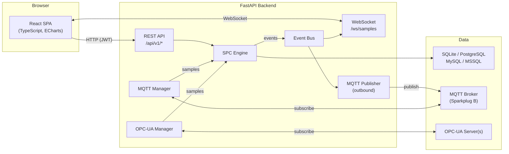

**Key architectural decisions:**

- **Layered backend**: API routes delegate to a dependency-injected service layer (repositories, SPC engine, alert manager). No business logic lives in route handlers.
- **Event-driven real-time**: The SPC engine publishes domain events to an in-process async event bus. A WebSocket broadcaster subscribes to those events and pushes updates to connected clients. An MQTT publisher subscribes to the same events and publishes them outbound to configured brokers. This keeps the engine decoupled from delivery concerns.
- **Multi-tenancy via plants**: All data is scoped to a "plant" (manufacturing site). Users have per-plant roles, and queries are filtered by `plant_id` foreign keys.
- **Triple data ingestion**: Measurements arrive through the REST API (manual entry, external systems via API keys), through MQTT (industrial equipment via Sparkplug B protocol), or through OPC-UA (direct subscription to OPC-UA server nodes). All three paths feed into the same SPC engine.
- **Multi-database support**: The system supports SQLite (development/small deployments), PostgreSQL (asyncpg), MySQL (aiomysql), and MSSQL (aioodbc). Database credentials are encrypted at rest using Fernet symmetric encryption with a separate key from JWT secrets.
- **Protocol-agnostic data sources**: Data sources use a polymorphic Joined Table Inheritance model. The base `DataSource` table stores common fields, with protocol-specific sub-tables (`MQTTDataSource`, `OPCUADataSource`) for each protocol.

---

## 2. Backend Architecture

The backend is a Python FastAPI application using async SQLAlchemy with multi-dialect support (SQLite via aiosqlite, PostgreSQL via asyncpg, MySQL via aiomysql, MSSQL via aioodbc). It follows a layered architecture with clear separation of concerns.

### Application Lifecycle

The FastAPI app uses a `lifespan` context manager (`main.py`) to coordinate startup and shutdown of all subsystems:

```mermaid
graph TD
    subgraph Startup
        S1["1. Configure structured logging"]
        S2["2. Initialize database connection"]
        S3["3. Bootstrap admin user<br/>(if no users exist)"]
        S4["4. Check migration status<br/>(compare Alembic head)"]
        S5["5. Start WebSocket manager"]
        S6["6. Wire WebSocket broadcaster<br/>to event bus"]
        S7["7. Initialize MQTT manager<br/>(connect to active brokers)"]
        S8["8. Initialize TAG provider<br/>(if MQTT connected)"]
        S9["9. Initialize OPC-UA manager<br/>(connect to active servers)"]
        S10["10. Initialize OPC-UA provider<br/>(if servers connected)"]
        S11["11. Initialize MQTT publisher<br/>(outbound event bridge)"]
        S1 --> S2 --> S3 --> S4 --> S5 --> S6 --> S7 --> S8 --> S9 --> S10 --> S11
    end

    subgraph Shutdown
        D1["1. Shutdown OPC-UA provider"]
        D2["2. Shutdown OPC-UA manager"]
        D3["3. Shutdown TAG provider"]
        D4["4. Shutdown MQTT manager"]
        D5["5. Drain event bus tasks"]
        D6["6. Stop WebSocket manager"]
        D7["7. Dispose database connection"]
        D1 --> D2 --> D3 --> D4 --> D5 --> D6 --> D7
    end

    Startup --> |"yield (app running)"| Shutdown
```

**Why this order matters:** The OPC-UA provider depends on the OPC-UA manager, so it starts after and shuts down before. The TAG provider depends on MQTT, so it follows the same pattern. The MQTT publisher is initialized last because it needs both the MQTT manager (for publishing) and the event bus (for subscriptions). The event bus is drained before the WebSocket manager stops so that in-flight notifications are delivered. The database connection is disposed last because other shutdown steps may need it.

### Middleware Pipeline

Requests pass through a minimal middleware stack:

1. **CORS** -- Configured via `OPENSPC_CORS_ORIGINS` environment variable. Allows credentials (cookies) for the refresh token flow.
2. **Rate limiting** -- Via `slowapi` on admin-only endpoints (database admin, user management). Rate limit exceeded responses return HTTP 429.
3. **FastAPI exception handlers** -- Standard HTTP exception and validation error responses.

### Dependency Injection

FastAPI's `Depends()` system is used extensively. All injectable dependencies are defined in `api/deps.py`:

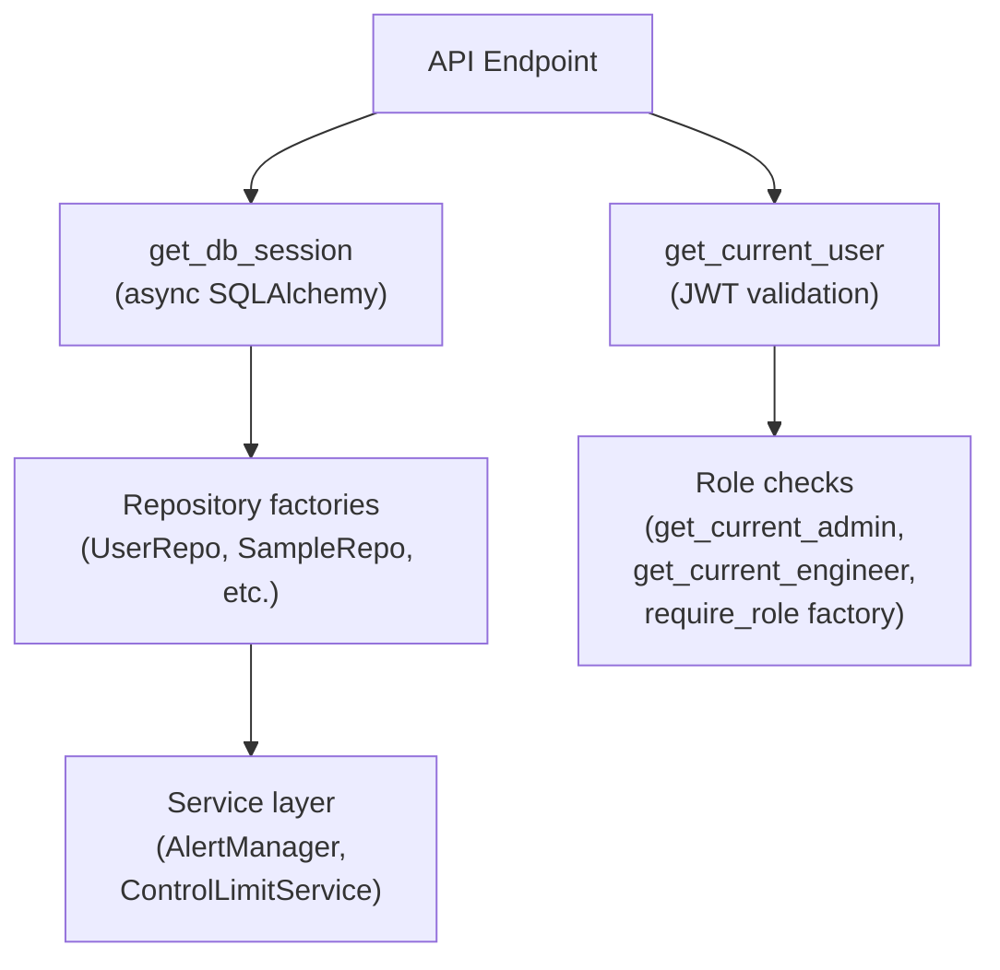

Key dependency chains:

| Dependency | What it provides | Used by |
|---|---|---|
| `get_db_session` | Async SQLAlchemy session | All endpoints |
| `get_current_user` | Authenticated `User` model with roles | Protected endpoints |
| `get_current_admin` | User verified as admin | Admin-only endpoints |
| `require_role(min_role)` | Factory returning a role-check dependency | Flexible role gates |
| `get_current_user_or_api_key` | JWT user OR API key entity | Data entry endpoints |
| `resolve_plant_id_for_characteristic` | Plant ID via characteristic -> hierarchy join | Plant-scoped RBAC |

**Why dependency injection?** It makes the code testable (dependencies can be replaced with mocks), avoids global state, and gives each request its own database session with proper lifecycle management.

### Router Organization

All API routers live under `api/v1/` and are registered in `main.py`:

| Router | Prefix | Responsibility |
|---|---|---|
| `auth` | `/api/v1/auth` | Login, refresh, logout, profile |
| `users` | `/api/v1/users` | User CRUD, role assignment |
| `plants` | `/api/v1/plants` | Plant/site CRUD |
| `hierarchy` | `/api/v1/hierarchy` | Equipment hierarchy tree (ISA-95) |
| `characteristics` | `/api/v1/characteristics` | SPC characteristic CRUD, chart data, rules |
| `characteristic_config` | `/api/v1/characteristics/{id}/config` | Polymorphic characteristic configuration |
| `samples` | `/api/v1/samples` | Sample submission, batch import, editing |
| `violations` | `/api/v1/violations` | Violation listing, acknowledgment |
| `annotations` | `/api/v1/characteristics/{id}/annotations` | Point and period annotations |
| `brokers` | `/api/v1/brokers` | MQTT broker CRUD, connection, discovery |
| `opcua_servers` | `/api/v1/opcua-servers` | OPC-UA server CRUD, connection, node browsing |
| `tags` | `/api/v1/tags` | Tag-to-characteristic mapping |
| `providers` | `/api/v1/providers` | TAG and OPC-UA provider status and control |
| `data_entry` | `/api/v1/data-entry` | External system data submission |
| `api_keys` | `/api/v1/api-keys` | API key management |
| `database_admin` | `/api/v1/database` | Database config, status, backup, migrations (admin-only) |
| `websocket` | `/ws/samples` | Real-time WebSocket endpoint |
| `devtools` | `/api/v1/devtools` | Database reset/seed (sandbox only) |

### Request Lifecycle

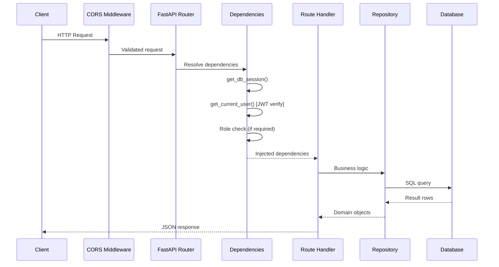

---

## 3. Frontend Architecture

The frontend is a React 19 single-page application written in TypeScript 5.9, built with Vite 7, and styled with Tailwind CSS 4. Charts are rendered using ECharts 6 (canvas-based).

### Provider Hierarchy

React context providers are nested in a specific order. Providers that make API calls are placed inside the authentication gate to prevent 401 cascades on page load.

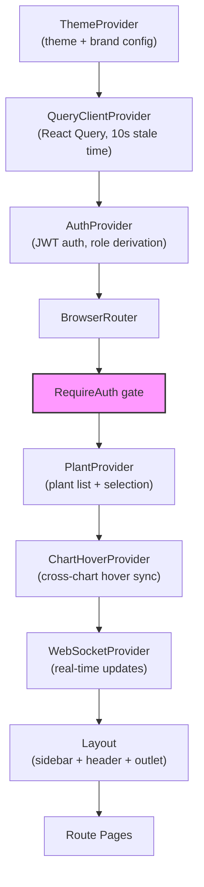

**Why this nesting order:**

- `ThemeProvider` is outermost because it only reads localStorage (no API calls).
- `QueryClientProvider` wraps everything that uses React Query.
- `AuthProvider` restores the session from the refresh cookie on mount. It does not depend on plant selection.
- `RequireAuth` is the gate: everything below it is only rendered for authenticated users. This prevents `PlantProvider` and `WebSocketProvider` from firing API calls before a valid token exists.
- `PlantProvider` fetches the plant list and auto-selects the first plant. Other providers depend on the selected plant.
- `WebSocketProvider` opens a persistent connection with the JWT token and subscribes to characteristic updates.

### State Management Strategy

OpenSPC uses three complementary state management approaches:

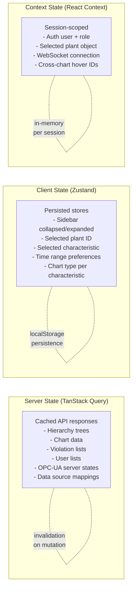

| Layer | Technology | Persisted | Purpose |
|---|---|---|---|
| Server state | TanStack React Query | Cache (memory) | API data with automatic refetching, polling (30s chart data, 45s violation stats), and mutation-driven invalidation |
| Client state | Zustand | localStorage (`openspc-ui`, `openspc-dashboard`) | UI preferences that survive page reloads: sidebar state, selected characteristic, chart type, time range |
| Context state | React Context | No | Session-scoped values that many components need: current user, selected plant, WebSocket connection, hover state |

**Why three layers?** Server state has different caching and invalidation semantics than UI preferences. Zustand stores are persisted to localStorage so the user's dashboard layout survives a refresh. React contexts are used for values that are inherently session-scoped (auth, WebSocket connection).

### Component Architecture

The UI follows a hierarchy: Layout > Pages > Feature Components > Shared Components.

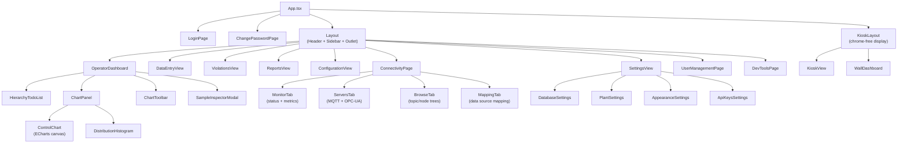

The application currently contains approximately:
- **13 pages** (OperatorDashboard, DataEntryView, ViolationsView, ReportsView, ConfigurationView, ConnectivityPage, SettingsView, UserManagementPage, KioskView, WallDashboard, LoginPage, ChangePasswordPage, DevToolsPage)
- **90+ reusable components** across subdirectories
- **28 connectivity components** in `components/connectivity/` (Monitor, Servers, Browse, and Mapping tabs with supporting components)

### Connectivity Hub

The Connectivity Hub (`ConnectivityPage`) is a unified interface for managing all industrial protocols. It uses a 4-tab layout with nested routing:

| Tab | Route | Components | Purpose |
|---|---|---|---|
| Monitor | `/connectivity/monitor` | `MonitorTab`, `ConnectivityMetrics`, `DataFlowPipeline`, `ConnectionMetrics`, `BrokerStatusCards`, `ServerStatusGrid` | Real-time connection status, data flow metrics |
| Servers | `/connectivity/servers` | `ServersTab`, `MQTTServerForm`, `OPCUAServerForm`, `ServerListItem`, `ServerStatusCard`, `ConnectionTestButton` | MQTT broker and OPC-UA server CRUD, connection management |
| Browse | `/connectivity/browse` | `BrowseTab`, `TopicTreeBrowser`, `NodeTreeBrowser`, `LiveValuePreview`, `ServerSelector`, `ProtocolSelector` | MQTT topic discovery and OPC-UA address space browsing |
| Mapping | `/connectivity/mapping` | `MappingTab`, `MappingTable`, `MappingRow`, `MappingDialog`, `QuickMapForm`, `CharacteristicPicker`, `ProtocolSourceFields`, `DataPointPreview` | Map topics/nodes to SPC characteristics with data source configuration |

The `ProtocolBadge` component and `protocols.ts` registry provide extensible protocol definitions (MQTT, OPC-UA) with consistent styling across the hub.

### ECharts Integration

Charts use ECharts 6 with canvas rendering for performance. The integration has three layers:

1. **Tree-shaking registry** (`lib/echarts.ts`) -- Only the needed ECharts components are registered (LineChart, BarChart, CustomChart, etc.) to minimize bundle size.
2. **Lifecycle hook** (`hooks/useECharts.ts`) -- Manages ECharts instance creation, disposal, ResizeObserver for responsive sizing, and mouse event bridging from canvas events to React callbacks.
3. **Chart components** (`ControlChart.tsx`, `DistributionHistogram.tsx`, etc.) -- Build ECharts option objects from SPC data and pass them to the hook.

The `ControlChart` component uses ECharts custom series `renderItem` for data point symbols: diamonds for violations, triangles for undersized samples, circles for normal points, and glow rings for highlighted points.

---

## 4. Authentication Flow

OpenSPC uses a dual-token JWT authentication scheme: a short-lived access token (15 min) for API requests and a long-lived refresh token (7 days) stored as an httpOnly cookie for silent session renewal.

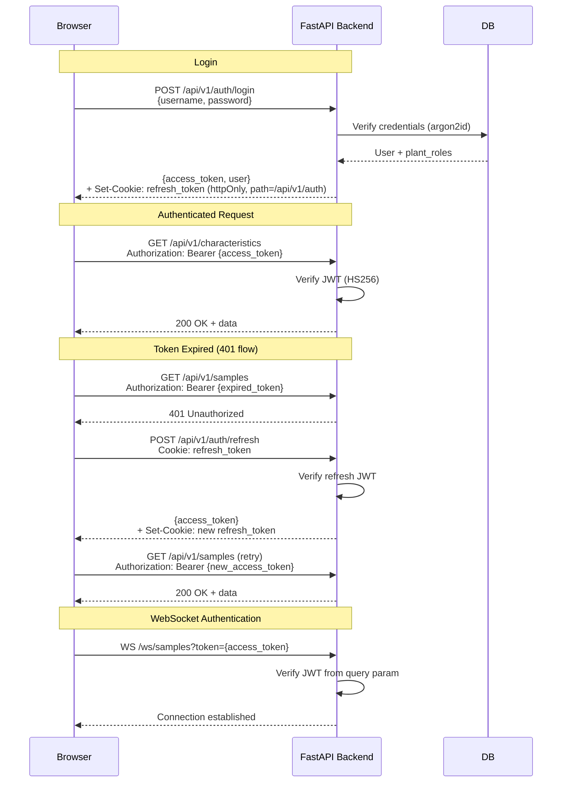

### Concurrent Refresh Handling

The frontend API client (`api/client.ts`) uses a shared promise to prevent multiple concurrent token refreshes when several requests hit 401 simultaneously:

```
Request A gets 401 → starts refresh → creates Promise
Request B gets 401 → sees existing Promise → waits on it
Request C gets 401 → sees existing Promise → waits on it
                      refresh completes → all three retry with new token
```

The client also performs **proactive refresh**: before sending a request, it checks if the access token will expire within 2 minutes and refreshes preemptively to avoid the 401 round-trip.

**Why this design:**

- Access tokens are stored in memory only (not localStorage) to reduce XSS risk. A page refresh loses the token, but the httpOnly refresh cookie silently restores the session.
- The refresh cookie is scoped to `path=/api/v1/auth` so it is only sent to the refresh endpoint.
- The shared-promise pattern avoids a thundering herd of refresh requests when multiple API calls fail simultaneously.

---

## 5. Real-Time Data Pipeline

When industrial equipment produces measurements via MQTT, data flows through several systems before reaching the user's browser:

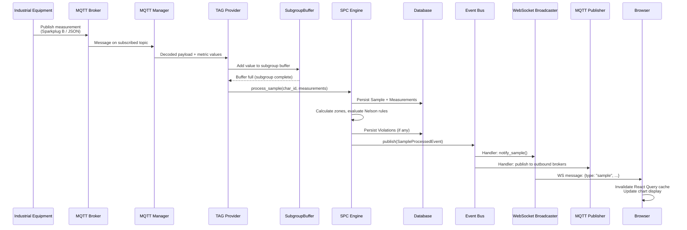

### Event Bus

The event bus (`core/events/bus.py`) is an in-process async pub/sub system. It provides:

- **Type-safe subscriptions**: Handlers subscribe to specific event classes (e.g., `SampleProcessedEvent`).
- **Fire-and-forget publishing**: `publish()` creates background tasks for handlers and returns immediately.
- **Error isolation**: One handler failure does not affect other handlers.
- **Graceful shutdown**: `shutdown()` waits for all pending tasks to complete.

Events published by the system:

| Event | Publisher | Subscribers |
|---|---|---|
| `SampleProcessedEvent` | SPC Engine | WebSocket broadcaster, MQTT publisher |
| `ViolationCreatedEvent` | Alert Manager | WebSocket broadcaster, MQTT publisher |
| `ViolationAcknowledgedEvent` | Violations API | WebSocket broadcaster, MQTT publisher |
| `ControlLimitsUpdatedEvent` | Control Limit Service | WebSocket broadcaster, MQTT publisher, rolling window cache |
| `CharacteristicCreatedEvent` | Characteristics API | (extensible) |
| `CharacteristicUpdatedEvent` | Characteristics API | (extensible) |
| `CharacteristicDeletedEvent` | Characteristics API | (extensible) |
| `AlertThresholdExceededEvent` | Alert Manager | (extensible) |

### WebSocket Protocol

The WebSocket endpoint (`/ws/samples`) uses JWT authentication via query parameter (WebSocket does not support custom headers). The connection manager runs a heartbeat cleanup every 30 seconds, removing connections idle for more than 90 seconds.

**Client-to-server messages:**
- `{"type": "subscribe", "characteristic_id": N}` -- Subscribe to updates
- `{"type": "unsubscribe", "characteristic_id": N}` -- Unsubscribe
- `{"type": "ping"}` -- Keepalive

**Server-to-client messages:**
- `{"type": "sample", ...}` -- New sample processed
- `{"type": "violation", ...}` -- Violation detected
- `{"type": "ack_update", ...}` -- Violation acknowledged
- `{"type": "limits_update", ...}` -- Control limits recalculated

On the frontend, the `WebSocketProvider` disables React Query polling when a WebSocket connection is active, falling back to 30-second polling if the connection drops.

---

## 6. OPC-UA Data Pipeline

OpenSPC supports direct subscription to OPC-UA server nodes for real-time data collection, parallel to the MQTT pipeline. The OPC-UA pipeline uses the `asyncua` library for client communication.

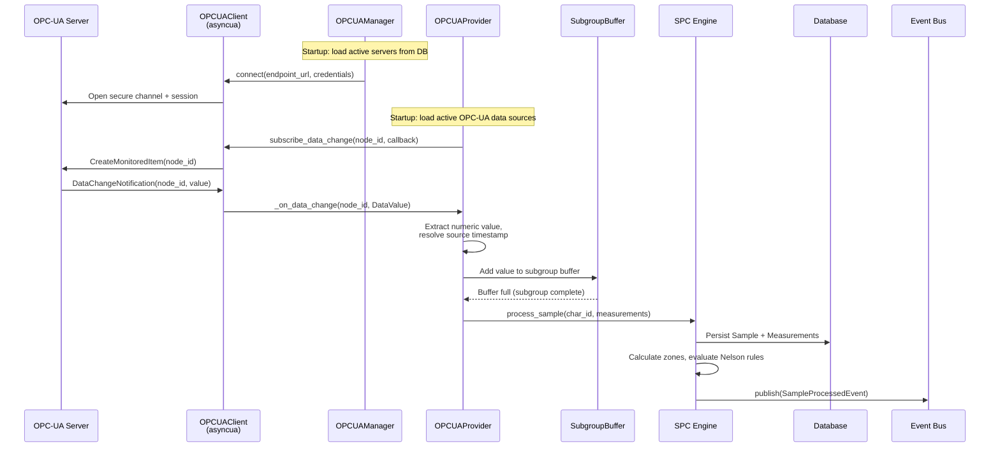

### Architecture Components

| Component | Location | Responsibility |
|---|---|---|
| `OPCUAClient` | `opcua/client.py` | Low-level asyncua wrapper: connect, disconnect, subscribe, read, browse |
| `OPCUAManager` | `opcua/manager.py` | Multi-server lifecycle: load from DB, connect/disconnect, state tracking |
| `NodeBrowsingService` | `opcua/browsing.py` | Address space navigation: browse children, read attributes, search nodes |
| `OPCUAProvider` | `core/providers/opcua_provider.py` | Data collection: subscribe to nodes, buffer readings, trigger SPC engine |
| `OPCUAProviderManager` | `core/providers/opcua_manager.py` | Provider lifecycle: initialize, shutdown, refresh subscriptions |

### Key Differences from MQTT Pipeline

| Aspect | MQTT (TAG Provider) | OPC-UA Provider |
|---|---|---|
| Protocol library | `aiomqtt` | `asyncua` |
| Data format | Sparkplug B protobuf or JSON | Native OPC-UA `DataValue` |
| Mapping model | 1 topic can fan out to multiple metrics | 1 node = 1 characteristic |
| Server management | `MQTTManager` (multi-broker) | `OPCUAManager` (multi-server) |
| Trigger strategies | `on_change`, `on_trigger`, `on_timer` | `on_change`, `on_timer` only |
| Subscription params | Per-topic via broker config | Per-node override or server defaults |
| Value extraction | Decode Sparkplug B or JSON payload | Direct `DataValue.Value.Value` cast |
| Shared buffer | `SubgroupBuffer` | `SubgroupBuffer` (same class) |

### Node Browsing

The OPC-UA address space can be browsed from the frontend via REST API endpoints. The `NodeBrowsingService` provides:

- **Browse children**: Navigate the server's node hierarchy (Objects, Variables, etc.)
- **Read attributes**: Get display name, data type, access level for any node
- **Read value**: Read the current value of a Variable node
- **Search**: Find nodes by display name or NodeId pattern

These are exposed through the `/api/v1/opcua-servers/{id}/browse`, `/api/v1/opcua-servers/{id}/nodes/{node_id}`, and `/api/v1/opcua-servers/{id}/nodes/{node_id}/value` endpoints.

---

## 7. MQTT Outbound Publishing

OpenSPC can publish SPC events (samples, violations, acknowledgments, limit updates) outbound to MQTT brokers for integration with external systems, dashboards, or historian databases.

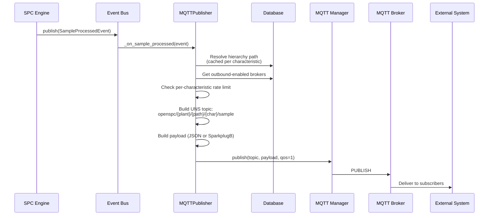

### Topic Structure

Outbound topics follow a UNS (Unified Namespace) compatible structure:

```
{prefix}/{plant}/{hierarchy...}/{characteristic}/{event_type}
```

Example: `openspc/plant_a/area1/line2/cell3/diameter/sample`

Each segment is sanitized (lowercased, spaces replaced with underscores, MQTT special characters removed).

### Event Types Published

| Event Type | Topic Suffix | Trigger | Payload Fields |
|---|---|---|---|
| Sample processed | `/sample` | Every sample through SPC engine | `sample_id`, `mean`, `range`, `zone`, `in_control` |
| Violation created | `/violation` | Nelson rule violation detected | `violation_id`, `rule_id`, `rule_name`, `severity` |
| Violation acknowledged | `/ack` | User acknowledges violation | `violation_id`, `user`, `reason` |
| Limits updated | `/limits` | Control limits recalculated | `center_line`, `ucl`, `lcl`, `method`, `sample_count` |

### Rate Control

Per-characteristic rate limiting prevents publish storms when high-frequency data sources produce many samples rapidly. Each broker has a configurable `outbound_rate_limit` (minimum seconds between publishes per characteristic). The publisher tracks last-publish timestamps and skips throttled events.

### Payload Formats

Two formats are supported per broker:

- **JSON** (default): Human-readable, includes event type and UTC timestamp
- **SparkplugB**: Protobuf-encoded metrics for industrial integration (uses the same `SparkplugEncoder` as inbound)

---

## 8. SPC Calculation Pipeline

The SPC engine (`core/engine/spc_engine.py`) processes each sample through an 8-step pipeline:

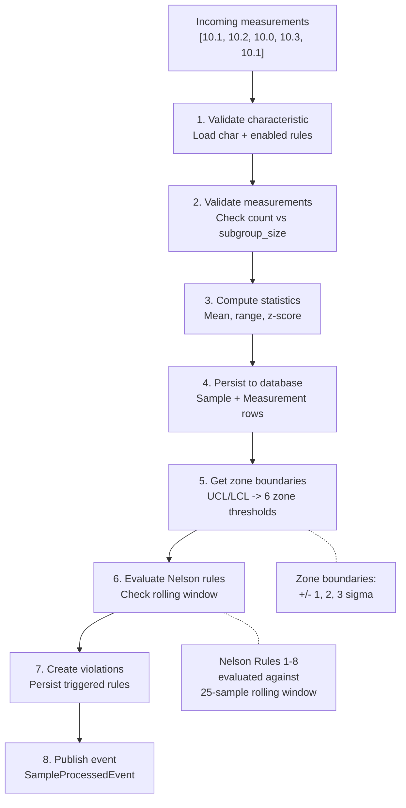

### Control Limit Calculation

The `ControlLimitService` auto-selects the calculation method based on subgroup size:

| Subgroup Size | Method | Formula |
|---|---|---|
| n = 1 | Moving Range | sigma = MR-bar / d2 (d2 = 1.128 for span 2) |
| 2 <= n <= 10 | R-bar / d2 | sigma = R-bar / d2, UCL = X-bar + 3 * sigma / sqrt(n) |
| n > 10 | S-bar / c4 | sigma = S-bar / c4, UCL = X-bar + 3 * sigma / sqrt(n) |

Where d2, c4 are standard SPC constants looked up from tables based on subgroup size. Control limits are always placed at +/- 3 sigma from the center line.

### Nelson Rule Evaluation

All 8 Western Electric / Nelson rules are implemented as pluggable classes in `core/engine/nelson_rules.py`. Each rule checks the most recent samples in a 25-point rolling window:

| Rule | Name | Pattern | Severity |
|---|---|---|---|
| 1 | Outlier | 1 point beyond 3-sigma | CRITICAL |
| 2 | Shift | 9 consecutive on same side of center | WARNING |
| 3 | Trend | 6 consecutive monotonically increasing/decreasing | WARNING |
| 4 | Alternator | 14 consecutive alternating up/down | WARNING |
| 5 | Zone A | 2 of 3 consecutive in Zone A or beyond (same side) | WARNING |
| 6 | Zone B | 4 of 5 consecutive in Zone B or beyond (same side) | WARNING |
| 7 | Stratification | 15 consecutive within Zone C | WARNING |
| 8 | Mixture | 8 consecutive outside Zone C | WARNING |

The `NelsonRuleLibrary` aggregates all rules and runs only the enabled subset for each characteristic. Rules can be individually enabled/disabled and configured to require (or not require) operator acknowledgment.

### Zone Classification

Each sample is classified into one of 8 zones based on its distance from the center line:

```
  BEYOND_UCL    ─── UCL (center + 3 sigma)
  ZONE_A_UPPER  ─── center + 2 sigma
  ZONE_B_UPPER  ─── center + 1 sigma
  ZONE_C_UPPER  ───
                    center line
  ZONE_C_LOWER  ───
  ZONE_B_LOWER  ─── center - 1 sigma
  ZONE_A_LOWER  ─── center - 2 sigma
  BEYOND_LCL    ─── LCL (center - 3 sigma)
```

### Rolling Window

The `RollingWindowManager` maintains a per-characteristic sliding window of the 25 most recent samples. Windows are cached in an LRU dictionary (max 1,000 characteristics) and lazy-loaded from the database on first access. Per-characteristic async locks prevent concurrent modification.

### Subgroup Modes

OpenSPC supports three modes for handling variable subgroup sizes:

| Mode | Name | Behavior |
|---|---|---|
| C | NOMINAL_TOLERANCE | Fixed UCL/LCL. Rejects samples with more measurements than `subgroup_size`. Standard X-bar chart. |
| A | STANDARDIZED | Converts each sample mean to a z-score: `z = (x-bar - CL) / (sigma / sqrt(n))`. Rules evaluate z-scores against fixed +/-3 limits. |
| B | VARIABLE_LIMITS | Calculates per-sample control limits: `UCL_i = CL + 3 * sigma / sqrt(n_i)`. Each point has its own limits. |

Modes A and B require `stored_sigma` and `stored_center_line` to be calculated first via the `recalculate-limits` endpoint.

---

## 9. Multi-Database Support

OpenSPC supports four database backends through SQLAlchemy's async dialect system. The dialect abstraction layer (`db/dialects.py`) handles connection URL construction, credential encryption, and configuration file management.

### Supported Databases

| Dialect | Async Driver | Default Port | Use Case |
|---|---|---|---|
| SQLite | `aiosqlite` | N/A (file) | Development, small single-server deployments |
| PostgreSQL | `asyncpg` | 5432 | Production, multi-user, full-featured |
| MySQL | `aiomysql` | 3306 | Enterprise environments with MySQL infrastructure |
| MSSQL | `aioodbc` | 1433 | Enterprise environments with SQL Server infrastructure |

### Credential Encryption

Database passwords are encrypted at rest using Fernet symmetric encryption:

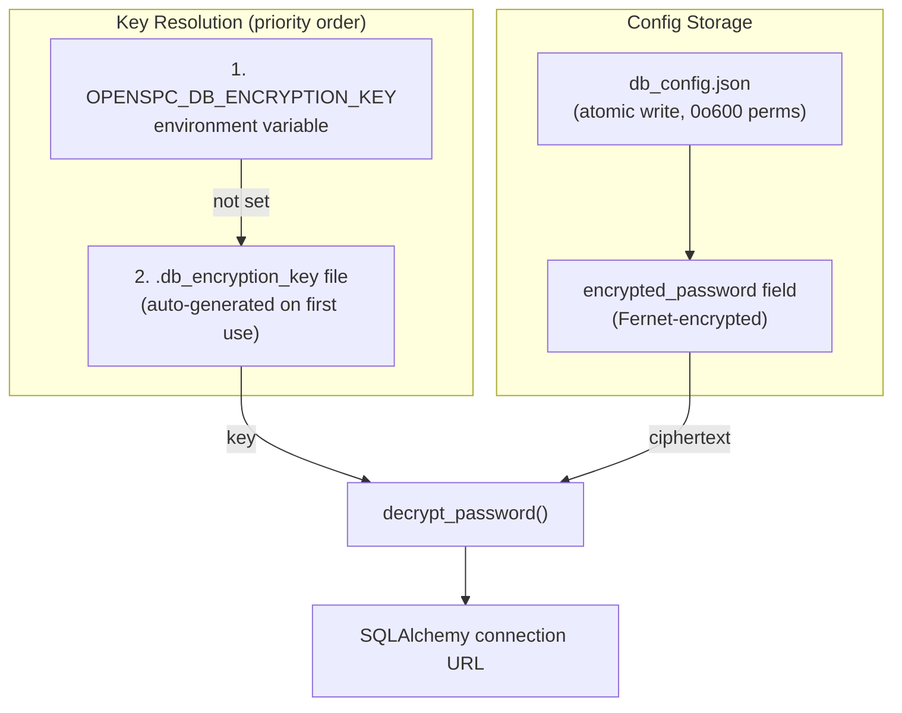

**Important**: The encryption key is separate from the JWT secret (`.db_encryption_key` vs `.jwt_secret`). Rotating the JWT secret does not affect encrypted database credentials.

### Configuration Flow

1. Admin configures database via UI (Settings > Database) or API (`/api/v1/database/config`)
2. Password is encrypted with `encrypt_password()` using the Fernet key
3. Config is saved atomically to `db_config.json` (temp file + `os.replace()`)
4. Connection can be tested before saving via `/api/v1/database/test`
5. On next startup, `db_config.json` is loaded and the URL is constructed via `build_database_url()`

### Admin API

The database admin API (`/api/v1/database/*`) provides 7 endpoints, all requiring admin role:

| Endpoint | Method | Rate Limit | Purpose |
|---|---|---|---|
| `/database/config` | GET | No | Read current database configuration (password redacted) |
| `/database/config` | PUT | 5/min | Update database configuration |
| `/database/test` | POST | 10/min | Test a connection without saving |
| `/database/status` | GET | No | Current connection status (dialect, version, table count) |
| `/database/backup` | POST | 2/min | Create SQLite backup (SQLite only) |
| `/database/vacuum` | POST | 1/min | Run VACUUM on SQLite database |
| `/database/migrations` | GET | No | Migration status (current vs head revision) |

All mutation endpoints are rate-limited via `slowapi` and audit-logged with structured logging.

### Security Measures

- **SSRF protection**: Only known database ports (5432, 3306, 1433) are allowed for server dialects
- **Hostname validation**: Regex pattern blocks special characters and path traversal
- **Options whitelist**: Only safe connection options (`pool_size`, `pool_timeout`, `pool_recycle`, `pool_pre_ping`) are permitted
- **Atomic writes**: Config file writes use temp-file + rename to prevent corruption
- **Restrictive permissions**: Config and key files are created with 0o600 permissions

---

## 10. Database Schema

OpenSPC uses SQLAlchemy ORM models with async sessions. The system supports SQLite, PostgreSQL, MySQL, and MSSQL via dialect abstraction. Schema migrations are managed by Alembic (20 migrations as of v0.4.0).

```mermaid
erDiagram
    User ||--o{ UserPlantRole : "has roles"
    Plant ||--o{ UserPlantRole : "assigns roles"
    Plant ||--o{ Hierarchy : "contains"
    Plant ||--o{ MQTTBroker : "configures"
    Plant ||--o{ OPCUAServer : "configures"
    Hierarchy ||--o{ Hierarchy : "parent-child"
    Hierarchy ||--o{ Characteristic : "monitors"
    Characteristic ||--o{ Sample : "collects"
    Characteristic ||--|| CharacteristicConfig : "configured by"
    Characteristic ||--o{ CharacteristicRule : "has rules"
    Characteristic ||--o{ Annotation : "annotated with"
    Characteristic ||--o| DataSource : "data source"
    DataSource ||--o| MQTTDataSource : "MQTT config"
    DataSource ||--o| OPCUADataSource : "OPC-UA config"
    MQTTDataSource }o--|| MQTTBroker : "belongs to"
    OPCUADataSource }o--|| OPCUAServer : "belongs to"
    Sample ||--o{ Measurement : "contains"
    Sample ||--o{ Violation : "triggers"
    Sample ||--o{ SampleEditHistory : "edited via"
    Annotation ||--o{ AnnotationHistory : "edit trail"

    User {
        int id PK
        string username UK
        string email
        string hashed_password
        bool is_active
        bool must_change_password
        datetime created_at
    }

    UserPlantRole {
        int id PK
        int user_id FK
        int plant_id FK
        enum role "operator|supervisor|engineer|admin"
    }

    Plant {
        int id PK
        string name
        string code UK
        bool is_active
        json settings
    }

    Hierarchy {
        int id PK
        int parent_id FK
        int plant_id FK
        string name
        enum type "Folder|Enterprise|Site|Area|Line|Cell|Equipment|Tag"
    }

    Characteristic {
        int id PK
        int hierarchy_id FK
        string name
        int subgroup_size
        float target_value
        float usl
        float lsl
        float ucl
        float lcl
        enum subgroup_mode "NOMINAL_TOLERANCE|STANDARDIZED|VARIABLE_LIMITS"
        float stored_sigma
        float stored_center_line
    }

    CharacteristicRule {
        int characteristic_id PK_FK
        int rule_id PK
        bool is_enabled
        bool require_acknowledgement
    }

    CharacteristicConfig {
        int id PK
        int characteristic_id FK_UK
        text config_json
        bool is_active
    }

    DataSource {
        int id PK
        string type "mqtt|opcua"
        int characteristic_id FK_UK
        string trigger_strategy
        bool is_active
        datetime created_at
        datetime updated_at
    }

    MQTTDataSource {
        int id PK_FK
        int broker_id FK
        string topic
        string metric_name
        string trigger_tag
    }

    OPCUADataSource {
        int id PK_FK
        int server_id FK
        string node_id
        int sampling_interval
        int publishing_interval
    }

    Sample {
        int id PK
        int char_id FK
        datetime timestamp
        string batch_number
        int actual_n
        bool is_undersized
        bool is_excluded
        float z_score
        float effective_ucl
        float effective_lcl
    }

    Measurement {
        int id PK
        int sample_id FK
        float value
    }

    Violation {
        int id PK
        int sample_id FK
        int rule_id
        string rule_name
        enum severity "WARNING|CRITICAL"
        bool acknowledged
        bool requires_acknowledgement
        string ack_user
        string ack_reason
    }

    Annotation {
        int id PK
        int characteristic_id FK
        string annotation_type
        text text
        int sample_id FK
        datetime start_time
        datetime end_time
    }

    AnnotationHistory {
        int id PK
        int annotation_id FK
        text previous_text
        string changed_by
    }

    SampleEditHistory {
        int id PK
        int sample_id FK
        string edited_by
        string reason
        json previous_values
        json new_values
    }

    MQTTBroker {
        int id PK
        int plant_id FK
        string name UK
        string host
        int port
        bool is_active
        string payload_format
        bool outbound_enabled
        string outbound_topic_prefix
        string outbound_format
        float outbound_rate_limit
    }

    OPCUAServer {
        int id PK
        int plant_id FK
        string name UK
        string endpoint_url
        string auth_mode
        string security_policy
        string security_mode
        bool is_active
        int session_timeout
        int publishing_interval
        int sampling_interval
    }

    APIKey {
        uuid id PK
        string name
        string key_hash
        string key_prefix
        json permissions
        bool is_active
        datetime expires_at
    }
```

### Key Relationships

- **User to Plant**: Many-to-many via `UserPlantRole`. Each user has exactly one role per plant. Admin role at any plant implies admin everywhere.
- **Plant to Hierarchy**: One-to-many. The hierarchy follows ISA-95 equipment model levels (Enterprise > Site > Area > Line > Cell > Equipment > Tag).
- **Hierarchy**: Self-referential tree (adjacency list via `parent_id`). Leaf deletion only -- cannot delete a node that has children.
- **Characteristic to Sample**: One-to-many. Each sample contains one or more measurements (subgroup). Creating a characteristic auto-initializes all 8 Nelson rule configurations.
- **Characteristic to DataSource**: Optional one-to-one. If `data_source` is NULL, the characteristic uses manual entry. If present, the `type` column indicates the protocol (`mqtt` or `opcua`), and the corresponding sub-table holds protocol-specific config.
- **DataSource (JTI)**: Joined Table Inheritance with `type` as polymorphic discriminator. Base table `data_source` with sub-tables `mqtt_data_source` and `opcua_data_source`. No `polymorphic_identity` on the base class.
- **Sample to Violation**: One-to-many. A single sample can trigger multiple Nelson rule violations simultaneously.
- **Plant to OPCUAServer / MQTTBroker**: One-to-many. Each server or broker is scoped to a plant.

### Audit Trail

Several entities maintain edit history:
- `SampleEditHistory` records before/after measurement values with editor and reason.
- `AnnotationHistory` records previous text on annotation edits.
- `Violation` records who acknowledged it, when, and why.
- Database admin operations are audit-logged via structured logging.

---

## 11. Project Directory Structure

```
SPC-client/
|-- backend/
|   |-- src/
|   |   |-- openspc/
|   |       |-- main.py                 # FastAPI app, lifespan, router registration
|   |       |-- api/
|   |       |   |-- deps.py             # Dependency injection (auth, repos, services)
|   |       |   |-- schemas/            # Pydantic request/response schemas
|   |       |   |-- v1/                 # All API route modules
|   |       |       |-- auth.py         # Login, refresh, logout
|   |       |       |-- users.py        # User CRUD, role assignment
|   |       |       |-- plants.py       # Plant/site management
|   |       |       |-- hierarchy.py    # Equipment hierarchy tree
|   |       |       |-- characteristics.py  # SPC characteristics, chart data
|   |       |       |-- characteristic_config.py  # Polymorphic config
|   |       |       |-- samples.py      # Sample submission, editing, batch import
|   |       |       |-- violations.py   # Violation listing, acknowledgment
|   |       |       |-- annotations.py  # Point and period annotations
|   |       |       |-- brokers.py      # MQTT broker management
|   |       |       |-- opcua_servers.py  # OPC-UA server CRUD, browsing, connection
|   |       |       |-- tags.py         # Tag-to-characteristic mapping
|   |       |       |-- providers.py    # TAG + OPC-UA provider control
|   |       |       |-- data_entry.py   # External system ingestion (JWT + API key)
|   |       |       |-- api_keys.py     # API key CRUD
|   |       |       |-- database_admin.py  # DB config, backup, migrations (admin)
|   |       |       |-- websocket.py    # Real-time WebSocket endpoint
|   |       |       |-- devtools.py     # Sandbox mode: reset and seed
|   |       |-- core/
|   |       |   |-- config.py           # pydantic-settings (OPENSPC_* env vars)
|   |       |   |-- broadcast.py        # WebSocket broadcaster (event bus subscriber)
|   |       |   |-- publish.py          # MQTT outbound publisher (event bus subscriber)
|   |       |   |-- rate_limit.py       # slowapi rate limiter configuration
|   |       |   |-- logging.py          # Structured logging (structlog) configuration
|   |       |   |-- auth/
|   |       |   |   |-- jwt.py          # JWT create/verify (HS256, 15min/7d)
|   |       |   |   |-- passwords.py    # Argon2id hashing
|   |       |   |   |-- api_key.py      # API key verify (bcrypt, prefix lookup)
|   |       |   |   |-- bootstrap.py    # Admin user auto-creation
|   |       |   |-- engine/
|   |       |   |   |-- spc_engine.py   # 8-step sample processing pipeline
|   |       |   |   |-- nelson_rules.py # All 8 Nelson rules
|   |       |   |   |-- control_limits.py  # Limit calculation (MR, R-bar, S-bar)
|   |       |   |   |-- rolling_window.py  # Per-characteristic sliding window
|   |       |   |-- events/
|   |       |   |   |-- bus.py          # Async pub/sub event bus
|   |       |   |   |-- events.py       # Domain event definitions (8 event types)
|   |       |   |-- alerts/
|   |       |   |   |-- manager.py      # Violation creation, acknowledgment
|   |       |   |-- providers/
|   |       |       |-- protocol.py     # DataProvider protocol + SampleEvent types
|   |       |       |-- buffer.py       # SubgroupBuffer (shared by TAG + OPC-UA)
|   |       |       |-- manager.py      # TAG ProviderManager (MQTT -> SPC bridge)
|   |       |       |-- tag.py          # TAG provider (MQTT topic subscriptions)
|   |       |       |-- manual.py       # Manual provider (REST API submissions)
|   |       |       |-- opcua_provider.py  # OPC-UA provider (node subscriptions)
|   |       |       |-- opcua_manager.py   # OPC-UA ProviderManager lifecycle
|   |       |-- db/
|   |       |   |-- database.py         # Async engine + session factory
|   |       |   |-- dialects.py         # Multi-dialect support, encryption, config
|   |       |   |-- models/             # SQLAlchemy ORM models (19 model classes)
|   |       |   |   |-- user.py, plant.py, hierarchy.py, characteristic.py,
|   |       |   |   |-- sample.py, violation.py, annotation.py, broker.py,
|   |       |   |   |-- api_key.py, characteristic_config.py,
|   |       |   |   |-- data_source.py  # DataSource, MQTTDataSource, OPCUADataSource (JTI)
|   |       |   |   |-- opcua_server.py # OPCUAServer model
|   |       |   |-- repositories/       # Data access layer (12 repos)
|   |       |       |-- base.py, user.py, plant.py, hierarchy.py,
|   |       |       |-- characteristic.py, characteristic_config.py,
|   |       |       |-- sample.py, violation.py, broker.py,
|   |       |       |-- opcua_server.py, data_source.py
|   |       |-- mqtt/
|   |       |   |-- manager.py          # Multi-broker MQTT client manager
|   |       |   |-- sparkplug.py        # Sparkplug B encoder/decoder
|   |       |-- opcua/
|   |       |   |-- client.py           # asyncua client wrapper (connect, subscribe, browse)
|   |       |   |-- manager.py          # Multi-server OPC-UA manager (lifecycle, state)
|   |       |   |-- browsing.py         # Node browsing service (address space navigation)
|   |       |-- utils/
|   |           |-- constants.py        # SPC constants (d2, D3, D4, A2, c4, etc.)
|   |           |-- statistics.py       # Sigma estimation, limit calculation helpers
|   |-- alembic/                        # Database migration scripts (20 migrations)
|
|-- frontend/
|   |-- src/
|       |-- main.tsx                    # React entry point
|       |-- App.tsx                     # Provider hierarchy, routing (13 pages)
|       |-- api/
|       |   |-- client.ts              # fetchApi, token management, 15 API namespaces
|       |   |-- hooks.ts               # React Query hooks (60+ hooks)
|       |-- providers/
|       |   |-- AuthProvider.tsx        # JWT auth, role derivation, force password change
|       |   |-- PlantProvider.tsx       # Plant list, selection, query invalidation
|       |   |-- WebSocketProvider.tsx   # Persistent WS connection, reconnection
|       |   |-- ThemeProvider.tsx       # Light/dark/system theme, brand colors
|       |-- contexts/
|       |   |-- ChartHoverContext.tsx   # Cross-chart hover sync (throttled)
|       |-- stores/
|       |   |-- uiStore.ts             # Sidebar state (persisted)
|       |   |-- dashboardStore.ts      # Dashboard state (partially persisted)
|       |   |-- configStore.ts         # Configuration page state (transient)
|       |-- pages/                      # 13 page-level components
|       |   |-- OperatorDashboard.tsx   # Main SPC dashboard
|       |   |-- DataEntryView.tsx       # Manual entry + sample history
|       |   |-- ViolationsView.tsx      # Violation management
|       |   |-- ReportsView.tsx         # Report generation + export
|       |   |-- ConfigurationView.tsx   # Hierarchy + characteristic config
|       |   |-- ConnectivityPage.tsx    # 4-tab connectivity hub (tabbed routing)
|       |   |-- SettingsView.tsx        # App settings (database, appearance, plants, keys)
|       |   |-- UserManagementPage.tsx  # User CRUD + role assignment
|       |   |-- KioskView.tsx           # Auto-rotating chart display
|       |   |-- WallDashboard.tsx       # Multi-chart grid display
|       |   |-- LoginPage.tsx, ChangePasswordPage.tsx, DevToolsPage.tsx
|       |-- components/                 # ~90 reusable UI components
|       |   |-- Layout.tsx, Header.tsx, Sidebar.tsx
|       |   |-- ControlChart.tsx        # Core ECharts control chart
|       |   |-- ChartPanel.tsx          # Chart + histogram combo
|       |   |-- DistributionHistogram.tsx
|       |   |-- SampleInspectorModal.tsx
|       |   |-- DatabaseSettings.tsx    # Database configuration UI
|       |   |-- DatabaseConnectionForm.tsx  # Multi-dialect connection form
|       |   |-- DatabaseMaintenancePanel.tsx  # Backup, vacuum, migration status
|       |   |-- DatabaseMigrationStatus.tsx
|       |   |-- charts/                 # DualChartPanel, RangeChart, BoxWhisker
|       |   |-- characteristic-config/  # Config tabs (General, Limits, Sampling, Rules)
|       |   |-- connectivity/           # 28 components (4 tabs + supporting)
|       |   |   |-- MonitorTab, ServersTab, BrowseTab, MappingTab
|       |   |   |-- MQTTServerForm, OPCUAServerForm
|       |   |   |-- TopicTreeBrowser, NodeTreeBrowser
|       |   |   |-- MappingDialog, MappingTable, MappingRow, QuickMapForm
|       |   |   |-- ServerStatusCard, ServerStatusGrid, ServerSelector
|       |   |   |-- ProtocolBadge, ProtocolSelector, ProtocolSourceFields
|       |   |   |-- CharacteristicPicker, DataPointPreview, LiveValuePreview
|       |   |   |-- ConnectionMetrics, ConnectivityMetrics, DataFlowPipeline
|       |   |   |-- BrokerStatusCards, ConnectionTestButton, ServerListItem
|       |   |-- users/                  # UserTable, UserFormDialog
|       |-- hooks/
|       |   |-- useECharts.ts           # ECharts lifecycle + ResizeObserver
|       |-- lib/
|       |   |-- echarts.ts             # Tree-shaken ECharts registration
|       |   |-- roles.ts              # RBAC: role hierarchy, view/action permissions
|       |   |-- protocols.ts          # Protocol registry (MQTT, OPC-UA definitions)
|       |   |-- chart-registry.ts     # Chart type definitions + auto-recommendation
|       |   |-- nelson-rules.ts       # Rule metadata, descriptions, causes
|       |   |-- theme-presets.ts      # Chart color presets
|       |   |-- report-templates.ts   # Report template definitions
|       |   |-- export-utils.ts       # PDF, Excel, PNG export
|       |-- types/
|           |-- index.ts              # All domain types
|           |-- charts.ts             # Chart type + SPC constant types
|
|-- docs/                              # Documentation
|-- .planning/                         # Phase plans and state tracking
```
