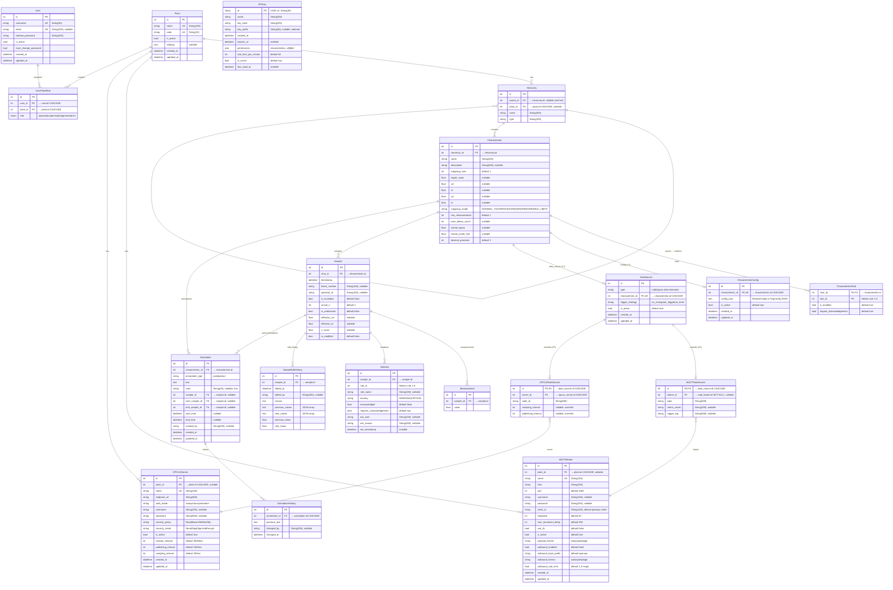

# Database Schema

Entity-relationship diagram for the OpenSPC database (19 tables).

```mermaid
erDiagram
    %% ═══════════════════════════════════════════════
    %% OpenSPC Database Schema — 19 tables
    %% ═══════════════════════════════════════════════

    Plant {
        int id PK
        string name UK "String(100)"
        string code UK "String(10)"
        bool is_active
        json settings "nullable"
        datetime created_at
        datetime updated_at
    }

    User {
        int id PK
        string username UK "String(50)"
        string email UK "String(255), nullable"
        string hashed_password "String(255)"
        bool is_active
        bool must_change_password
        datetime created_at
        datetime updated_at
    }

    UserPlantRole {
        int id PK
        int user_id FK "→ user.id CASCADE"
        int plant_id FK "→ plant.id CASCADE"
        enum role "operator|supervisor|engineer|admin"
    }

    Hierarchy {
        int id PK
        int parent_id FK "→ hierarchy.id, nullable (self-ref)"
        int plant_id FK "→ plant.id CASCADE, nullable"
        string name "String(255)"
        string type "String(100)"
    }

    Characteristic {
        int id PK
        int hierarchy_id FK "→ hierarchy.id"
        string name "String(255)"
        string description "String(500), nullable"
        int subgroup_size "default 1"
        float target_value "nullable"
        float usl "nullable"
        float lsl "nullable"
        float ucl "nullable"
        float lcl "nullable"
        string subgroup_mode "NOMINAL_TOLERANCE|STANDARDIZED|VARIABLE_LIMITS"
        int min_measurements "default 1"
        int warn_below_count "nullable"
        float stored_sigma "nullable"
        float stored_center_line "nullable"
        int decimal_precision "default 3"
    }

    CharacteristicRule {
        int char_id PK,FK "→ characteristic.id"
        int rule_id PK "Nelson rule 1-8"
        bool is_enabled "default true"
        bool require_acknowledgement "default true"
    }

    CharacteristicConfig {
        int id PK
        int characteristic_id FK,UK "→ characteristic.id CASCADE"
        text config_json "ManualConfig or TagConfig JSON"
        bool is_active "default true"
        datetime created_at
        datetime updated_at
    }

    Sample {
        int id PK
        int char_id FK "→ characteristic.id"
        datetime timestamp
        string batch_number "String(100), nullable"
        string operator_id "String(100), nullable"
        bool is_excluded "default false"
        int actual_n "default 1"
        bool is_undersized "default false"
        float effective_ucl "nullable"
        float effective_lcl "nullable"
        float z_score "nullable"
        bool is_modified "default false"
    }

    Measurement {
        int id PK
        int sample_id FK "→ sample.id"
        float value
    }

    SampleEditHistory {
        int id PK
        int sample_id FK "→ sample.id"
        datetime edited_at
        string edited_by "String(255), nullable"
        text reason
        text previous_values "JSON array"
        text new_values "JSON array"
        float previous_mean
        float new_mean
    }

    Violation {
        int id PK
        int sample_id FK "→ sample.id"
        int rule_id "Nelson rule 1-8"
        string rule_name "String(100), nullable"
        string severity "WARNING|CRITICAL"
        bool acknowledged "default false"
        bool requires_acknowledgement "default true"
        string ack_user "String(100), nullable"
        string ack_reason "String(500), nullable"
        datetime ack_timestamp "nullable"
    }

    Annotation {
        int id PK
        int characteristic_id FK "→ characteristic.id"
        string annotation_type "point|period"
        text text
        string color "String(20), nullable, hex"
        int sample_id FK "→ sample.id, nullable"
        int start_sample_id FK "→ sample.id, nullable"
        int end_sample_id FK "→ sample.id, nullable"
        datetime start_time "nullable"
        datetime end_time "nullable"
        string created_by "String(255), nullable"
        datetime created_at
        datetime updated_at
    }

    AnnotationHistory {
        int id PK
        int annotation_id FK "→ annotation.id CASCADE"
        text previous_text
        string changed_by "String(255), nullable"
        datetime changed_at
    }

    MQTTBroker {
        int id PK
        int plant_id FK "→ plant.id CASCADE, nullable"
        string name UK "String(100)"
        string host "String(255)"
        int port "default 1883"
        string username "String(100), nullable"
        string password "String(255), nullable"
        string client_id "String(100), default openspc-client"
        int keepalive "default 60"
        int max_reconnect_delay "default 300"
        bool use_tls "default false"
        bool is_active "default true"
        string payload_format "json|sparkplugb"
        bool outbound_enabled "default false"
        string outbound_topic_prefix "default openspc"
        string outbound_format "json|sparkplugb"
        float outbound_rate_limit "default 1.0 msg/s"
        datetime created_at
        datetime updated_at
    }

    OPCUAServer {
        int id PK
        int plant_id FK "→ plant.id CASCADE, nullable"
        string name UK "String(100)"
        string endpoint_url "String(500)"
        string auth_mode "anonymous|username"
        string username "String(255), nullable"
        string password "String(500), nullable"
        string security_policy "None|Basic256Sha256|..."
        string security_mode "None|Sign|SignAndEncrypt"
        bool is_active "default true"
        int session_timeout "default 30000ms"
        int publishing_interval "default 1000ms"
        int sampling_interval "default 250ms"
        datetime created_at
        datetime updated_at
    }

    DataSource {
        int id PK
        string type "mqtt|opcua (discriminator)"
        int characteristic_id FK,UK "→ characteristic.id CASCADE"
        string trigger_strategy "on_change|on_trigger|on_timer"
        bool is_active "default true"
        datetime created_at
        datetime updated_at
    }

    MQTTDataSource {
        int id PK,FK "→ data_source.id CASCADE"
        int broker_id FK "→ mqtt_broker.id SET NULL, nullable"
        string topic "String(500)"
        string metric_name "String(255), nullable"
        string trigger_tag "String(500), nullable"
    }

    OPCUADataSource {
        int id PK,FK "→ data_source.id CASCADE"
        int server_id FK "→ opcua_server.id CASCADE"
        string node_id "String(500)"
        int sampling_interval "nullable, override"
        int publishing_interval "nullable, override"
    }

    APIKey {
        string id PK "UUID v4, String(36)"
        string name "String(255)"
        string key_hash "String(255)"
        string key_prefix "String(16), nullable, indexed"
        datetime created_at
        datetime expires_at "nullable"
        json permissions "characteristics: all|[ids]"
        int rate_limit_per_minute "default 60"
        bool is_active "default true"
        datetime last_used_at "nullable"
    }

    %% ═══════════════════════════════════════════════
    %% Relationships
    %% ═══════════════════════════════════════════════

    %% Plant scoping
    Plant ||--o{ Hierarchy : "has"
    Plant ||--o{ MQTTBroker : "has"
    Plant ||--o{ OPCUAServer : "has"

    %% User ↔ Plant (many-to-many via role)
    User ||--o{ UserPlantRole : "assigned"
    Plant ||--o{ UserPlantRole : "scoped"

    %% Hierarchy (self-referential tree)
    Hierarchy ||--o{ Hierarchy : "parent → children"
    Hierarchy ||--o{ Characteristic : "contains"

    %% Characteristic children
    Characteristic ||--o{ CharacteristicRule : "rules"
    Characteristic ||--o| CharacteristicConfig : "config (1:1)"
    Characteristic ||--o| DataSource : "data_source (1:1)"
    Characteristic ||--o{ Sample : "samples"
    Characteristic ||--o{ Annotation : "annotations"

    %% Sample children
    Sample ||--o{ Measurement : "measurements"
    Sample ||--o{ Violation : "violations"
    Sample ||--o{ SampleEditHistory : "edit_history"

    %% Annotation
    Annotation ||--o{ AnnotationHistory : "history"
    Sample ||--o{ Annotation : "point annotations"

    %% Data Source JTI (Joined Table Inheritance)
    DataSource ||--o| MQTTDataSource : "extends (JTI)"
    DataSource ||--o| OPCUADataSource : "extends (JTI)"

    %% Data source → server/broker
    MQTTDataSource }o--|| MQTTBroker : "broker"
    OPCUADataSource }o--|| OPCUAServer : "server"
```
