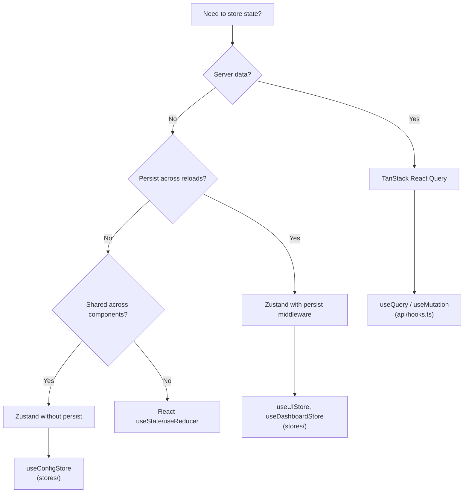
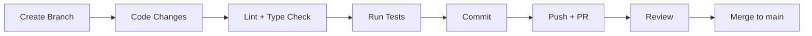

# Development Guide

This guide covers everything needed to contribute to OpenSPC -- from environment setup to adding new features.

---

## Table of Contents

1. [Development Environment Setup](#1-development-environment-setup)
2. [Project Structure](#2-project-structure)
3. [Backend Development](#3-backend-development)
4. [Frontend Development](#4-frontend-development)
5. [Database Migrations](#5-database-migrations)
6. [Adding a New Chart Type](#6-adding-a-new-chart-type)
7. [State Management Patterns](#7-state-management-patterns)
8. [Testing](#8-testing)
9. [Git Workflow](#9-git-workflow)
10. [Troubleshooting Common Dev Issues](#10-troubleshooting-common-dev-issues)

---

## 1. Development Environment Setup

### Prerequisites

| Tool | Minimum Version | Purpose |
|------|----------------|---------|
| Python | 3.11+ | Backend runtime |
| Node.js | 18+ | Frontend tooling |
| npm | 9+ | Package management |
| Git | 2.30+ | Version control |

### Clone the Repository

```bash
git clone https://github.com/your-org/openspc.git
cd openspc
```

### Backend Setup

```bash
cd backend

# Create and activate a virtual environment
python -m venv .venv

# Windows
.venv\Scripts\activate

# macOS/Linux
source .venv/bin/activate

# Install with dev dependencies
pip install -e ".[dev]"

# Initialize the database
alembic upgrade head

# Start the dev server
uvicorn openspc.main:app --reload --port 8000
```

The backend starts at `http://localhost:8000`. API docs are available at `/docs` (Swagger UI) and `/redoc`.

**Key backend dependencies** (installed automatically via `pip install -e .`):
- `fastapi`, `uvicorn` -- Web framework and ASGI server
- `sqlalchemy[asyncio]`, `aiosqlite` -- Async ORM + SQLite driver
- `asyncpg`, `aiomysql`, `aioodbc` -- Optional drivers for PostgreSQL, MySQL, MSSQL
- `aiomqtt` -- Async MQTT client
- `asyncua` -- Async OPC-UA client
- `cryptography` -- Fernet encryption for database credentials
- `structlog` -- Structured logging
- `slowapi` -- Rate limiting

**Environment variables** (optional -- sensible defaults are provided):

```bash
# .env or shell exports
OPENSPC_DATABASE_URL=sqlite+aiosqlite:///./openspc.db   # default
OPENSPC_ADMIN_USERNAME=admin                              # default
OPENSPC_ADMIN_PASSWORD=admin                              # default
OPENSPC_CORS_ORIGINS=http://localhost:5173                # default
OPENSPC_SANDBOX=true                                      # enables dev tools
OPENSPC_LOG_FORMAT=console                                # default (or "json")
```

### Frontend Setup

```bash
cd frontend

# Install dependencies
npm install

# Start the dev server
npm run dev
```

The frontend starts at `http://localhost:5173` and proxies `/api` and `/ws` requests to the backend at `localhost:8000`.

### IDE Recommendations

**VS Code** (recommended) with these extensions:

| Extension | Purpose |
|-----------|---------|
| Python (ms-python.python) | Python IntelliSense, linting |
| Pylance (ms-python.vscode-pylance) | Type checking |
| Ruff (charliermarsh.ruff) | Python linting/formatting |
| ESLint (dbaeumer.vscode-eslint) | TypeScript/React linting |
| Tailwind CSS IntelliSense (bradlc.vscode-tailwindcss) | Class autocomplete |
| Prettier (esbenp.prettier-vscode) | Code formatting |

Recommended `settings.json` for the workspace:

```jsonc
{
  "python.defaultInterpreterPath": "./backend/.venv/Scripts/python",
  "[python]": {
    "editor.defaultFormatter": "charliermarsh.ruff",
    "editor.codeActionsOnSave": {
      "source.fixAll.ruff": "explicit",
      "source.organizeImports.ruff": "explicit"
    }
  },
  "python.analysis.typeCheckingMode": "basic",
  "eslint.workingDirectories": ["frontend"]
}
```

---

## 2. Project Structure

### Backend (`backend/src/openspc/`)

```
backend/
  alembic.ini                     # Alembic migration config
  alembic/
    env.py                        # Async migration runner
    versions/                     # 20 migration scripts (date-prefixed)
  src/openspc/
    main.py                       # FastAPI app, lifespan, router registration
    api/
      deps.py                     # Dependency injection (auth, RBAC)
      v1/                         # 19 router modules
        auth.py                   # Login, refresh, logout, /me
        users.py                  # User CRUD + role assignment
        plants.py                 # Plant/site CRUD
        hierarchy.py              # ISA-95 hierarchy tree (2 routers)
        characteristics.py        # SPC characteristic CRUD + chart data
        characteristic_config.py  # Polymorphic config (manual/tag)
        samples.py                # Sample submission + SPC engine
        violations.py             # Violation queries + acknowledgement
        annotations.py            # Point/period annotations
        brokers.py                # MQTT broker management
        opcua_servers.py          # OPC-UA server CRUD, browsing, subscriptions
        database_admin.py         # DB config, test, status, backup, vacuum, migrations
        tags.py                   # Tag-to-characteristic mapping
        providers.py              # TAG + OPC-UA provider status/control
        data_entry.py             # External data ingestion (JWT + API key)
        api_keys.py               # API key CRUD
        websocket.py              # Real-time sample/violation feed
        devtools.py               # Sandbox: DB reset + seed scripts
    core/
      config.py                   # Settings via pydantic-settings (OPENSPC_ prefix)
      broadcast.py                # Event bus -> WebSocket bridge
      publish.py                  # MQTT outbound publisher (violations, stats, Nelson events)
      rate_limit.py               # Slowapi rate limiting configuration
      logging.py                  # Structured logging via structlog (console/JSON)
      auth/
        jwt.py                    # JWT creation/validation (HS256)
        passwords.py              # Argon2id hashing
        api_key.py                # API key generation + verification
        bootstrap.py              # Auto-create admin on first run
      engine/
        spc_engine.py             # 8-step sample processing pipeline
        nelson_rules.py           # All 8 Nelson/Western Electric rules
        control_limits.py         # Auto-select: moving_range / r_bar_d2 / s_bar_c4
        rolling_window.py         # Per-characteristic LRU window (25 samples)
      events/
        bus.py                    # Async publish/subscribe event bus
        events.py                 # Event type definitions
      alerts/
        manager.py                # Violation creation + acknowledgement
      providers/
        manager.py                # MQTT TAG -> SPC engine bridge
        tag.py                    # Tag provider (MQTT tag subscriptions)
        opcua_provider.py         # OPC-UA data subscription -> SPC engine
        opcua_manager.py          # OPC-UA provider lifecycle management
        buffer.py                 # SubgroupBuffer (shared by TAG + OPC-UA providers)
        manual.py                 # Manual data entry provider
        protocol.py               # Protocol abstraction base
    mqtt/
      manager.py                  # Multi-broker MQTT connections
    opcua/
      client.py                   # asyncua wrapper (connect, browse, subscribe)
      manager.py                  # OPC-UA server lifecycle management
      browsing.py                 # OPC-UA node tree browsing + discovery
    db/
      database.py                 # Async engine + session factory
      dialects.py                 # Multi-dialect support (SQLite/PG/MySQL/MSSQL)
      models/                     # 19 SQLAlchemy ORM models (12 model files)
```

### Frontend (`frontend/src/`)

```
frontend/src/
  App.tsx                         # Root: providers, routes, error boundary
  main.tsx                        # Entry point
  api/
    client.ts                     # fetchApi + 15 API namespaces + token management
    hooks.ts                      # 60+ React Query hooks (queries + mutations)
  providers/
    AuthProvider.tsx               # JWT auth, role derivation
    PlantProvider.tsx              # Plant list + selection context
    WebSocketProvider.tsx          # Real-time WS connection
    ThemeProvider.tsx              # Dark/light/system + brand colors
  contexts/
    ChartHoverContext.tsx          # Cross-chart hover synchronization
  stores/
    uiStore.ts                    # Sidebar state, selected plant (persisted)
    dashboardStore.ts             # Chart selections, real-time cache (partially persisted)
    configStore.ts                # Configuration page UI state (transient)
  pages/                          # 13 page components
  components/                     # ~93 UI components total
    charts/                       # 4 chart-specific (DualChartPanel, RangeChart, etc.)
    characteristic-config/        # 8 config tabs (General, Limits, Sampling, Rules, etc.)
    connectivity/                 # 28 components (Monitor, Servers, Browse, Mapping tabs)
    users/                        # 2 user table + form dialog
    (root)                        # ~51 shared components
  hooks/
    useECharts.ts                 # ECharts instance lifecycle + events
  lib/
    echarts.ts                    # Tree-shaken ECharts registration
    chart-registry.ts             # 10 chart type definitions
    protocols.ts                  # Protocol registry (MQTT + OPC-UA definitions)
    roles.ts                      # RBAC helpers (hasAccess, canPerformAction)
    theme-presets.ts              # Chart color presets
    utils.ts                      # cn() - Tailwind class merger
    nelson-rules.ts               # Nelson rule metadata + descriptions
    report-templates.ts           # 4 report templates
    export-utils.ts               # PDF/Excel/PNG export
    help-content.ts               # Contextual help registry
  types/
    index.ts                      # Core TypeScript interfaces
    charts.ts                     # Chart type definitions + SPC constants
```

### Key Files to Know About

| File | Why It Matters |
|------|---------------|
| `backend/src/openspc/main.py` | App creation, lifespan (startup/shutdown), router registration |
| `backend/src/openspc/api/deps.py` | All authentication + authorization dependencies |
| `backend/src/openspc/core/config.py` | All `OPENSPC_*` environment variables |
| `backend/src/openspc/db/dialects.py` | Multi-dialect SQL abstraction (SQLite/PG/MySQL/MSSQL) |
| `backend/src/openspc/opcua/client.py` | asyncua wrapper for OPC-UA communication |
| `backend/src/openspc/core/publish.py` | MQTT outbound publisher for SPC events |
| `frontend/src/App.tsx` | Provider hierarchy, route definitions, auth gates |
| `frontend/src/api/client.ts` | Token management, 401 retry logic, 15 API namespaces |
| `frontend/src/api/hooks.ts` | All React Query hooks, query keys, polling intervals |
| `frontend/src/lib/protocols.ts` | Protocol registry (MQTT + OPC-UA definitions for UI) |

---

## 3. Backend Development

### Running the Dev Server

```bash
cd backend
uvicorn openspc.main:app --reload --port 8000
```

The `--reload` flag watches for file changes and auto-restarts. The interactive API docs at `http://localhost:8000/docs` are useful for testing endpoints.

### Linting and Type Checking

```bash
# Lint check
ruff check src/

# Lint with auto-fix
ruff check --fix src/

# Format
ruff format src/

# Type check
mypy src/openspc/
```

**Ruff configuration** (from `pyproject.toml`):

```toml
[tool.ruff]
target-version = "py311"
line-length = 100

[tool.ruff.lint]
select = ["E", "F", "I", "UP", "B", "SIM"]
```

Rules enabled: pyflakes (F), pycodestyle errors (E), isort (I), pyupgrade (UP), flake8-bugbear (B), flake8-simplify (SIM).

### Running Tests

```bash
cd backend
pytest                    # Run all tests
pytest -x                 # Stop on first failure
pytest -v                 # Verbose output
pytest --cov=openspc      # With coverage report
pytest tests/test_auth.py # Run specific test file
```

Tests use `pytest-asyncio` with `asyncio_mode = "auto"` (async test functions auto-detected).

### Code Style Conventions

- **Async everywhere**: All database operations use `async`/`await`. Handlers are `async def`.
- **Type hints**: All function signatures should have full type annotations.
- **Dependency injection**: Use FastAPI `Depends()` for auth, database sessions, and shared state.
- **Pydantic schemas**: Request/response models defined alongside route files or in a `schemas` module.
- **Error responses**: Raise `HTTPException` with appropriate status codes and detail messages.

### Adding a New Endpoint (Step-by-Step)

Here is a complete walkthrough for adding a `GET /api/v1/widgets` endpoint:

**Step 1: Create the database model** (`db/models/widget.py`)

```python
from sqlalchemy import Integer, String, ForeignKey
from sqlalchemy.orm import Mapped, mapped_column

from openspc.db.models.hierarchy import Base


class Widget(Base):
    __tablename__ = "widgets"

    id: Mapped[int] = mapped_column(Integer, primary_key=True, autoincrement=True)
    name: Mapped[str] = mapped_column(String(100), nullable=False)
    plant_id: Mapped[int] = mapped_column(Integer, ForeignKey("plants.id"))
```

**Step 2: Create a migration** (see [Database Migrations](#5-database-migrations))

```bash
cd backend
alembic revision --autogenerate -m "add_widget_table"
alembic upgrade head
```

**Step 3: Create the route handler** (`api/v1/widgets.py`)

```python
from fastapi import APIRouter, Depends
from sqlalchemy import select
from sqlalchemy.ext.asyncio import AsyncSession

from openspc.api.deps import get_current_user, get_db
from openspc.db.models.widget import Widget

router = APIRouter(prefix="/api/v1/widgets", tags=["widgets"])


@router.get("/")
async def list_widgets(
    db: AsyncSession = Depends(get_db),
    _user=Depends(get_current_user),  # require authentication
):
    result = await db.execute(select(Widget))
    widgets = result.scalars().all()
    return [{"id": w.id, "name": w.name} for w in widgets]
```

**Step 4: Register the router** in `main.py`:

```python
from openspc.api.v1.widgets import router as widgets_router

# In the router registration section:
app.include_router(widgets_router)
```

**Step 5: Add Pydantic response schemas** for validation and documentation:

```python
from pydantic import BaseModel


class WidgetResponse(BaseModel):
    id: int
    name: str

    model_config = {"from_attributes": True}


@router.get("/", response_model=list[WidgetResponse])
async def list_widgets(...):
    ...
```

---

## 4. Frontend Development

### Running the Dev Server

```bash
cd frontend
npm run dev      # Start Vite dev server (port 5173)
npm run build    # TypeScript check + production build
npm run lint     # ESLint check
npm run preview  # Serve production build locally
```

The Vite dev server proxies API requests to the backend:

```typescript
// vite.config.ts
server: {
  proxy: {
    '/api': { target: 'http://localhost:8000' },
    '/ws':  { target: 'ws://localhost:8000', ws: true },
  },
},
```

### TypeScript Conventions

- **Strict mode**: `strict: true` in `tsconfig.app.json` with `noUnusedLocals` and `noUnusedParameters`.
- **Path aliases**: `@/` maps to `src/` (e.g., `import { useAuth } from '@/providers/AuthProvider'`).
- **Types**: Core interfaces in `types/index.ts`, chart types in `types/charts.ts`.
- **No `any`**: Use proper types. For ECharts option objects, use the composed `ECOption` type from `lib/echarts.ts`.

### Adding a New Page (Step-by-Step)

**Step 1: Create the page component** (`pages/WidgetPage.tsx`)

```tsx
export function WidgetPage() {
  return (
    <div className="p-6">
      <h1 className="text-2xl font-bold mb-4">Widgets</h1>
      <p className="text-muted-foreground">Widget content goes here.</p>
    </div>
  )
}
```

**Step 2: Add the route** in `App.tsx`:

```tsx
import { WidgetPage } from '@/pages/WidgetPage'

// Inside the main layout route:
<Route
  path="widgets"
  element={
    <ProtectedRoute requiredRole="engineer">
      <WidgetPage />
    </ProtectedRoute>
  }
/>
```

**Step 3: Add sidebar navigation** in `components/Sidebar.tsx`:

Find the nav items array and add an entry:

```tsx
{ path: '/widgets', label: 'Widgets', icon: BoxIcon, minRole: 'engineer' },
```

**Step 4: Create API hooks**

Add the API module in `api/client.ts`:

```typescript
export const widgetApi = {
  list: () => fetchApi<Widget[]>('/widgets/'),
  get: (id: number) => fetchApi<Widget>(`/widgets/${id}`),
  create: (data: WidgetCreate) =>
    fetchApi<Widget>('/widgets/', { method: 'POST', body: JSON.stringify(data) }),
}
```

Add query hooks in `api/hooks.ts`:

```typescript
export const queryKeys = {
  // ... existing keys
  widgets: {
    all: ['widgets'] as const,
    list: () => [...queryKeys.widgets.all, 'list'] as const,
    detail: (id: number) => [...queryKeys.widgets.all, 'detail', id] as const,
  },
}

export function useWidgets() {
  return useQuery({
    queryKey: queryKeys.widgets.list(),
    queryFn: () => widgetApi.list(),
  })
}

export function useCreateWidget() {
  const queryClient = useQueryClient()
  return useMutation({
    mutationFn: (data: WidgetCreate) => widgetApi.create(data),
    onSuccess: () => {
      queryClient.invalidateQueries({ queryKey: queryKeys.widgets.all })
      toast.success('Widget created')
    },
    onError: (error: Error) => {
      toast.error(error.message)
    },
  })
}
```

### Component Patterns

#### Using ECharts (`useECharts` hook)

The project uses ECharts 6 with tree-shaken imports. All chart components follow this pattern:

```tsx
import { useECharts } from '@/hooks/useECharts'
import type { ECOption } from '@/lib/echarts'

export function MyChart({ data }: { data: number[] }) {
  const option: ECOption = {
    xAxis: { type: 'category', data: data.map((_, i) => `#${i + 1}`) },
    yAxis: { type: 'value' },
    series: [{ type: 'line', data }],
  }

  const { containerRef, refresh } = useECharts({ option })

  return <div ref={containerRef} style={{ width: '100%', height: 400 }} />
}
```

**Important**: The container `div` must always be in the DOM. Never hide it behind an early return (e.g., `if (isLoading) return <Spinner />`). Instead, use `visibility: hidden` with an overlay for loading/empty states.

To add a new chart type to the tree-shaken bundle, register it in `lib/echarts.ts`:

```typescript
import { PieChart } from 'echarts/charts'
registerECharts([PieChart, /* existing components... */])
```

#### Using TanStack Query Hooks

All server data flows through React Query hooks defined in `api/hooks.ts`:

```tsx
import { useWidgets, useCreateWidget } from '@/api/hooks'

function WidgetList() {
  const { data: widgets, isLoading, error } = useWidgets()
  const createMutation = useCreateWidget()

  if (isLoading) return <div>Loading...</div>
  if (error) return <div>Error: {error.message}</div>

  return (
    <ul>
      {widgets?.map((w) => <li key={w.id}>{w.name}</li>)}
      <button onClick={() => createMutation.mutate({ name: 'New Widget' })}>
        Add Widget
      </button>
    </ul>
  )
}
```

Polling is used for chart data (30s) and violation stats (45s) as a fallback when WebSocket is disconnected.

#### Using Zustand Stores

Zustand stores manage client-side UI state. The pattern:

```typescript
// stores/myStore.ts
import { create } from 'zustand'
import { persist } from 'zustand/middleware'

interface MyState {
  selectedId: number | null
  setSelectedId: (id: number | null) => void
}

export const useMyStore = create<MyState>()(
  persist(
    (set) => ({
      selectedId: null,
      setSelectedId: (id) => set({ selectedId: id }),
    }),
    {
      name: 'openspc-my-store',    // localStorage key
      partialize: (state) => ({     // only persist these fields
        selectedId: state.selectedId,
      }),
    }
  )
)
```

Use `persist` middleware only for state that should survive page reloads. Transient state (WebSocket connection status, hover state) should not be persisted.

#### Theme-Aware Components

All components use Tailwind CSS with theme variables. For chart components that need to respond to runtime color changes:

```tsx
import { useChartColors } from '@/hooks/useChartColors'

function MyChart() {
  const { chartColors, refresh } = useChartColors()

  useEffect(() => {
    refresh()
  }, [chartColors, refresh])

  // ... build ECharts option using chartColors
}
```

---

## 5. Database Migrations

OpenSPC uses **Alembic** with async SQLAlchemy for database migrations. The database is SQLite by default (via `aiosqlite`).

### How Alembic Works

Alembic tracks schema versions in an `alembic_version` table. Each migration script has a unique revision ID and an `upgrade()` / `downgrade()` function pair. Migrations run in order based on the revision chain.

The Alembic environment (`alembic/env.py`) is configured for async operation and uses `render_as_batch=True` for SQLite compatibility (SQLite does not support `ALTER TABLE` for most column operations).

### Creating a New Migration

```bash
cd backend

# Auto-generate from model changes (preferred)
alembic revision --autogenerate -m "add_widget_table"

# Create an empty migration (for data migrations or manual SQL)
alembic revision -m "backfill_widget_defaults"
```

Auto-generated migrations detect:
- New tables/columns
- Dropped tables/columns
- Type changes, index changes
- Foreign key changes

**Always review the generated migration** before running it. Autogenerate cannot detect:
- Table/column renames (shows as drop + create)
- Data migrations
- Changes to CHECK constraints

### Running and Rolling Back

```bash
# Apply all pending migrations
alembic upgrade head

# Apply next migration only
alembic upgrade +1

# Rollback one migration
alembic downgrade -1

# Rollback to a specific revision
alembic downgrade abc123

# Show current revision
alembic current

# Show migration history
alembic history --verbose
```

### Common Migration Pitfalls

1. **SQLite batch mode**: SQLite requires batch operations for column alterations. The env.py already sets `render_as_batch=True`, but if you write manual migrations, wrap column operations:

   ```python
   def upgrade():
       with op.batch_alter_table('widgets') as batch_op:
           batch_op.add_column(sa.Column('description', sa.Text()))
   ```

2. **Import your models**: The `alembic/env.py` imports `from openspc.db.models import Base`. If you add a new model file, make sure it is imported (directly or transitively) so that `Base.metadata` includes its tables.

3. **Don't edit applied migrations**: Once a migration has been applied (especially by other developers), create a new migration instead of editing the existing one. Existing migrations are **immutable**.

4. **Test both directions**: Always verify that both `upgrade()` and `downgrade()` work.

5. **Multi-dialect safety**: OpenSPC supports SQLite, PostgreSQL, MySQL, and MSSQL. When writing migrations:
   - Never use `lastrowid` -- it silently returns 0 on PostgreSQL. Instead, insert rows, SELECT them back by a unique column, then insert children.
   - Use `op.batch_alter_table()` for SQLite compatibility (already configured in `env.py`).
   - Test migrations against your target dialect before deploying.

---

## 6. Adding a New Chart Type

OpenSPC supports 10 chart types across 3 categories (Variable, Attribute, Analysis). Here is how to add a new one.

### Step 1: Register in the Chart Type Registry

Edit `frontend/src/lib/chart-registry.ts`:

```typescript
export const chartTypeRegistry: Record<ChartTypeId, ChartTypeDefinition> = {
  // ... existing types

  'ewma': {
    id: 'ewma',
    name: 'EWMA Chart',
    shortName: 'EWMA',
    category: 'variable',
    description: 'Exponentially Weighted Moving Average for detecting small shifts.',
    requiresSubgroupSize: false,
    minSubgroupSize: 1,
    maxSubgroupSize: null,
    dataType: 'continuous',
    isDualChart: false,
    controlLimitMethod: 'ewma',
    helpKey: 'chart-type-ewma',
  },
}
```

Add the new type ID to `types/charts.ts`:

```typescript
export type ChartTypeId =
  | 'xbar' | 'xbar-r' | 'xbar-s' | 'i-mr'
  | 'p' | 'np' | 'c' | 'u'
  | 'pareto' | 'box-whisker'
  | 'ewma'  // new
```

### Step 2: Backend Calculation Support

If the new chart type requires different control limit calculations, add a method to `backend/src/openspc/core/engine/control_limits.py`:

```python
async def calculate_ewma_limits(
    self, characteristic_id: int, lambda_weight: float = 0.2
) -> LimitResult:
    """Calculate EWMA control limits."""
    # Load historical data, compute EWMA statistics
    ...
```

### Step 3: Frontend Rendering

For simple line-based chart types, the existing `ControlChart` component may work out of the box -- it renders data from the `chart-data` API response.

For chart types needing a distinct visual (like box-whisker or Pareto), create a new component:

```tsx
// components/charts/EWMAChart.tsx
export function EWMAChart({ data }: { data: ChartData }) {
  // Build ECharts option for EWMA display
  const option = useMemo(() => buildEWMAOption(data), [data])
  const { containerRef } = useECharts({ option })
  return <div ref={containerRef} style={{ width: '100%', height: 400 }} />
}
```

### Step 4: ChartTypeSelector Integration

The `ChartTypeSelector` component in `components/charts/ChartTypeSelector.tsx` reads from the registry and groups by category. Your new type will automatically appear in the dropdown once registered in `chartTypeRegistry`.

For dual-chart types (`isDualChart: true`), the `DualChartPanel` handles rendering the primary + secondary chart pair. For standalone charts, the main `ChartPanel` is used.

---

## 7. State Management Patterns

### When to Use What



### Decision Guide

| Data Type | Solution | Example |
|-----------|----------|---------|
| API response data | React Query | Characteristics, samples, violations |
| Real-time WebSocket data | React Query invalidation | WS message triggers `invalidateQueries` |
| UI layout state (persisted) | Zustand + persist | Sidebar collapsed/expanded, selected plant |
| Chart preferences (persisted) | Zustand + persist | Selected time range, histogram position |
| Page-local editing state | Zustand (transient) | Config tree selection, dirty flag |
| Component-local state | `useState` | Form inputs, modal open/close |
| Cross-component coordination | React Context | Chart hover sync (ChartHoverContext) |

### API Hook Pattern

All API hooks follow a consistent pattern in `api/hooks.ts`:

```typescript
// Query keys are structured and hierarchical
export const queryKeys = {
  widgets: {
    all: ['widgets'] as const,
    list: (params?: object) => [...queryKeys.widgets.all, 'list', params] as const,
    detail: (id: number) => [...queryKeys.widgets.all, 'detail', id] as const,
  },
}

// Queries use queryKey + queryFn + optional config
export function useWidgets() {
  return useQuery({
    queryKey: queryKeys.widgets.list(),
    queryFn: () => widgetApi.list(),
    refetchInterval: 30_000,  // optional polling
  })
}

// Mutations invalidate related queries on success
export function useDeleteWidget() {
  const queryClient = useQueryClient()
  return useMutation({
    mutationFn: (id: number) => widgetApi.delete(id),
    onSuccess: () => {
      queryClient.invalidateQueries({ queryKey: queryKeys.widgets.all })
      toast.success('Widget deleted')
    },
    onError: (error: Error) => toast.error(error.message),
  })
}
```

### Zustand Store Pattern

Stores in this project follow a consistent shape:

```typescript
import { create } from 'zustand'
import { persist } from 'zustand/middleware'

interface SomeState {
  // State fields
  value: string
  // Actions (always co-located with state)
  setValue: (v: string) => void
  reset: () => void
}

export const useSomeStore = create<SomeState>()(
  persist(
    (set) => ({
      value: '',
      setValue: (v) => set({ value: v }),
      reset: () => set({ value: '' }),
    }),
    {
      name: 'openspc-some-store',
      partialize: (state) => ({ value: state.value }),
    }
  )
)
```

**Key conventions:**
- Store name matches export name: `useSomeStore` in `someStore.ts`
- localStorage key uses `openspc-` prefix
- `partialize` excludes transient fields (functions, computed values, Maps/Sets)
- Actions are defined inline with `set()`

---

## 8. Testing

### Backend Tests

Tests use **pytest** with **pytest-asyncio** for async test support and **httpx** for the FastAPI test client.

```bash
cd backend

# Run all tests
pytest

# Run with coverage
pytest --cov=openspc --cov-report=html

# Run specific test file
pytest tests/test_samples.py

# Run tests matching a pattern
pytest -k "test_nelson_rule"

# Stop on first failure with verbose output
pytest -xvs
```

**Configuration** (from `pyproject.toml`):

```toml
[tool.pytest.ini_options]
asyncio_mode = "auto"
testpaths = ["tests"]
```

The `asyncio_mode = "auto"` setting means async test functions are automatically recognized without needing `@pytest.mark.asyncio`.

**Test fixtures** typically provide:
- An in-memory SQLite database
- A FastAPI `TestClient` (via httpx `AsyncClient`)
- Authenticated user context

Example test structure:

```python
import pytest
from httpx import AsyncClient

@pytest.fixture
async def client(app):
    async with AsyncClient(app=app, base_url="http://test") as ac:
        yield ac

async def test_list_widgets(client: AsyncClient, auth_headers: dict):
    response = await client.get("/api/v1/widgets/", headers=auth_headers)
    assert response.status_code == 200
    data = response.json()
    assert isinstance(data, list)
```

Additional dev dependencies available for testing:
- **hypothesis**: Property-based testing for SPC calculations
- **pytest-cov**: Coverage reporting

### Frontend Testing

The frontend uses TypeScript strict mode as its primary correctness check. The build step (`npm run build`) runs `tsc -b` before Vite bundling, catching type errors at build time.

```bash
cd frontend

# Type check + build (catches type errors)
npm run build

# Lint check
npm run lint
```

### What to Test

**Backend (priority order):**
1. SPC engine calculations (Nelson rules, control limits)
2. Authentication and authorization (JWT, RBAC, API keys)
3. Sample processing pipeline (validate -> persist -> calculate -> evaluate)
4. API endpoint response schemas and status codes
5. Edge cases: empty data, concurrent access, boundary conditions

**Frontend (priority order):**
1. Type correctness (enforced via `tsc`)
2. API client behavior (token refresh, error handling)
3. Store state transitions
4. Component rendering with different data states

---

## 9. Git Workflow

### Development Workflow



### Branch Naming

Use descriptive branch names with a type prefix:

```
feat/add-ewma-chart
fix/token-refresh-race-condition
refactor/extract-spc-engine
docs/update-api-reference
```

### Commit Message Conventions

The project uses **semantic commit messages** with a phase scope (from `.planning/config.json`):

```
{type}({phase}-{plan}): {description}
```

**Types:**
- `feat` -- New feature
- `fix` -- Bug fix
- `refactor` -- Code restructuring (no behavior change)
- `docs` -- Documentation only
- `test` -- Test additions or changes
- `chore` -- Build, tooling, dependency updates

**Examples:**

```
feat(connectivity-1): add multi-broker MQTT manager
fix(user-mgmt): prevent self-deactivation for admin users
docs(core): add architecture guide with Mermaid diagrams
```

All commits should include the co-author tag:

```
Co-Authored-By: Claude Opus 4.6 <noreply@anthropic.com>
```

### Pre-Commit Checks

Before committing, run:

```bash
# Backend
cd backend
ruff check src/
ruff format --check src/
mypy src/openspc/
pytest

# Frontend
cd frontend
npm run lint
npm run build
```

---

## 10. Troubleshooting Common Dev Issues

### Port Conflicts

**Problem**: `Address already in use` when starting the backend or frontend.

```bash
# Find what's using port 8000 (backend)
# Windows
netstat -ano | findstr :8000
taskkill /PID <pid> /F

# macOS/Linux
lsof -i :8000
kill -9 <pid>

# Find what's using port 5173 (frontend)
# Windows
netstat -ano | findstr :5173
```

**Alternative**: Start on a different port:

```bash
uvicorn openspc.main:app --reload --port 8001
npm run dev -- --port 5174
```

If you change ports, update the Vite proxy config in `vite.config.ts` and the `OPENSPC_CORS_ORIGINS` environment variable.

### Database Locked (SQLite)

**Problem**: `database is locked` errors during development.

**Causes:**
- Multiple processes writing to the same SQLite file
- A migration running while the dev server is active
- A crashed process left a WAL lock

**Solutions:**

```bash
# Stop all Python processes
# Windows
taskkill /F /IM python.exe

# macOS/Linux
pkill -f uvicorn

# Delete WAL files (safe if no process is running)
cd backend
rm -f openspc.db-wal openspc.db-shm

# Restart the dev server
uvicorn openspc.main:app --reload --port 8000
```

**Prevention**: Only run one backend instance at a time. Stop the server before running migrations.

### CORS Errors in Development

**Problem**: Browser console shows `Access-Control-Allow-Origin` errors.

**Cause**: The frontend URL does not match `OPENSPC_CORS_ORIGINS`.

**Solution**: Ensure the environment variable includes your frontend URL:

```bash
OPENSPC_CORS_ORIGINS=http://localhost:5173
```

For multiple origins (e.g., testing from a different port):

```bash
OPENSPC_CORS_ORIGINS=http://localhost:5173,http://localhost:5174
```

The Vite proxy should handle most requests during development (API calls go through the same origin), so CORS is typically only an issue if you access the backend directly.

### WebSocket Connection Issues

**Problem**: WebSocket fails to connect or disconnects frequently.

**Symptoms in browser console:**
- `WebSocket connection to 'ws://...' failed`
- Repeated connect/disconnect cycles

**Debugging steps:**

1. **Check the backend is running**: The WebSocket endpoint is at `/ws/samples`.

2. **Check authentication**: The WebSocket requires a valid JWT token as a query parameter. If the token is expired, the connection will be rejected. Check that the auth flow is working (can you access `/api/v1/auth/me`?).

3. **Check Vite proxy**: The `vite.config.ts` must proxy `/ws` with `ws: true`:

   ```typescript
   '/ws': {
     target: 'ws://localhost:8000',
     ws: true,
   },
   ```

4. **Check heartbeat**: The WebSocket manager drops connections idle for >90 seconds. The client sends `ping` messages to keep alive. If pings are not being sent, check the `WebSocketProvider`.

### Alembic Migration Errors

**Problem**: `Can't locate revision` or `Target database is not up to date`.

```bash
# Check current database revision
cd backend
alembic current

# Show full migration history
alembic history --verbose

# If the database is ahead of your code (e.g., pulled older branch)
alembic downgrade head

# Nuclear option: reset database (dev only!)
rm openspc.db
alembic upgrade head
```

### Import Errors After Adding a New Model

**Problem**: Alembic autogenerate does not detect your new model.

**Cause**: The model file is not imported by `openspc/db/models/__init__.py` or transitively through `Base`.

**Solution**: Ensure your model is imported in the models package. The `alembic/env.py` imports `from openspc.db.models import Base`, which needs to have your model's metadata registered.

### Frontend Build Fails with Type Errors

**Problem**: `npm run build` fails but `npm run dev` works fine.

**Cause**: Vite dev server does not run TypeScript type checking. The build step runs `tsc -b` first.

**Solution**: Fix the type errors shown in the build output. Common issues:
- Unused imports or variables (`noUnusedLocals`, `noUnusedParameters`)
- Missing type annotations on function parameters
- Implicit `any` types

```bash
# Check types without building
npx tsc --noEmit
```
