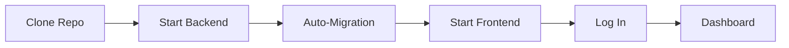

# Getting Started

This guide takes you from zero to a working OpenSPC instance in under 10 minutes. By the end, you will have a running backend, a running frontend, and your first control chart with live data.

---

## Prerequisites

You need three tools installed before starting:

| Tool | Minimum Version | Purpose |
|------|-----------------|---------|
| **Python** | 3.11+ | Backend runtime |
| **Node.js** | 18+ (with npm) | Frontend build and dev server |
| **Git** | Any recent | Clone the repository |

### Installing prerequisites

**Windows:**
- Python: Download from [python.org](https://www.python.org/downloads/). Check "Add Python to PATH" during installation.
- Node.js: Download the LTS installer from [nodejs.org](https://nodejs.org/).
- Git: Download from [git-scm.com](https://git-scm.com/download/win).

**macOS:**
```bash
# Using Homebrew
brew install python@3.11 node git
```

**Linux (Debian/Ubuntu):**
```bash
sudo apt update
sudo apt install python3.11 python3.11-venv nodejs npm git
```

Verify your installations:

```bash
python --version    # Python 3.11.x or higher
node --version      # v18.x.x or higher
git --version       # any version
```

> **Note:** On some systems, the Python command may be `python3` instead of `python`.

---

## Installation

### 1. Clone the repository

```bash
git clone https://github.com/djbrandl/OpenSPC.git
cd OpenSPC
```

### 2. Start the backend

The backend is a Python FastAPI application that serves the API, runs the SPC engine, and manages the database. You need a terminal open in the `backend/` directory.

#### Option A: Start script (Windows)

```cmd
cd backend
start.bat
```

#### Option B: Start script (macOS / Linux)

```bash
cd backend
chmod +x start.sh
./start.sh
```

#### Option C: Manual setup

```bash
cd backend

# Create a virtual environment
python -m venv .venv

# Activate it
source .venv/bin/activate        # macOS / Linux
.venv\Scripts\activate.bat       # Windows CMD
.venv\Scripts\Activate.ps1       # Windows PowerShell

# Install dependencies
pip install -e .

# Run database migrations
alembic upgrade head

# Start the server
uvicorn openspc.main:app --reload --host 0.0.0.0 --port 8000
```

When the backend starts successfully, you will see:

```
→ Backend:  http://localhost:8000
→ API Docs: http://localhost:8000/docs
```

The start scripts automatically:
- Create a Python virtual environment (if it does not exist)
- Install all Python dependencies
- Run database migrations (creates `openspc.db` on first run)
- Start the development server with hot reload

### 3. Start the frontend

Open a **second terminal** and navigate to the `frontend/` directory.

#### Option A: Start script (Windows)

```cmd
cd frontend
start.bat
```

#### Option B: Start script (macOS / Linux)

```bash
cd frontend
chmod +x start.sh
./start.sh
```

#### Option C: Manual setup

```bash
cd frontend
npm install
npm run dev
```

When the frontend starts successfully, you will see:

```
→ Frontend: http://localhost:5173
```

The start scripts automatically:
- Install npm dependencies (if `node_modules/` does not exist)
- Start the Vite dev server with hot module replacement

---

## Setup Flow



---

## First Login

Open your browser to **http://localhost:5173**.

You will see the OpenSPC login page. Use the default development credentials:

| Field | Value |
|-------|-------|
| **Username** | `admin` |
| **Password** | `password` |

These credentials are set by the start scripts for development. After logging in, you land on the **Dashboard** page.

> **Security note:** The default credentials are for development only. For production deployments, set `OPENSPC_ADMIN_USERNAME` and `OPENSPC_ADMIN_PASSWORD` environment variables to secure values before first startup. See the [Deployment Guide](deployment.md) for details.

---

## Your First 10 Minutes

This walkthrough takes you through the core OpenSPC workflow: creating a place for your data, entering measurements, reading a control chart, and triggering a violation.

### Step 1: Navigate the dashboard

After logging in, you are on the **Dashboard** page. This is the primary workspace for monitoring process control. The layout has two main areas:

- **Left panel** -- A hierarchy tree showing your equipment and characteristics. This is where you select what to monitor.
- **Right panel** -- The control chart area. This is where selected characteristic data is visualized.

The dashboard is empty at first because no characteristics have been created yet.

### Step 2: Understand the sidebar

The sidebar on the left edge of the screen provides navigation to all areas of OpenSPC:

| Page | Purpose | Minimum Role |
|------|---------|--------------|
| **Dashboard** | Control charts and real-time monitoring | Operator |
| **Data Entry** | Manual sample submission and history | Operator |
| **Violations** | Nelson rule violation tracking | Operator |
| **Reports** | Generate and export SPC reports | Supervisor |
| **Connectivity** | MQTT broker and tag configuration | Engineer |
| **Configuration** | Hierarchy and characteristic setup | Engineer |
| **Settings** | Appearance, branding, API keys, sites | Admin |
| **Users** | User accounts and role management | Admin |

As the admin user, you have access to all pages. The sidebar collapses to icons when you click the collapse button at the top.

### Step 3: Create a plant (optional)

OpenSPC comes with a **DEFAULT** plant already created. A plant represents a physical facility or site. If you only have one site, the DEFAULT plant is sufficient.

To create an additional plant:
1. Go to **Settings** in the sidebar
2. Click the **Sites** tab
3. Click **Add Plant**
4. Enter a name (e.g., "Chicago Assembly") and a short code (e.g., "CHI")
5. Click **Save**

Switch between plants using the dropdown in the header bar.

### Step 4: Create a characteristic

A **characteristic** is the measurable property you want to track with SPC. Examples: bolt diameter, fill weight, surface roughness, response time.

1. Go to **Configuration** in the sidebar
2. In the hierarchy tree (left panel), click **Add** to create a hierarchy node. Choose a type that fits your structure:
   - **Enterprise** > **Site** > **Area** > **Line** > **Cell** > **Equipment**
   - For a quick test, just create a single "Equipment" node named "Test Machine"
3. Select the node you created, then click **New Characteristic** in the right panel
4. Fill in the wizard:
   - **Name**: e.g., "Bolt Diameter"
   - **Subgroup size**: `1` for individual measurements (I-MR chart) or `5` for subgroups (X-bar chart)
   - Leave other settings at defaults
5. Click **Create**

The characteristic now appears under your hierarchy node. Select it to view its (empty) control chart on the Dashboard.

### Step 5: Enter sample data

With a characteristic selected on the Dashboard, you can enter data:

1. Go to **Data Entry** in the sidebar
2. Select your characteristic from the dropdown
3. Enter measurement values in the input fields. For subgroup size 1, you enter a single value. For subgroup size 5, you enter 5 values.
4. Click **Submit**

Enter at least 20-25 samples to see meaningful control limits. For a quick test with subgroup size 1, try entering values that cluster around a center (e.g., values between 9.8 and 10.2):

```
10.01, 9.98, 10.03, 9.99, 10.02, 9.97, 10.01, 10.00, 9.96, 10.04,
10.02, 9.99, 10.01, 9.98, 10.03, 10.00, 9.97, 10.02, 9.99, 10.01,
10.00, 9.98, 10.03, 10.01, 9.99
```

After submitting enough samples, OpenSPC automatically calculates control limits (UCL, center line, LCL) based on the data.

### Step 6: Read the control chart

Go back to the **Dashboard** and select your characteristic. The control chart shows:

- **Data points** connected by a line -- each point represents a sample mean (or individual value for n=1)
- **Center Line (CL)** -- the process average (solid line in the middle)
- **Upper Control Limit (UCL)** -- 3 sigma above the center line
- **Lower Control Limit (LCL)** -- 3 sigma below the center line
- **Zone shading** -- colored bands showing the sigma zones:
  - **Zone C** (green): Within 1 sigma of center -- normal variation
  - **Zone B** (yellow): Between 1-2 sigma -- worth watching
  - **Zone A** (orange): Between 2-3 sigma -- unusual variation
  - Beyond the limits (red): Out of control

A process "in control" shows random scatter within the control limits with no patterns.

### Step 7: Trigger a Nelson rule violation

Nelson rules detect non-random patterns in your data. The easiest rule to trigger is **Rule 1: Beyond 3 sigma** -- a single point outside the control limits.

After you have 20+ samples with control limits calculated:

1. Go to **Data Entry**
2. Submit a value far from the center line. If your data centers around 10.0, try entering `10.50` or `9.50`.
3. Go back to the **Dashboard**

The violating point appears as a **red diamond** instead of a normal circle. A violation badge appears in the sidebar next to "Violations."

You can also trigger other rules with patterns:
- **Rule 2 (Shift)**: Enter 9 values all above (or all below) the center line
- **Rule 3 (Trend)**: Enter 6 values that continuously increase or decrease

### Step 8: Inspect a sample point

Click any data point on the control chart to open the **Sample Inspector**. This modal shows four tabs:

1. **Measurements** -- Individual measurement values, mean, range, standard deviation, and which zone the point falls in. Supervisors can edit values or exclude the sample.
2. **Violations** -- If the point triggered Nelson rules, shows which rules, their severity, a sparkline visualization of the pattern, and an acknowledgment workflow.
3. **Annotations** -- Notes attached to this point. Add context like "shift change" or "new material lot."
4. **History** -- Audit trail of edits with before/after diffs.

---

## Loading Demo Data

If you want to explore OpenSPC with realistic data without entering it manually, the start scripts enable **sandbox mode** which provides seed scripts:

1. Go to **Dev Tools** in the sidebar (visible only in sandbox mode)
2. Choose a seed script:
   - **Pharmaceutical Demo** -- 3 sites, ~26 characteristics, ~37,000 samples
   - **Nelson Rules Test** -- 2 plants, 10 characteristics, ~1,200 samples (good for seeing violations)
   - **Chart Showcase** -- 1 plant, 4 characteristics, ~360 samples
3. Click **Run** and confirm

The database resets and populates with the selected dataset. You will be logged out and can log back in with `admin` / `password`.

---

## Next Steps

Now that you have a working OpenSPC instance, explore further:

- **[User Guide](user-guide.md)** -- Detailed walkthrough of every feature for daily use
- **[Administration Guide](administration.md)** -- User management, roles, plants, and system configuration
- **[Architecture Guide](architecture.md)** -- How OpenSPC works under the hood, with system diagrams
- **[API Reference](api-reference.md)** -- REST API documentation for integrations
- **[Deployment Guide](deployment.md)** -- Running OpenSPC in production (single server, multi-server, containerized)
