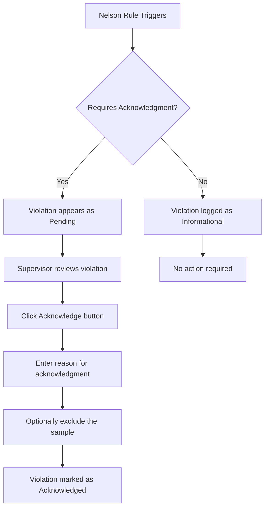
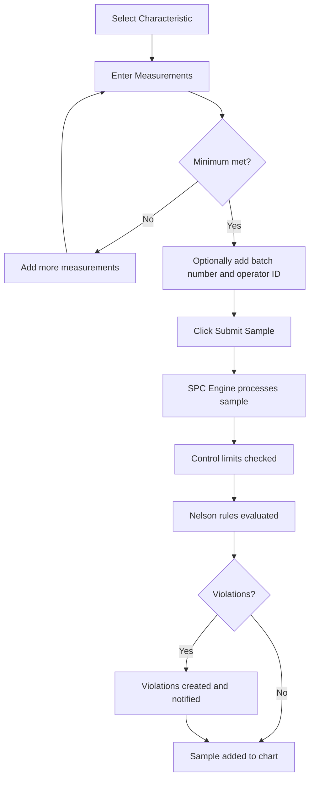

# OpenSPC User Guide

This guide covers the daily use of OpenSPC for quality engineers, process engineers, production supervisors, and operators. It assumes you are familiar with basic SPC concepts and have a login account.

---

## Table of Contents

1. [Dashboard Overview](#1-dashboard-overview)
2. [Control Charts](#2-control-charts)
3. [Dual Charts and Secondary Charts](#3-dual-charts-and-secondary-charts)
4. [Distribution Histogram](#4-distribution-histogram)
5. [Nelson Rules](#5-nelson-rules)
6. [Sample Inspector](#6-sample-inspector)
7. [Data Entry](#7-data-entry)
8. [Annotations](#8-annotations)
9. [Comparison Mode](#9-comparison-mode)
10. [Reports and Export](#10-reports-and-export)
11. [Connectivity Hub](#11-connectivity-hub)
12. [Kiosk Mode](#12-kiosk-mode)
13. [Wall Dashboard](#13-wall-dashboard)
14. [Violations View](#14-violations-view)
15. [Roles and Permissions](#15-roles-and-permissions)

---

## 1. Dashboard Overview

### What You See When You Log In

After logging in, you are taken to the **Operator Dashboard** -- the primary workspace in OpenSPC. The dashboard uses a two-panel layout:

- **Left panel (Hierarchy Tree)** -- A tree-based characteristic selector showing your plant's equipment hierarchy. Each characteristic displays a color-coded status indicator (green for in-control, red for violations).
- **Right panel (Chart Area)** -- The control chart visualization for the selected characteristic, along with toolbars and supplementary panels.

### Sidebar Navigation

The collapsible sidebar on the left edge of the screen provides navigation to all areas of OpenSPC. Sidebar items are filtered by your role -- you will only see pages you have permission to access.

| Section | Available To |
|---------|-------------|
| Dashboard | All users |
| Data Entry | All users |
| Violations | All users |
| Reports | Supervisor and above |
| Configuration | Engineer and above |
| Connectivity | Engineer and above |
| Settings | Admin only |
| User Management | Admin only |

The sidebar can be **expanded** (showing labels), **collapsed** (icons only), or **hidden** entirely. Click the collapse button at the top of the sidebar to toggle between states.

A **violation badge** on the Violations sidebar item shows the count of pending violations requiring acknowledgment.

### Plant Selector

The plant/site selector is located in the top header bar. If your organization has multiple plants configured, use this dropdown to switch between them. Switching plants resets the dashboard state and reloads the hierarchy tree for the selected plant.

### How to Navigate the Hierarchy Tree

The hierarchy tree follows the ISA-95 equipment model. Typical levels include:

**Enterprise > Site > Area > Line > Cell > Equipment**

1. Click the expand arrow next to any node to reveal its children.
2. Leaf nodes that contain characteristics show a count badge (e.g., "3" means three characteristics under that equipment).
3. Click a **characteristic name** to load its control chart in the right panel.
4. Each characteristic shows a status dot: green (in control) or red (has violations).

---

## 2. Control Charts

Control charts are the core visualization in OpenSPC. They display your process data over time with statistical control limits, helping you detect when a process goes out of control.

### Chart Types Available

OpenSPC supports 10 chart types across three categories:

#### Variable Data Charts

| Chart Type | Short Name | When to Use |
|-----------|-----------|-------------|
| X-bar | X-bar | Subgroup means (general purpose) |
| X-bar & R | X-bar R | Subgroup means + ranges, subgroup size 2-10 |
| X-bar & S | X-bar S | Subgroup means + std deviation, subgroup size >10 |
| Individuals & Moving Range | I-MR | Individual measurements (subgroup size = 1) |

#### Attribute Data Charts

| Chart Type | When to Use |
|-----------|-------------|
| p chart | Proportion defective (variable sample size) |
| np chart | Number defective (fixed sample size) |
| c chart | Count of defects per unit (fixed opportunity) |
| u chart | Defects per unit (variable opportunity) |

#### Analysis Charts

| Chart Type | When to Use |
|-----------|-------------|
| Box-Whisker | Measurement distribution per sample |

**Auto-recommendation**: OpenSPC automatically recommends the best chart type based on the characteristic's subgroup size:
- n = 1: I-MR recommended
- n = 2 to 10: X-bar R recommended
- n > 10: X-bar S recommended

### Reading the Chart

Every control chart displays:

- **Center Line (CL)** -- The process average, shown as a solid green line.
- **Upper Control Limit (UCL)** -- The upper 3-sigma boundary, shown as a dashed red line at the top.
- **Lower Control Limit (LCL)** -- The lower 3-sigma boundary, shown as a dashed red line at the bottom.
- **Specification Limits (USL/LSL)** -- Optional engineering tolerance limits, shown as red dashed lines. Toggle these on or off using the **Spec Limits** button in the toolbar.
- **Zone Shading** -- Colored bands indicating the A, B, and C zones on each side of the center line:
  - **Zone C** (green) -- Within 1 sigma of center. This is where most points should fall.
  - **Zone B** (amber/yellow) -- Between 1 and 2 sigma.
  - **Zone A** (red/pink) -- Between 2 and 3 sigma. Points here are warning signs.

### Interacting with the Chart

- **Hover** over any data point to see its value, timestamp, zone classification, and any associated violations in a tooltip.
- **Click** a data point to open the **Sample Inspector** modal with full details (see [Section 6](#6-sample-inspector)).
- **Range Slider** -- Enable the brush/range slider from the toolbar to zoom into a specific window of data points. A sparkline preview shows the full data range, and you drag handles to select a viewport.

### Data Point Shapes

OpenSPC uses distinct shapes and colors to communicate status at a glance:

- **Circle** (normal) -- Standard data point within control limits. Displayed as a filled circle.
- **Diamond** (violation) -- A data point that triggered one or more Nelson rule violations. Displayed in red with a glow effect and a numbered badge showing the primary violated rule.
- **Triangle** (undersized) -- A sample with fewer measurements than the configured subgroup size. Displayed with a dashed ring.
- **Gray circle** (excluded) -- A sample that has been manually excluded from SPC calculations.

### Chart Type Selector

Use the **Chart** dropdown in the toolbar to switch between chart types. The selector groups charts by category and shows:
- Which chart type is currently recommended for your subgroup size
- Compatibility indicators (incompatible types are grayed out)
- A help tip showing the current subgroup size

### X-Axis Mode

The toolbar provides two x-axis display modes:
- **Index** -- Sample number (1, 2, 3, ...)
- **Timestamp** -- Actual collection date/time with adaptive formatting

### Time Range

Control data display using the time range selector:
- **Points** -- Show last N points (e.g., last 50, 100, 200)
- **Duration** -- Show data from last N hours (e.g., last 8h, 24h, 7d)
- **Custom** -- Specify a custom start and end date

---

## 3. Dual Charts and Secondary Charts

### How Paired Charts Work

When you select a dual chart type (X-bar R, X-bar S, or I-MR), OpenSPC displays two stacked charts:

- **Primary chart (top)** -- Shows subgroup means (X-bar) or individual values (I)
- **Secondary chart (bottom)** -- Shows the corresponding dispersion measure:
  - **X-bar R**: Range chart (R) showing the range within each subgroup
  - **X-bar S**: Standard deviation chart (S) showing subgroup standard deviation
  - **I-MR**: Moving Range chart (MR) showing successive differences between individual values

Both charts share the same x-axis (samples are aligned vertically) so you can correlate patterns between the mean and dispersion.

### Cross-Chart Hover Sync

When you hover over a data point on either chart, the corresponding point on the other chart is highlighted. This synchronization helps you identify whether a shift in the mean coincides with a change in variability.

### Resizable Panels

A drag handle between the primary and secondary charts lets you resize the vertical split. Drag up or down to give more space to whichever chart you need to focus on. The default split is 60/40 (primary/secondary).

### Secondary Chart Summary Panel

When the histogram is positioned to the right, a summary statistics panel appears next to the secondary chart showing:
- Center line value (R-bar, S-bar, or MR)
- UCL and LCL for the secondary chart
- Observed max, min, and sample count

---

## 4. Distribution Histogram

The distribution histogram shows how your sample values are distributed relative to the control and specification limits. It includes a normal distribution curve overlay.

### What It Shows

- **Bar chart** of value frequencies binned across the data range
- **Normal curve overlay** fitted to the data
- **Specification limit lines** (USL/LSL) when enabled
- **Bidirectional hover**: Hovering a histogram bar highlights the corresponding points on the control chart, and hovering a chart point highlights the corresponding histogram bar

### Position Options

Use the **Histogram** button in the toolbar to choose:

- **Right** -- Vertical histogram alongside the chart (shares the Y-axis). Useful when you want to see the distribution without losing chart height. Resizable via drag handle.
- **Below** -- Horizontal histogram under the chart. Useful for wider screens. Resizable via drag handle.
- **Hidden** -- No histogram displayed.

---

## 5. Nelson Rules

OpenSPC implements all 8 Nelson (Western Electric) rules for detecting non-random patterns in process data. Each rule identifies a specific pattern that indicates the process may be out of statistical control.

### The 8 Rules Explained

| Rule | Name | What It Detects | Severity |
|------|------|----------------|----------|
| 1 | **Beyond 3-sigma** | A single point falls outside the UCL or LCL | CRITICAL |
| 2 | **Zone Bias** | 9 consecutive points on the same side of the center line | WARNING |
| 3 | **Trend** | 6 consecutive points continuously increasing or decreasing | WARNING |
| 4 | **Oscillation** | 14 consecutive points alternating up and down | WARNING |
| 5 | **Zone A Pattern** | 2 of 3 consecutive points in Zone A (beyond 2-sigma) on the same side | WARNING |
| 6 | **Zone B Pattern** | 4 of 5 consecutive points in Zone B or beyond (beyond 1-sigma) on the same side | WARNING |
| 7 | **Zone C Stability** | 15 consecutive points within Zone C (within 1-sigma) -- too little variation | WARNING |
| 8 | **Mixed Zones** | 8 consecutive points outside Zone C on both sides of center | WARNING |

### What Each Violation Looks Like on the Chart

When a Nelson rule triggers:
- The data point is rendered as a **red diamond** instead of a normal circle
- A **numbered badge** appears on the diamond showing the primary rule number
- If a point triggers multiple rules, the badge shows the most severe
- The violation count is reflected in the sidebar badge and the footer status bar

### How to Acknowledge Violations

Violations that require acknowledgment must be addressed by a Supervisor or higher:



You can acknowledge violations in three places:
1. **Sample Inspector** -- Click a violation point, go to Violations tab, click Acknowledge
2. **Violations View** -- Find the violation in the table, click Acknowledge
3. **Batch acknowledge** -- Acknowledge multiple violations at once via the API

### Sparkline Visualizations

Each Nelson rule has a distinctive sparkline icon that illustrates the pattern visually. These appear in the configuration panel and in the Sample Inspector violations tab, helping you quickly identify which pattern was detected.

---

## 6. Sample Inspector

The Sample Inspector is a detailed modal view of a single data point. Open it by **clicking any data point** on the control chart.

### Modal Layout

The inspector has a **header**, a **sidebar navigation**, an **overview section**, and a **content area**:

- **Header**: Shows the sample ID, a shape indicator (diamond for violations, circle for normal), violation count badge, and excluded status.
- **Sidebar**: Four navigation sections -- Measurements, Violations, Annotations, and Edit History (only shown if the sample has been modified).
- **Overview**: Always visible at the top of the content area.

### Overview Section

The overview displays at a glance:
- **Mean value** in large text, color-coded by zone (green for Zone C, amber for Zone B, red for Zone A)
- **Zone badge** showing which zone the value falls in
- **Metadata**: Timestamp, source (Manual, MQTT Tag, or OPC-UA Node), measurement count, batch number, operator ID
- **Status chips**:
  - "In Control" (green) or "OUT OF CONTROL" (red)
  - "Modified 2x" (amber) if the sample has been edited
  - "Undersized" (amber) if fewer measurements than the subgroup size
  - "Excluded" (gray) if excluded from calculations

### Measurements Tab

- **Measurement grid**: All individual measurements labeled M1, M2, M3, etc.
- **Statistics**: Mean, Range, Min, Max
- **Mini bar chart**: Visual distribution of the measurements within the sample with a mean line overlay
- **Actions** (Supervisor+):
  - **Edit Measurements**: Modify individual values with a required reason (creates an audit trail)
  - **Exclude/Restore Sample**: Toggle whether the sample is included in SPC calculations

### Violations Tab

- Each violation displays:
  - Rule number and name with sparkline pattern illustration
  - Severity badge (CRITICAL or WARNING)
  - Detailed description of the rule
  - Common causes and recommended actions
  - Acknowledgment status (or Acknowledge button if pending)
- To acknowledge: Click "Acknowledge," enter a reason, and confirm

### Annotations Tab

- View existing point annotations for this sample
- **Add a note**: Type text in the input area and click "Add Note"
- **Edit**: Hover over an annotation and click the pencil icon
- **Delete**: Hover and click the X icon, then confirm
- Point annotations use upsert semantics: one annotation per sample

### Edit History Tab

Only visible if the sample has been modified. Shows a timeline of all edits:
- Who edited, when, and why (reason text)
- Before and after mean values with strikethrough/highlight formatting
- Measurement-by-measurement diff showing which specific values changed

---

## 7. Data Entry

### How to Enter Data Manually

Navigate to **Data Entry** from the sidebar. The page has three tabs:

1. **Manual Entry** -- Submit new samples
2. **Sample History** -- View and manage submitted samples
3. **Scheduling** -- (Coming soon)

### Submitting a Sample



1. **Select a characteristic** from the hierarchy tree. The selected characteristic shows its subgroup size, minimum required measurements, and target value.

2. **Enter measurements** in the grid. The number of input fields matches the subgroup size. Fields marked with a star (*) are required.
   - If the characteristic has subgroup size 5 but minimum measurements of 3, you must fill at least 3 fields.
   - Submitting fewer than the subgroup size creates an "undersized" sample (shown as a triangle on the chart).

3. **Optional fields**:
   - **Batch Number** -- Reference to the production batch (e.g., "LOT-2024-001")
   - **Operator ID** -- Who collected the sample (e.g., "OP-123")

4. Click **Submit Sample**. The system processes the sample through the SPC engine, evaluates Nelson rules, and updates the control chart in real time.

### After Submission

- The form clears for the next entry
- A success toast notification appears
- The chart updates with the new data point (via WebSocket if connected, otherwise on next poll)
- Any triggered violations appear immediately

---

## 8. Annotations

Annotations let you attach notes to specific data points or time periods on the chart. They provide context for process events like changeovers, material switches, or equipment maintenance.

### Point Annotations vs Period Annotations

| Type | What It Marks | How to Create |
|------|-------------- |--------------|
| **Point** | A single data point | Click a data point in the Sample Inspector, go to Annotations tab, add a note |
| **Period** | A time range | Click the "Annotate" button in the chart toolbar, select start/end dates |

### Visual Indicators on Charts

- **Point annotations**: Shown as an amber asterisk (*) at the top of the chart with a dashed vertical line at the sample position
- **Period annotations**: Shown as a shaded region spanning the annotated time range

### Creating Annotations

**Point annotation** (from Sample Inspector):
1. Click a data point to open the Sample Inspector
2. Go to the Annotations tab
3. Type your note and click "Add Note"

**Period annotation** (from toolbar):
1. Click the "Annotate" button in the chart toolbar
2. Select start and end dates using the calendar and time pickers
3. Enter your note text
4. Optionally pick a custom color
5. Click "Create"

### Editing and Deleting

- **Edit**: In the Annotation List Panel below the chart, click the pencil icon next to an annotation, modify the text, and click Save
- **Delete**: Click the trash icon, then confirm the deletion
- All edits are tracked with a history trail showing previous text values and who made changes

### Annotation List Panel

When annotations are enabled (via the toolbar toggle), a collapsible panel appears below the chart showing annotations visible in the current viewport. The panel:
- Filters annotations to only show those within the visible range
- Highlights annotations when you hover the corresponding chart point
- Shows a badge with the count (e.g., "3/7" meaning 3 visible out of 7 total)

---

## 9. Comparison Mode

Comparison mode lets you view two characteristics side by side to identify correlations or compare process behavior.

### How to Activate

1. Click the **Compare** toggle in the chart toolbar
2. The dashboard splits into two chart areas: Primary (top) and Secondary (bottom)
3. Click **Browse Hierarchy** to select the second characteristic from the hierarchy tree

### Side-by-Side Chart Viewing

- Both charts share the same time range settings
- Each chart has its own control limits and zone shading
- The primary characteristic uses the default color scheme; the secondary uses a distinct color scheme for clear differentiation
- The currently selected (primary) characteristic is grayed out in the comparison selector to prevent selecting it twice

### Exiting Comparison Mode

Click the Compare toggle again to return to single-chart view. The secondary characteristic selection is preserved for the next time you enable comparison mode.

---

## 10. Reports and Export

### How to Generate a Report

Navigate to **Reports** from the sidebar (requires Supervisor role or above).

The Reports page has a three-column layout:

1. **Left panel** -- Report template selection, time range, and characteristic picker
2. **Right panel** -- Live report preview with export button

### Report Templates

| Template | What It Includes |
|----------|-----------------|
| **Characteristic Summary** | Control chart, statistics, violations, annotations, samples |
| **Capability Analysis** | Histogram, Cp/Cpk/Pp/Ppk metrics, interpretation |
| **Violation Summary** | Violation stats, trend chart, violation table |
| **Trend Analysis** | Trend chart with annotations |

### How to Use

1. Select a **report template** from the list
2. Adjust the **data range** (points, duration, or custom dates)
3. Select a **characteristic** from the hierarchy tree
4. Preview the report in the right panel
5. Click **Export** to download

### Export Formats

| Format | Description |
|--------|------------|
| **PDF** | Visual report with charts rendered as images. Best for sharing and printing. |
| **Excel (.xlsx)** | Structured spreadsheet with data columns (timestamp, mean, zone, violations). Best for further analysis. |
| **CSV** | Plain text comma-separated values. Best for importing into other systems. |

---

## 11. Connectivity Hub

The Connectivity Hub (`/connectivity`) is the centralized interface for managing all industrial data sources. It provides a unified view of MQTT brokers and OPC-UA servers, enabling engineers to configure, monitor, and map data from industrial equipment into the SPC engine.

The Connectivity Hub is organized into four tabs accessible from a sidebar navigation, grouped under **Operations** (Monitor, Servers) and **Configuration** (Browse, Mapping).

### Monitor Tab

The Monitor tab is a read-only operational dashboard showing the health of all connectivity sources at a glance.

**Connectivity Metrics** -- Five summary cards across the top:

| Metric | Description |
|--------|-------------|
| Total Servers | Count of all configured MQTT brokers and OPC-UA servers |
| Connected | Number of servers currently online |
| Mapped Sources | Total subscribed topics and monitored nodes |
| Activity | Whether any server is actively receiving data (Active or Idle) |
| Errors | Count of servers in an error state |

**Data Flow Pipeline** -- A three-stage visual diagram showing how data flows through the system:

```
Sources --> Ingestion --> SPC Engine
```

Each stage is color-coded by health status:
- **Green (Healthy)**: All connections active, data flowing normally
- **Amber (Degraded)**: Some connections have errors but data is still flowing
- **Red (Down)**: All connections have errors, no data flowing
- **Gray (Idle)**: No servers configured or connected

The Sources stage shows a per-protocol breakdown (MQTT connected/total, OPC-UA connected/total). The Ingestion stage shows active mappings, subscribed topics, and monitored nodes. The SPC Engine stage shows processing status and data source count.

**Server Status Grid** -- Individual status cards for every configured server, showing connection state, protocol type, and key metrics.

If no servers are configured, the Monitor tab displays an empty state with a prompt to add a server.

### Servers Tab

The Servers tab is where you add, edit, and manage MQTT brokers and OPC-UA servers.

**Server List** -- A unified list of all servers, regardless of protocol. Each server row shows:
- Protocol badge (MQTT or OPC-UA)
- Server name and connection string (host:port for MQTT, endpoint URL for OPC-UA)
- Connection status indicator
- Edit button

**Filtering and Search:**
- **Protocol filter chips**: All, MQTT, or OPC-UA (with count badges)
- **Search bar**: Filter by server name or connection address

**Adding a Server:**

1. Click **Add Server**.
2. Select the protocol: **MQTT** or **OPC-UA**.
3. Fill in the protocol-specific form (see below).
4. Optionally click **Test Connection** to verify connectivity.
5. Click **Create Server**.

**MQTT Broker Form Fields:**

| Field | Description | Required |
|-------|-------------|----------|
| Name | Descriptive name (e.g., "Factory Floor Broker") | Yes |
| Host | Broker hostname or IP address | Yes |
| Port | MQTT port (default: 1883) | Yes |
| Username | MQTT authentication username | No |
| Password | MQTT authentication password | No |
| Client ID | Custom MQTT client identifier | No |
| Payload Format | `json` or `sparkplugb` | Yes |
| TLS | Enable encrypted connections | No |

**OPC-UA Server Form Fields:**

| Field | Description | Required |
|-------|-------------|----------|
| Name | Descriptive name (e.g., "PLC Controller 1") | Yes |
| Endpoint URL | OPC-UA endpoint (must start with `opc.tcp://`) | Yes |
| Auth Mode | Anonymous or Username/Password | Yes |
| Username / Password | Credentials (when using Username/Password auth) | Conditional |
| Security Policy | None or Basic256Sha256 | Yes |
| Security Mode | None, Sign, or Sign and Encrypt | Yes |
| Session Timeout | Connection timeout in milliseconds (default: 30000) | Yes |
| Publish Interval | Server publish interval in milliseconds (default: 1000) | Yes |
| Sampling Interval | Node sampling interval in milliseconds (default: 250) | Yes |

### Browse Tab

The Browse tab provides a split-panel interface for discovering and exploring data points on connected servers.

**Server Selector** -- A dropdown at the top for choosing which server to browse. Shows protocol type and connection status. Browsing requires the server to be connected; a warning appears if the selected server is disconnected.

**Left Panel -- Protocol-Specific Browser:**

- **MQTT brokers**: A topic tree browser that organizes discovered topics by their `/` separator hierarchy. Supports tree view, flat view, and search filtering. For Sparkplug B topics, decoded metric names and current values are shown.
- **OPC-UA servers**: A node tree browser that navigates the OPC-UA address space. Expand folders to drill into the namespace and find variable nodes.

**Right Panel -- Preview and Quick Map:**

- **Data Point Preview**: Shows the live value of the selected topic or node, along with metadata (data type, timestamp, quality). For Sparkplug B topics, individual metrics can be selected from a list.
- **Quick Map Form**: A streamlined form for mapping the selected data point directly to a characteristic. Select a target characteristic, configure the trigger strategy, and click Map.

### Mapping Tab

The Mapping tab provides a complete view of all data source mappings across both MQTT and OPC-UA protocols.

**Mapping Table** -- Each row displays:
- Characteristic name
- Protocol badge (MQTT or OPC-UA)
- Source identifier (topic path or node ID)
- Source detail (metric name for Sparkplug B)
- Server name
- Trigger strategy
- Active status
- Edit and Delete actions

**Filtering and Search:**
- **Filter chips**: All, MQTT, OPC-UA, or Unmapped (characteristics without a data source)
- **Search bar**: Filter by characteristic name

**Creating a Mapping:**

1. Click **New Mapping** to open the mapping dialog.
2. Select the protocol (MQTT or OPC-UA).
3. Configure the data source (broker/server, topic/node, metric).
4. Select the target characteristic.
5. Choose a trigger strategy:
   - **On Change**: Create a sample whenever the value changes
   - **On Trigger**: Create a sample when a trigger tag fires
   - **On Timer**: Create samples at timed intervals
6. Click Save.

Existing mappings can be edited or deleted from the table row actions. The tab also shows a count of unmapped characteristics, making it easy to identify which characteristics still need data sources.

---

## 12. Kiosk Mode

Kiosk mode provides a full-screen, chrome-free display designed for shop-floor monitors and factory TV screens.

### What It Is For

- Hands-free monitoring on production floor displays
- Large-format visibility for operators
- Auto-rotating view of multiple characteristics

### How to Activate

Navigate to `/kiosk` in your browser, or use the Kiosk link in the sidebar. You can configure which characteristics to display via URL parameters:

| Parameter | Example | Description |
|-----------|---------|------------|
| `chars` | `?chars=1,2,3` | Comma-separated characteristic IDs to display |
| `interval` | `?interval=20` | Rotation interval in seconds (default: 15) |

Example: `/kiosk?chars=1,5,12&interval=10` displays characteristics 1, 5, and 12, rotating every 10 seconds.

If no `chars` parameter is provided, all characteristics are shown.

### Display Elements

- **Status indicator** -- Color-coded circle in the header:
  - Green: In control
  - Yellow: Warning (value near limits)
  - Red (pulsing): Active violation
- **Chart** -- Full-width control chart
- **Stats bar** -- Current value, UCL, LCL, and unit
- **Pagination dots** -- Shows which characteristic is currently displayed (when multiple are configured)

### Controls

| Control | Action |
|---------|--------|
| Left/Right arrow keys | Navigate to previous/next characteristic |
| Space bar | Pause or resume auto-rotation |
| Navigation arrows (on-screen) | Click to navigate between characteristics |
| Pagination dots | Click to jump to a specific characteristic |

---

## 13. Wall Dashboard

The Wall Dashboard displays multiple control charts simultaneously in a configurable grid layout, designed for large monitors in control rooms.

### Grid Sizes

| Size | Charts | Best For |
|------|--------|---------|
| 2x2 | 4 charts | Small displays, focused monitoring |
| 3x3 | 9 charts | Standard overview |
| 4x4 | 16 charts | Large displays, broad monitoring |
| 2x3 | 6 charts | Vertical displays |
| 3x2 | 6 charts | Wide displays |

### How to Use

1. Navigate to `/wall-dashboard`
2. Select a grid size from the dropdown
3. Charts automatically fill with available characteristics, or specify which ones via `?chars=1,2,3,4` in the URL

### Features

- **Click to expand**: Click any chart card to open it in a full-screen modal with detailed stats (UCL, CL, LCL, point count)
- **Save presets**: Click Save to store the current grid size and characteristic selection
- **Load presets**: Click Load to restore a previously saved configuration
- **Brand badge**: Your organization's logo and app name appear as a subtle overlay

### URL Parameters

| Parameter | Example | Description |
|-----------|---------|------------|
| `grid` | `?grid=3x3` | Grid size (2x2, 3x3, 4x4, 2x3, 3x2) |
| `chars` | `?chars=1,2,3,4` | Specific characteristic IDs |

---

## 14. Violations View

The Violations view provides a centralized table for monitoring and managing all Nelson rule violations across your plant.

### Stats Cards

At the top of the page, five summary cards show:
- **Total Violations** -- All-time count
- **Pending (Required)** -- Unacknowledged violations that require attention
- **Informational** -- Violations that do not require acknowledgment
- **Critical** -- Count of CRITICAL severity violations
- **Warning** -- Count of WARNING severity violations

### Filtering

Two filter controls are available:

**Status filter** (segmented buttons):
- **Pending** -- Shows unacknowledged violations that require acknowledgment (default view)
- **Informational** -- Shows unacknowledged violations that do not require acknowledgment
- **Acknowledged** -- Shows violations that have been acknowledged
- **All** -- Shows everything

**Rule filter** (dropdown):
- Filter by specific Nelson rule number (1-8)
- "All Rules" shows violations from any rule

### Violations Table

Each row shows:
- **Time** -- When the violation was detected (date and time)
- **Characteristic** -- Name and hierarchy path
- **Rule** -- Number badge and rule name
- **Severity** -- CRITICAL (red) or WARNING (yellow) badge
- **Status** -- Pending (red clock), Informational (blue info), or Acknowledged (green check)
- **Actions** -- Acknowledge button (for pending violations, Supervisor+ only)

### Acknowledging from the Violations View

Click the **Acknowledge** button on any pending violation. The system records the acknowledgment with your username and a default reason. For more detailed acknowledgment with custom reasons, use the Sample Inspector instead.

---

## 15. Roles and Permissions

OpenSPC uses a four-tier role hierarchy. Roles are assigned per plant, so a user can have different roles at different sites.

### Role Hierarchy

```
Admin > Engineer > Supervisor > Operator
```

Each higher role inherits all permissions of the roles below it.

### What Each Role Can Do

| Capability | Operator | Supervisor | Engineer | Admin |
|-----------|----------|-----------|----------|-------|
| View dashboard and charts | Yes | Yes | Yes | Yes |
| Enter data manually | Yes | Yes | Yes | Yes |
| View violations | Yes | Yes | Yes | Yes |
| Use kiosk and wall dashboard | Yes | Yes | Yes | Yes |
| View reports | -- | Yes | Yes | Yes |
| Acknowledge violations | -- | Yes | Yes | Yes |
| Edit/exclude/delete samples | -- | Yes | Yes | Yes |
| Configure characteristics | -- | -- | Yes | Yes |
| Manage API keys | -- | -- | Yes | Yes |
| View connectivity status | -- | -- | Yes | Yes |
| Database settings | -- | -- | Yes | Yes |
| Manage theme and branding | -- | -- | -- | Yes |
| Create/manage users | -- | -- | -- | Yes |
| Manage plants/sites | -- | -- | -- | Yes |
| Access dev tools (sandbox) | -- | -- | -- | Yes |

### How Permissions Affect the UI

- **Sidebar**: Only shows navigation items you have access to
- **Buttons and actions**: Action buttons (Acknowledge, Edit, Delete, Exclude) are hidden if you lack the required role
- **Route protection**: Navigating directly to a URL you lack permission for redirects you with a notification
- **Plant-scoped roles**: Your role is determined by your assignment at the currently selected plant. If you have no role at a plant, you may have limited or no access to its data

### Role Derivation

When you switch plants, your effective role changes to match your assignment at that plant. If no specific role exists for the selected plant, the system falls back to your highest role across all plants.
